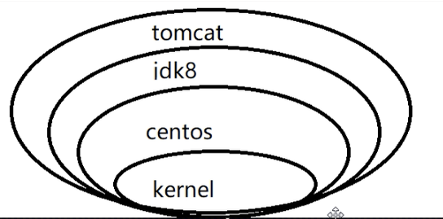

## docker

> 概念

一个容器其实就是一个简易版的linux环境，镜像和容器的关系相当于类和对象的关系。

> 组成部分

镜像、容器、仓库

### 使用

1. 将仓库docker hub修改成阿里云镜像
2. 拉镜像到本地
3. 运行镜像

### 底层原理

docker中的一个容器其实就是一个阉割版的虚拟机，只不过虚拟机需要考虑的东西更多一些，例如一些硬件的虚拟，以及包括系统指令之间的映射关系（虚拟机进程都是跑在虚拟机上的）；但是docker不同，首先docker只能用在linux系统中，每一个docker容器都有一个精简版的linux内核，所以不需要系统之间的映射，能直接跑在宿主机上，并且也不需要虚拟很多没有用的硬件，所以docker启动运行速度都显著大于虚拟机。

### 命令

**帮助命令**

- `docker version`

- `docker info`
- `docker --help`：查看命令指南

**镜像命令**

- `docker images`
- `docker search`：去dockerhub上搜索相应的image
- `docker pull`：拉相应的镜像到本地
- `docker rmi`：删除相应的镜像

**容器基础命令**

- `docker run`：通过镜像启动容器
- `docker start`：启动之前启动过的容器，并以之前的run参数启动
- `docker ps`：列出此时所有运行的进程
- 交互模式下退出容器：
  - `exit`：容器停止退出
  - `ctrl + p + q`：容器不停止退出
- `docker stop containerid`：停止容器
- `docker kill id`：强制停止

**容器重要命令**

容器内部其实运行了一个小型的Linux内核，所以大部分linux命令都能在docker容器中使用。例如`docker top id`：代表查看这个容器中所运行的进程

- `docker logs`：查看相应的容器日志
- `docker run -d`：命令容器以后台运行，此时需要有docker前台进程，要不然后台会强制退出
- `docker inspect id`：查看容器内部细节
- 重新进入退出交互的docker容器：
  - `docker attach id`
  - `docker exec -it 容器ID /bin/bash`：进入容器，打开容器内的一个新shell
- `docker exec `：在宿主机中对某容器执行命令，不进入容器
- `docker cp`：将容器内的路径拷贝到宿主机上

### docker镜像原理

> 内容
>
> 一个镜像包含了运行软件、软件相对应的环境。

#### 原理

- UnionFS：联合文件系统，分层高性能文件系统

#### 为什么tomcat镜像这么大？

> 镜像commit

`docker commit -m -a`：提交新镜像

### docker容器数据卷

> 作用：将容器产生的数据持久化
>
> 本质：其实就是对真实磁盘的一种映射

#### 挂载方式

**通过命令挂载**

1. `docker run -it -v host:docker containerid`：将host中文件路径和docker中的文件路径相映射
2. 使用`docker inspect`查看是否挂载成功

**使用dockerFile构建镜像挂载**

1. 制作dockerFile脚本
2. `docker build`命令，对脚本构建相应的镜像
3. 启动镜像

#### 数据卷容器

启动时根据`--volumes --from parent`实现容器于父容器的挂载。

### dockerFile

> 用来构建docker镜像的构建文件
>
> 可以进入dokcerhub中查看相应镜像的dockerFile

> 入口

通过centos的dockerFile，可以推断dockerFile的本源（因为所有的镜像都是基于linux内核），所以可以以这个为切入口。

#### 执行流程

1. 从上到下执行
2. 每条指令都会运行此时的镜像，运行完后将容器又变成镜像，依次执行

#### 语法规则

见思维导图

