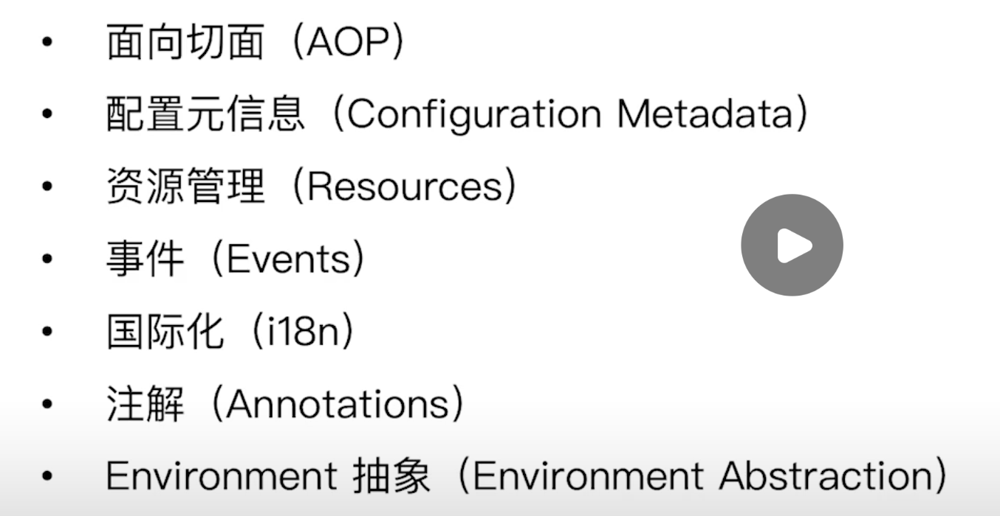

## 依赖查找


## 依赖注入


### 懒加载

使用`ObjectFactory`，将其作为一个bean，里面放入一个泛型，想要的时候从里面取出相应的对象。

## 依赖来源

1. 自定义bean
2. 容器内建bean

```java
Environment environment = beanFactory.getBean(Environment.class);
```

3. 容器内建依赖（只可注入不可查找，可以通过registerResolvableDependency进行插入）

```java
BeanFactory bean = beanFactory.getBean(BeanFactory.class);  // 拿不到

// 虽然xml中没有这个BeanFactory bean，依然能注入，这是一个内建非bean对象
System.out.println(userRepository.getBeanFactory());
```

## IOC配置

1. bean定义配置
2. IOC容器配置
3. 外部属性配置

## IOC容器底层

> 容器底层到底是BeanFactory还是ApplicationContext

其实`ApplicationContext`是`BeanFactory`的子接口，它在`BeanFactory`的基础上扩展了一些功能，但是我们会发现:

```java
		BeanFactory beanFactory = new ClassPathXmlApplicationContext("classpath:/META-INF/dependency-injection-context.xml");
		UserRepository userRepository = (UserRepository) beanFactory.getBean("userRepository");
		System.out.println(userRepository);

		// 虽然xml中没有这个BeanFactory bean，依然能注入，这是一个内建非bean对象
		System.out.println(userRepository.getBeanFactory());

		System.out.println(userRepository.getBeanFactory() == beanFactory);  // false
```

```java
public class UserRepository {

   private Collection<User> userList;

   private BeanFactory beanFactory;
}
```

拿到的上下文对象和内建注入的对象不是一个对象，通过源码看出，`ApplicationContext`中不仅继承了BeanFactory，而且它本身也注入了一个BeanFactory，我们注入的是它本身注入的那个`beanFactory`，这其实是使用了设计模式中的代理模式，委托`DefaultListableBeanFactory`来进行一系列操作，而它的底层其实就是BeanFactory的实现类，也就是被委托的`DefaultListableBeanFactory`对象。

### 源码解析

为什么`UserRepository`注入的对象是代理对象而不是原本的上下文对象呢？我们可以从`AbstractApplicationContext`中找到答案，在它的`prepareBeanFactory`方法中，有这样一段代码：

```java
beanFactory.registerResolvableDependency(BeanFactory.class, beanFactory);  // 如果你选择注入BeanFactory的话，就默认拿到代理注入
beanFactory.registerResolvableDependency(ResourceLoader.class, this); // 如果选择注入以下的几个的话，默认拿到的是源上下文。
beanFactory.registerResolvableDependency(ApplicationEventPublisher.class, this);
beanFactory.registerResolvableDependency(ApplicationContext.class, this);
```


## ApplicationContext作用

除了`BeanFactory`，它还有如下作用：



> 单纯使用BeanFactory来创建bean对象和使用ApplicationContext来创建bean对象的不同：

- 使用BeanFactory方式：

```java
public class BeanFactoryAsIocContainerDemo {
   public static void main(String[] args) {
      // 通过配置的方式
      DefaultListableBeanFactory beanFactory = new DefaultListableBeanFactory();
      XmlBeanDefinitionReader beanDefinitionReader = new XmlBeanDefinitionReader(beanFactory);
      int beanCount = beanDefinitionReader.loadBeanDefinitions("classpath:/META-INF/dependency-injection-context.xml");
      System.out.println("此时xml中有" + beanCount + "个bean");

      lookupCollectionByType(beanFactory);

   }

   private static void lookupCollectionByType(BeanFactory beanFactory) {
      if (beanFactory instanceof ListableBeanFactory) {
         ListableBeanFactory listableBeanFactory = (ListableBeanFactory) beanFactory;
         Map<String, User> beansOfType = listableBeanFactory.getBeansOfType(User.class);
         System.out.println(beansOfType);
      }
   }
}
```

- 使用ApplicationContext方式（使用new 注解的Context）

```java
@Configuration
public class AnnotationBeanFactoryDemo {
   public static void main(String[] args) {
      // 通过java 注解的方式
      AnnotationConfigApplicationContext applicationContext = new AnnotationConfigApplicationContext();
      applicationContext.register(AnnotationBeanFactoryDemo.class);
      // 启动容器，拿到相应的BeanFactory，并且对这个BeanFactory进行初始化
      applicationContext.refresh();
      lookupCollectionByType(applicationContext);
   }

   @Bean
   public User getUser() {
      User user = new User();
      user.setId(1L);
      user.setName("小沈");
      return user;
   }

   @Bean
   public User getSuperUser(User user) {
      SuperUser superUser = new SuperUser();
      superUser.setId(user.getId());
      superUser.setName(user.getName());
      superUser.setAddress("天上面");
      return superUser;
   }

   private static void lookupCollectionByType(BeanFactory beanFactory) {
      if (beanFactory instanceof ListableBeanFactory) {
         ListableBeanFactory listableBeanFactory = (ListableBeanFactory) beanFactory;
         Map<String, User> beansOfType = listableBeanFactory.getBeansOfType(User.class);
         System.out.println(beansOfType);
      }
   }
}
```

可以看出，上面的仅仅能进行bean的创建操作，而下面的需要进行refresh来对context的初始化操作，从而完成一系列功能。

## 面试题

1. 什么是ioc：依赖查找、依赖注入
2. `BeanFactory`和`FactoryBean`的区别：BeanFactory是ioc底层容器，而`FactoryBean`是用来创建复杂bean对象的。