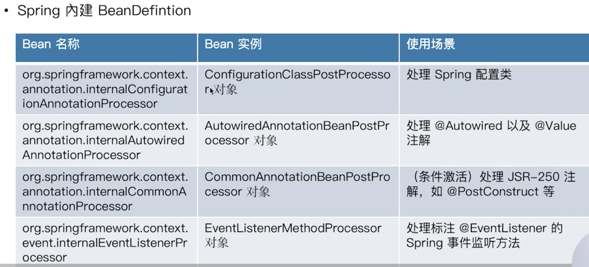
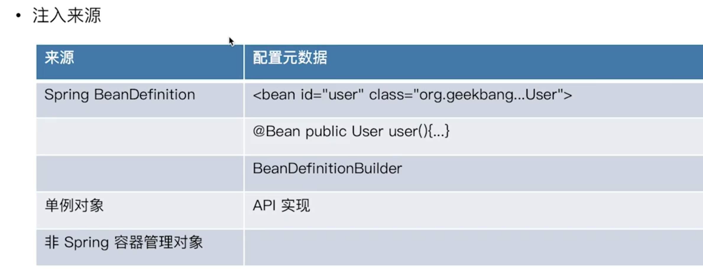
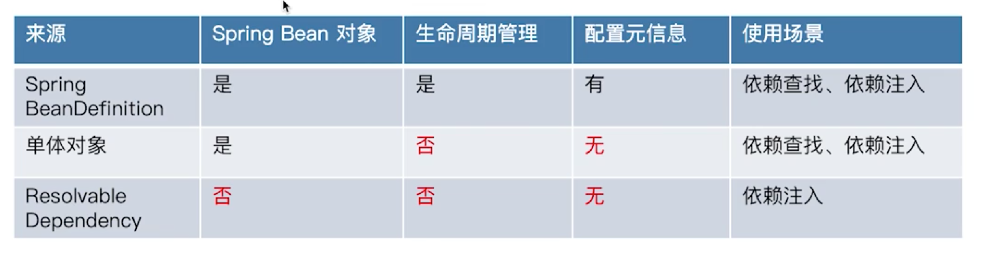
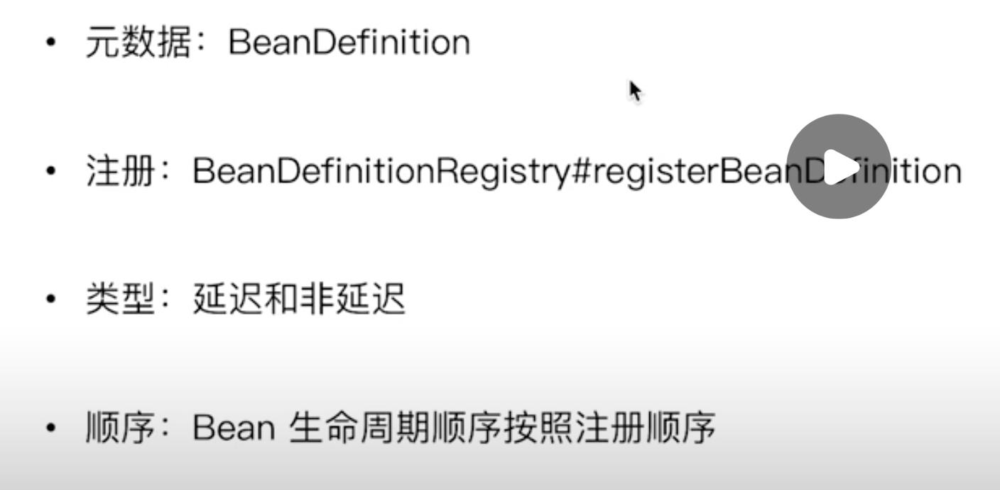
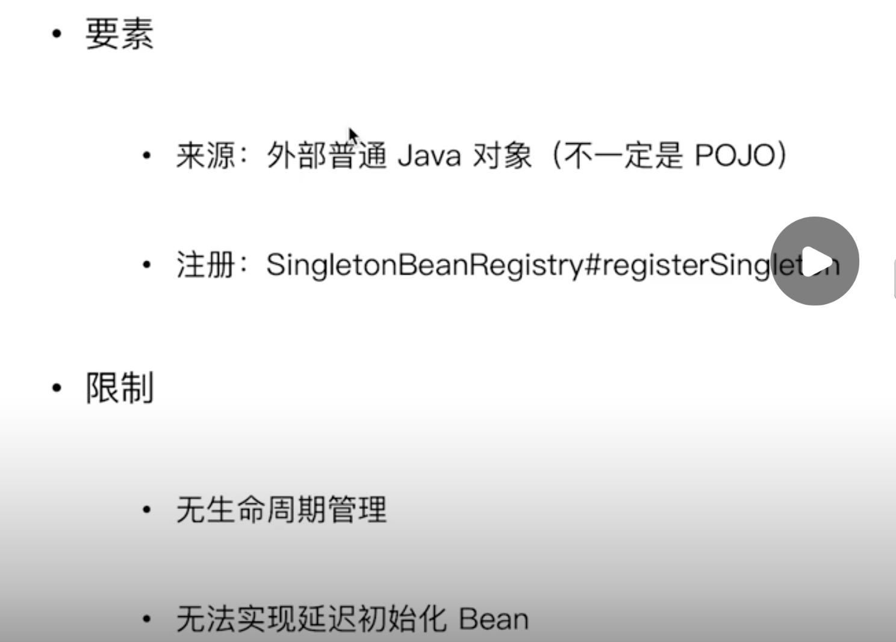
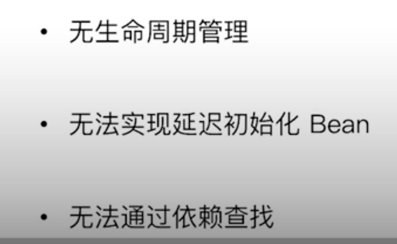

## 来源

### 依赖查找来源




如果需要注解场景，也就是xml中配置了`context:annotation-config`或者直接使用`AnnotationConfigApplicationContext`，都会在reader中调用`org.springframework.context.annotation.AnnotationConfigUtils#registerAnnotationConfigProcessors(org.springframework.beans.factory.support.BeanDefinitionRegistry)`注册一系列注解相关的`beanPostProcesser`作为`beanDefinition`到当前的applicationContext中。

这些beanDefinition在refresh操作后会进行实例化bean操作，又因为他们注册的早，所以肯定是先实例化。


### 依赖注入来源



### 区别

spring依赖注入的来源相比于依赖查找来源多了一个非spring容器管理对象，下面这些只能通过注入，不能通过`getBean`进行依赖查找：

```java
// 如果需要实现类似的功能，可以通过如下方式手动注册，默认注册了以下四种
beanFactory.registerResolvableDependency(BeanFactory.class, beanFactory);
beanFactory.registerResolvableDependency(ResourceLoader.class, this);
beanFactory.registerResolvableDependency(ApplicationEventPublisher.class, this);
beanFactory.registerResolvableDependency(ApplicationContext.class, this);
```

原因：在依赖注入的时候，会调用`org.springframework.beans.factory.support.DefaultListableBeanFactory#doResolveDependency`，在`findAutowireCandidates()`会遍历`resolvableDependencies`，如果存在对象，直接返回注入；但是直接getBena的话不会去找这里面的对象。


> 总结

Spring IOC的三种依赖来源，自定义注册的Spring bean、内建的Spring bean以及内建的可注入的依赖(不是严格意义上的bean，只是后面可能在注入中用到)，其中自定义注册的Spring bean基本上是通过xml、注解或者api注册BeanDefination创建的，内建的Spring bean是通过registerSingleton()创建的，内建的可注入的依赖是通过registerResolveDependency()创建的，后续如果我们需要往Spring容器里放入一些非Spring托管的bean但又可以被依赖注入的, 可以通过registerResolveDependency() API实现。




## Spring Bean来源



> 注册BeanDefinition：包括自定义、xml、注解等

默认实现就是`DefaultListableBeanFactory`中的`registerBeanDefinition`，将相应的BeanDefinition注册到map中，并使用一个List存储顺序，在bean初始化的时候也会按照顺序进行初始化。


> 单体对象作为来源

这里的单体对象指的是由外部初始化(new)的对象，spring不会对其生命周期管理：

```java
UserFactoryImpl userFactory = new UserFactoryImpl();
ConfigurableListableBeanFactory beanFactory = applicationContext.getBeanFactory();
// 直接注册
beanFactory.registerSingleton("userFactory", userFactory);
```



> ResolvableDependency作为来源

仅仅用于依赖注入，可以通过`org.springframework.beans.factory.config.ConfigurableListableBeanFactory#registerResolvableDependency`进行resolveMap的注册，此时只能通过依赖注入进行检索，直接getBean是拿不到的。


> 外部化配置作为依赖来源

使用@Value实现



## 面试题

> 依赖注入和查找的来源是否相同？

不相同，查找仅仅来源于自定义beanDefinition和单例bean。


