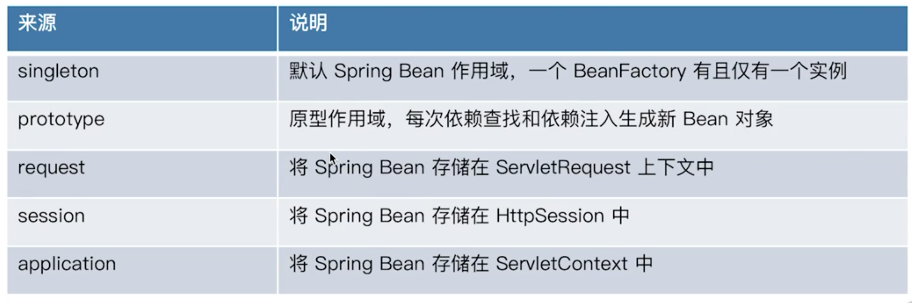

## Spring作用域



- 主要是前两种，后面的主要是模板引擎技术。
- 一个BeanFactory只有一个bean实例，但是层次性的BeanFactory可以有相应的多个bean实例。

## scope的本质

1. 通过加入注解或者xml配置bean，在beanDefinition中取得其元信息（scope类型）。
2. 通过doGetBean拿到它的beanDefinition，判断后执行相应的scope processors(可以自己定义)中的回调方法。


## scope分类

### singleton

在`BeanDefinition`中进行定义，如果是singleton，那么代表的就是单例模式，但是要注意`singleton`和`prototype`可以同时存在，但是如果两者同时为true的时候，可能会出现一些问题。

### prototype

- 依赖查找和注入都会生成新的对象
- 不能由beanFactory进行完整的生命周期管理（不能执行相应的销毁回调方法），因为singleton是一个bean id对应一个bean对象；而prototype一个bean id对应很多个bean对象，无法建立映射关系。

```java
public class BeanScopeDemo implements DisposableBean {

   @Autowired
   @Qualifier("scopeUser")
   private User scopeUser1;

   @Autowired
   @Qualifier("scopeUser")
   private User scopeUser2;

   @Autowired
   @Qualifier("prototypeUser")
   private User prototypeUser1;

   @Autowired
   @Qualifier("prototypeUser")
   private User prototypeUser2;

   @Autowired
   private ConfigurableListableBeanFactory beanFactory;

   @Autowired
   private Map<String, User> userMap;

   @Bean
   @Scope(ConfigurableBeanFactory.SCOPE_PROTOTYPE)
   private static User prototypeUser() {
      return createUser();
   }

   @Bean
   private static User scopeUser() {
      return createUser();
   }

   private static User createUser() {
      User user = new User();
      user.setId(System.nanoTime());
      return user;
   }

   public static void main(String[] args) {
      AnnotationConfigApplicationContext applicationContext = new AnnotationConfigApplicationContext();
      applicationContext.register(BeanScopeDemo.class);
      applicationContext.refresh();
      // 此时发现，prototypeUser不会进行销毁操作
      lookupUser(applicationContext);
      applicationContext.close();
   }

   private static void lookupUser(AnnotationConfigApplicationContext applicationContext) {
      BeanScopeDemo bean = applicationContext.getBean(BeanScopeDemo.class);
      System.out.println(bean.scopeUser1);
      System.out.println(bean.scopeUser2);
      System.out.println(bean.prototypeUser1);
      System.out.println(bean.prototypeUser2);
   }

   @Override
   public void destroy() throws Exception {
      prototypeUser1.destory();
      prototypeUser2.destory();
      // 将map中的prototype回调
      Set<Map.Entry<String, User>> entries = userMap.entrySet();
      for (Map.Entry<String, User> entry : entries) {
         String key = entry.getKey();
         // 此时手动执行销毁回调方法
         if (beanFactory.getBeanDefinition(key).isPrototype()) {
            User value = entry.getValue();
            value.destory();
         }
      }
   }
}
```

### RequestScope

在servlet中使用，每次注入的时候还是同一个对象（被CGLIB代理的对象），但是在返回模板引擎渲染的时候会创建一个新的代理对象。

### SessionScope

相比于Requset，每次注入的时候还是同一个对象，但是在返回模板引擎的时候会根据会话（cookie对应的session）来返回，如果session一样就返回同一个对象。

### ApplicationScope

使用ServletContextScope作为注册类，每次执行其get操作的时候会将此时的bean注入到servlet context的上下文中，在模板引擎的解析过程中可以被解析到。

## 自定义scope

> 步骤

- 实现接口`scope`，在get中完成一些自定义的处理。
- 将这个scope作为bean processor注入到bean factory中。
- 在bean的元信息中添加相应的注解或xml。

```java
public class MyThreadScope extends SimpleThreadScope {
   public static final String SCOPE_NAME = "MyThreadScope";
}
```

```java
public class MyScopeDemo {

   @Bean
   @Scope(MyThreadScope.SCOPE_NAME)
// @Scope(ConfigurableBeanFactory.SCOPE_SINGLETON)
   public User user() {
      User user = new User();
      user.setId(System.nanoTime());
      return user;
   }

   public static void main(String[] args) {
      AnnotationConfigApplicationContext applicationContext = new AnnotationConfigApplicationContext();
      applicationContext.register(MyScopeDemo.class);
      applicationContext.addBeanFactoryPostProcessor(beanFactory -> {
         beanFactory.registerScope(MyThreadScope.SCOPE_NAME, new MyThreadScope());
      });
      applicationContext.refresh();
      lookupScope(applicationContext);
      lookupScope2(applicationContext);
      // 此时发现，prototypeUser不会进行销毁操作
      applicationContext.close();
   }

   private static void lookupScope(AnnotationConfigApplicationContext applicationContext) {
      for (int i = 0; i < 3; i++) {
         User user = applicationContext.getBean("user", User.class);
         System.out.println(user);
      }
   }

   private static void lookupScope2(AnnotationConfigApplicationContext applicationContext) {
      for (int i = 0; i < 3; i++) {
         new Thread(() -> {
            User user = applicationContext.getBean("user", User.class);
            System.out.println(user);
         }).start();
      }
   }
}
```

## 面试题

> spring内建bean作用域scope有哪几种

singleton、prototype、request、session、application、websocket

> singleton bean是否在一个应用中是唯一的

不是，只是在当前上下文中是唯一的。

> application bean是否可以被替代

```java
@Override
public Object get(String name, ObjectFactory<?> objectFactory) {
   Object scopedObject = this.servletContext.getAttribute(name);
   if (scopedObject == null) {
      scopedObject = objectFactory.getObject();
      this.servletContext.setAttribute(name, scopedObject);
   }
   return scopedObject;
}
```

可以，application bean本质上其实就是在servlet context上下文中将当前bean存储了一下，其实在当前应用上下文中也可以是一样的效果，只要能被模板引擎监测扫描即可。


