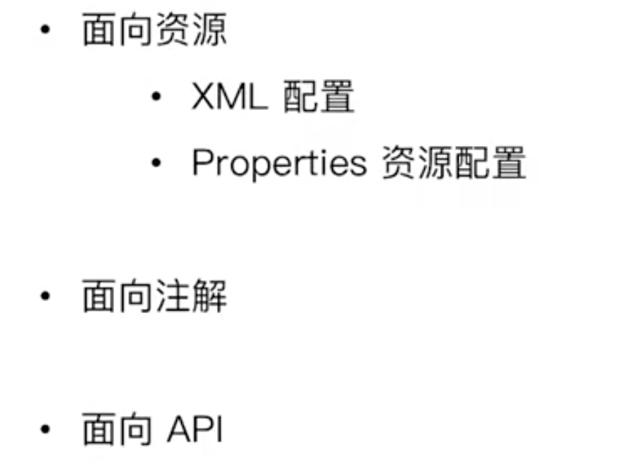
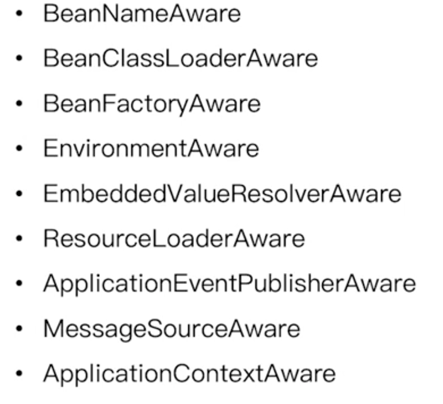
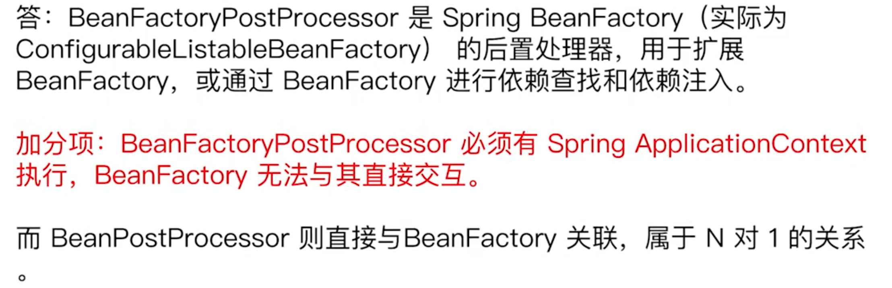

## 1.元信息配置阶段



## 2.元信息解析阶段

主要是在相应的Reader中实现，各种reader（包括注解、properties、xml）主要负责对不同资源元信息的解析，解析成相应的`beanDefinition`，往`BeanDefinitionRegistry`(ListableBeanFactory)中进行注册。


## 3.元信息注册阶段

在`listableBeanFactory`中的`registerBean`中进行注册，放入相应的map和list中，其中map存储相应的`beanDefinition`，list维护注册的顺序。

如果重复注册相同的beanDefinition，会报出警告。


## 4.元信息合并阶段

> 问题：为什么将元信息注册完了还需要元信息的合并？

从bean的parent和beanFactory的层级来解释：

1. 因为注册的时候只是将元信息按照beanDefinition的形式进行了注册，也就是设置了子类相关的字段和父类的class；而在真正getBean相关操作需要使用真正的元信息的时候，需要将相应的parentclass中的字段重新完全的注入properties，所以需要合并。
2. 有可能元信息处于不同层级的beanFactory中，需要通过这种方式进行合并。

> 合并的流程

1. 在注册完之后，如果需要获取getBean，此时入口是doGetBean，需要从`AbstractBeanFactory`的getMergedLocalBeanDefinition中拿到相应的RootBeanDefinition：

   ```java
   RootBeanDefinition mbd = this.mergedBeanDefinitions.get(beanName);
   ```

2. 如果肯定是没有的，此时有几种情况，一种情况是此时是beanDefinition没有parent，那么它会直接在`getMergedBeanDefinition`中`mbd = new RootBeanDefinition(bd);`，拿到相应的RootBeanDefinition，并且将它放到mergedBeanDefinitions的map中；第二种情况是此时它有parent，那么会先根据上面的操作拿到parent，然后对parent进行合并：

   ```java
   // mbd是parent的RootBeanDefinition，bd是此时的子类的beanDefinition，此时将mbd变成一个子类的RootBeanDefinition
   mbd = new RootBeanDefinition(pbd);
   mbd.overrideFrom(bd);
   ```

3. 将相应的RootBeanDefinition返回doGetBean方法中，进行下一步操作。

> 关键总结

合并后返回的结果，不论是子beanDefinition还是没有parent的beanDefinition，都会以`GenericBeanDefinition`作为`getBeanDefinition`后的结果，最终经过上面一系列的操作都会统一返回成RootBeanDefinition，也就是拥有全部的property value


## 5.Spring bean class加载

- classLoader 类加载
- java security安全控制
- ConfigurableBeanFactory 临时 ClassLoader（了解）

> 加载步骤

1. 在合并操作之后:`final RootBeanDefinition mbd = getMergedLocalBeanDefinition(beanName);`，拿到了相应的RootBeanDefintion对象，通过`return createBean(beanName, mbd, args);中的`Class<?> resolvedClass = resolveBeanClass(mbd, beanName);`作为入口，进入class的加载。

2. 进入resolveBeanClass方法：

   ```java
   if (mbd.hasBeanClass()) {
      return mbd.getBeanClass();
   }
   if (System.getSecurityManager() != null) {
      return AccessController.doPrivileged((PrivilegedExceptionAction<Class<?>>) () ->
         doResolveBeanClass(mbd, typesToMatch), getAccessControlContext());
   }
   else {
      return doResolveBeanClass(mbd, typesToMatch);
   }
   ```

   此时通过java 内置的security控制，再通过`getBeanClassLoader`拿到此时默认的上下文类加载器。

3. 执行`return mbd.resolveBeanClass(beanClassLoader);`，判断此时是否需要使用临时的ClassLoader加载：

   ```java
   		if (!ObjectUtils.isEmpty(typesToMatch)) {
   			// When just doing type checks (i.e. not creating an actual instance yet),
   			// use the specified temporary class loader (e.g. in a weaving scenario).
   			ClassLoader tempClassLoader = getTempClassLoader();
   			if (tempClassLoader != null) {
   				classLoaderToUse = tempClassLoader;
   				if (tempClassLoader instanceof DecoratingClassLoader) {
   					DecoratingClassLoader dcl = (DecoratingClassLoader) tempClassLoader;
   					for (Class<?> typeToMatch : typesToMatch) {
   						dcl.excludeClass(typeToMatch.getName());
   					}
   				}
   			}
   		}
   ```

4. 使用`ClassUtils.forName(className, classLoader);`,通过java内置的classLoader方式，拿到相应的class返回。

## 6.Spring bean的实例化前操作

1. 添加前置处理器`InstantiationAwareBeanPostProcessor`，作为BeanProcesser的一种特殊处理，在实例化前操作：

```java
DefaultListableBeanFactory beanFactory = new DefaultListableBeanFactory();
XmlBeanDefinitionReader xmlBeanDefinitionReader = new XmlBeanDefinitionReader(beanFactory);
beanFactory.addBeanPostProcessor(new InstantiationAwareBeanPostProcessor() {
   @Override
   public Object postProcessBeforeInstantiation(Class<?> beanClass, String beanName) throws BeansException {
      if (SuperUser.class.equals(beanClass) && ObjectUtils.nullSafeEquals(beanName, "superUser")) {
         return new SuperUser();
      }
      return null;
   }
});
```

2. 以createBean为入口，在bean的实例化之前，如果配置了相应的实例化前的处理器，那么就会先执行相应的`InstantiationAwareBeanPostProcessor`：

```java
@Nullable
protected Object applyBeanPostProcessorsBeforeInstantiation(Class<?> beanClass, String beanName) {
   for (BeanPostProcessor bp : getBeanPostProcessors()) {
      if (bp instanceof InstantiationAwareBeanPostProcessor) {
         InstantiationAwareBeanPostProcessor ibp = (InstantiationAwareBeanPostProcessor) bp;
         Object result = ibp.postProcessBeforeInstantiation(beanClass, beanName);
         if (result != null) {
            return result;
         }
      }
   }
   return null;
}
```

3. 在执行完相应的处理器之后，如果在处理器的前置方法中返回了不为null的对象，那么就会进入后置处理器，并且在后置处理器处理完之后直接将对象bean返回：

```java
if (bean != null) {
    // 后置
   bean = applyBeanPostProcessorsAfterInitialization(bean, beanName);
}
```

4. 如果前置方法中返回的对象为null，那么就会进入创建bean的`doCreateBean`操作，此时是正常的流程：

```java
try {
   // Give BeanPostProcessors a chance to return a proxy instead of the target bean instance.
          // 实例化的前置处理
          // 给 BeanPostProcessors 一个机会用来返回一个代理类而不是真正的类实例
          // AOP 的功能就是基于这个地方，参见 AbstractAutoProxyCreator
   Object bean = resolveBeforeInstantiation(beanName, mbdToUse);
   if (bean != null) {
      return bean;
   }
} catch (Throwable ex) {
   throw new BeanCreationException(mbdToUse.getResourceDescription(), beanName,
         "BeanPostProcessor before instantiation of bean failed", ex);
}

try {
    // 创建 Bean
   Object beanInstance = doCreateBean(beanName, mbdToUse, args);
```

## 7.spring bean 的实例化操作

bean实例化分为两种，一种是有参构造，一种是无参构造。

- 创建入口：`AbstractAutowireCapableBeanFactory#createBeanInstance`
- 如果bean的元信息中存在`byType=Constructor`或者有相应的构造器参数，那么此时就是默认通过构造器注入的方式进行操作，此时就会进入`autowireConstructor`
- 如果bean不存在有参的构造方法，那么就会进入`instantiateBean`

> 传统的创建bean对象方法：`CglibSubclassingInstantiationStrategy`

通过执行`instantiateBean`方法，通过反射拿到构造器，通过执行`return BeanUtils.instantiateClass(constructorToUse);`拿到相应的bean实例化对象。

> 通过ConstructorResolver#autowireConstructor执行相应构造方法的创建

1. 首先根据构造方法参数的个数进行排序，选择出最多的那个`Constructor`。

2. 通过`ParameterNameDiscoverer pnd = this.beanFactory.getParameterNameDiscoverer();`拿到beanFactory中用于查找Constructor中参数的组件，通过它拿到相应的参数名称。

3. 通过`createArgumentArray`拿到所有的参数bean对象：其中通过`resolveAutowiredArgument`中的

   ```java
   return this.beanFactory.resolveDependency(
         new DependencyDescriptor(param, true), beanName, autowiredBeanNames, typeConverter);
   ```

   进行依赖查找（通过type）。

4. 拿到了所有参数bean之后，封装成了一个`ArgumentsHolder`，再调用之前传统的创建策略，执行`instantiate`来进行相应的创建bean。


## 8.spring bean实例化后操作

1. 在`docreateBean`中，我们拿到了相应的instanceWrapper bean包装对象，此时里面的对象除了通过构造方法传入的，其余的对象应该是null的，此时我们需要通过`populateBean()`方法对bean中的字段进行一个填充。
2. 此时还会与实例化前一样，遍历一遍所有的`InstantiationAwareBeanPostProcessor`，如果有的话，调用他们的`postProcessAfterInstantiation`方法，将相应的bean对象传入，进行相应的拦截操作，如果对相应的bean操作后返回的是false，那么就会直接返回，不会进行下面的操作了。
3. 如果没有`InstantiationAwareBeanPostProcessor`或者此时`postProcessAfterInstantiation`返回的是true，那么依旧会进行下面的操作，对相应的字段进行再一步的处理。


## 9.spring bean属性赋值前阶段及属性赋值

- 在bean的实例化之后，先经过上述的`postProcessAfterInstantiation`（如果有的话），如果返回true，说明此时对对象进行操作之后还需要走下面的属性赋值流程，此时我们可以在对属性赋值之前，对相应的属性值进行一些操作。

- 通过`InstantiationAwareBeanPostProcessor`接口的`postProcessProperties`方法，对相应的pvs进行操作，从而改变它接下来赋值的数据。

#### `InstantiationAwareBeanPostProcessor`接口总结

```java
beanFactory.addBeanPostProcessor(new InstantiationAwareBeanPostProcessor() {
   // 拿到了相应的class，在bean的实例化前进行的操作，如果返回了非空对象，那么将不会进入创建bean对象。
   @Override
   public Object postProcessBeforeInstantiation(Class<?> beanClass, String beanName) throws BeansException {
      if (SuperUser.class.equals(beanClass) && ObjectUtils.nullSafeEquals(beanName, "superUser")) {
         return new SuperUser();
      }
      return null;
   }
   // 创建完bean对象，但是还没有进行相应的赋值操作。
   @Override
   public boolean postProcessAfterInstantiation(Object bean, String beanName) {
      // 如果此时是user，那么就会直接返回，不会进行下面的赋值操作。
      if (User.class.equals(bean.getClass()) && ObjectUtils.nullSafeEquals(beanName, "user")) {
         return false;
      }
      return true;
   }
   // 此时已经创建好了bean对象，在给对象赋值之前把相应的PropertyValues进行一下操作。
   @Override
   public PropertyValues postProcessProperties(PropertyValues pvs, Object bean, String beanName) {
      // 此时进来的应该是userholder，我们可以对此时的pvs进行一个操作后返回
      return pvs;
   }
});
```


## 10.Spring aware回调顺序



> 源码

在bean对象进行相应的赋值以后，此时如果bean对象实现了上述的接口，那么会在赋值以后进入相应的回调方法回调通过`initializeBean`进入：

- 前三个回调接口：

```java
private void invokeAwareMethods(final String beanName, final Object bean) {
   if (bean instanceof Aware) {
       // BeanNameAware
      if (bean instanceof BeanNameAware) {
         ((BeanNameAware) bean).setBeanName(beanName);
      }
      // BeanClassLoaderAware
      if (bean instanceof BeanClassLoaderAware) {
         ClassLoader bcl = getBeanClassLoader();
         if (bcl != null) {
            ((BeanClassLoaderAware) bean).setBeanClassLoader(bcl);
         }
      }
      // BeanFactoryAware
      if (bean instanceof BeanFactoryAware) {
         ((BeanFactoryAware) bean).setBeanFactory(AbstractAutowireCapableBeanFactory.this);
      }
   }
}
```

```java
public class UserHolder implements BeanNameAware, BeanClassLoaderAware, BeanFactoryAware {
   private User user;

   private String message;

   public UserHolder(User user) {
      this.user = user;
   }

   @Override
   public String toString() {
      return "UserHolder{" +
            "user=" + user +
            ", classLoader=" + classLoader +
            ", beanFactory=" + beanFactory +
            ", beanName='" + beanName + '\'' +
            '}';
   }

   public String getMessage() {
      return message;
   }

   public void setMessage(String message) {
      this.message = message;
   }

   private ClassLoader classLoader;

   private BeanFactory beanFactory;

   private String beanName;

   @Override
   public void setBeanClassLoader(ClassLoader classLoader) {
      this.classLoader = classLoader;
   }

   @Override
   public void setBeanFactory(BeanFactory beanFactory) throws BeansException {
      this.beanFactory = beanFactory;
   }

   @Override
   public void setBeanName(String name) {
      this.beanName = name;
   }
}
```

- 后面一些的回调，例如environment接口回调，下面的代码是在`ApplicationContextAwareProcessor`中进行操作的，会先判断`ApplicationContextAwareProcessor`处理器是否存在，如果存在则执行里面的回调操作：

  ```java
  private void invokeAwareInterfaces(Object bean) {
     if (bean instanceof Aware) {
        if (bean instanceof EnvironmentAware) {
           ((EnvironmentAware) bean).setEnvironment(this.applicationContext.getEnvironment());
        }
        if (bean instanceof EmbeddedValueResolverAware) {
           ((EmbeddedValueResolverAware) bean).setEmbeddedValueResolver(this.embeddedValueResolver);
        }
        if (bean instanceof ResourceLoaderAware) {
           ((ResourceLoaderAware) bean).setResourceLoader(this.applicationContext);
        }
        if (bean instanceof ApplicationEventPublisherAware) {
           ((ApplicationEventPublisherAware) bean).setApplicationEventPublisher(this.applicationContext);
        }
        if (bean instanceof MessageSourceAware) {
           ((MessageSourceAware) bean).setMessageSource(this.applicationContext);
        }
        if (bean instanceof ApplicationContextAware) {
           ((ApplicationContextAware) bean).setApplicationContext(this.applicationContext);
        }
     }
  }
  ```

  但是一般的beanFactory中是不会存在`ApplicationContextAwareProcessor`处理器的，由于`ApplicationContextAwareProcessor`是`applicationContext`内部类实现，所以也不能直接在外面进行添加注册，只有使用ApplicationContext作为beanFactory，这样才能使用相应的回调功能。


## 11.Bean 初始化

> 前阶段

执行完前三个相应的aware接口后，会进入`applyBeanPostProcessorsBeforeInitialization()`方法遍历执行所有的BeanProcessor的初始化`postProcessBeforeInitialization`操作，其中`ApplicationContextAwareProcessor`就是其中的一员，不过它只在applcationContext中进行使用。

> 初始化中

- bean初始化的三种方式
- `@PostConstructor`方法其实是在注解的相应`Postprocessor`前置处理类中执行的，可以将相应的`CommonAnnotationBeanPostProcessor`加入到相应的beanFactory中（applicationContext中有）。
- 其他两种方式都是在bean初始化的前置操作后执行的：在invokeInitMethods()中。


> 初始化后

遍历执行所有的BeanProcessor中的`postProcessAfterInitialization`方法。

> 总结

```java
        // before，前阶段
		Object wrappedBean = bean;
		if (mbd == null || !mbd.isSynthetic()) {
			wrappedBean = applyBeanPostProcessorsBeforeInitialization(wrappedBean, beanName);
		}

        // 激活用户自定义的 init 方法
		try {
			invokeInitMethods(beanName, wrappedBean, mbd);
		} catch (Throwable ex) {
			throw new BeanCreationException(
					(mbd != null ? mbd.getResourceDescription() : null),
					beanName, "Invocation of init method failed", ex);
		}

        // 后处理器，after
		if (mbd == null || !mbd.isSynthetic()) {
			wrappedBean = applyBeanPostProcessorsAfterInitialization(wrappedBean, beanName);
		
```

## 12.Bean初始化完成

> spring 4.1新特性

- spring bean `createBean`创建完成后，还能进行bean初始化后的回调：`beanFactory.preInstantiateSingletons()`这个方法中，会先对所有的`beanDefinition`进行相应的`getBean`操作进行所有bean的获取和初始化，之后如果bean对象本身实现了`SmartInitializingSingleton`接口，会在`getBean`操作之后分别调用他们的初始化完成后方法。
- `beanFactory.preInstantiateSingletons()`在`applicationContext`中的refresh->finishBeanFactoryInitialization中进行调用，目的就是在所有beanProcessor都添加后进行所有bean的一个初始化以及对bean对象的一个回调（实现`SmartInitializingSingleton`）
- 如果在`beanFactory`，并非`applicationContext`场景下，必须显式的调用`beanFactory.preInstantiateSingletons()`。

## 13.Bean的销毁操作

> 概念

bean的销毁只是在bean的容器中进行销毁，而不是被java环境所销毁。

> 销毁前阶段

1. 在bean执行相应的销毁回调前，可以通过添加相应的`DestructionAwareBeanPostProcessor`来进行回调前的拦截操作：`beanFactory.destroyBean("userHolder",userHolder);`

2. 在`destoryBean`中会过滤出所有的`DestructionAwareBeanPostProcessor`，分别将bean送入其中的`postProcessBeforeDestruction`中进行回调。

> 销毁中阶段

- 销毁的几种回调

- 操作和初始化的几种操作方式一样，通过`destoryBean`进入`new DisposableBeanAdapter(bean, beanName, mbd, getBeanPostProcessors(), getAccessControlContext()).destroy();`的destory方法，在destory方法中，先对所有的`DestructionAwareBeanPostProcessor`进行遍历（其中@PreDestory就是在这里被调用了），再进行接下来两种回调。
- 在`ApplicationContext`中，在`close()`的时候，会对所有的bean进行相应的销毁操作。

## 14.Bean的回收

> 步骤

1. 关闭容器
2. 执行GC
3. `finalize()`方法被回调

## 面试题

> beanPostProcessor的使用场景

生命周期回调、举例说明`@PostConstructor`

> BeanFactoryPostProcessor和BeanPostProcessor区别

一个是对BeanFactory的后置处理，一个是对bean的后置处理。

https://www.jianshu.com/p/a90a3e617ba6



注意：

1. 在beanFactory的场景下，只能通过`addProcessor()`的方式添加相应的`BeanPostProcessor`。
2. 在`ApplicationContext`中，我们可以将`beanPostProcessor`作为bean来进行注册，在refresh中会自动帮助我们将所有的processor进行添加。

> beanFactory是怎么处理bean的生命周期的？

上面所有的步骤。


