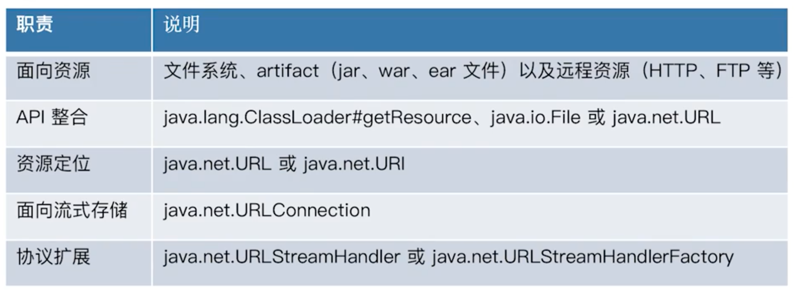
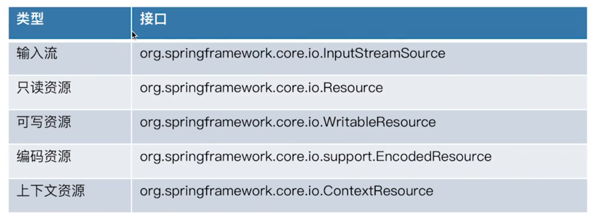
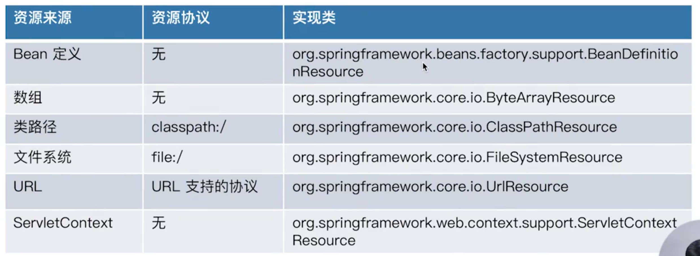
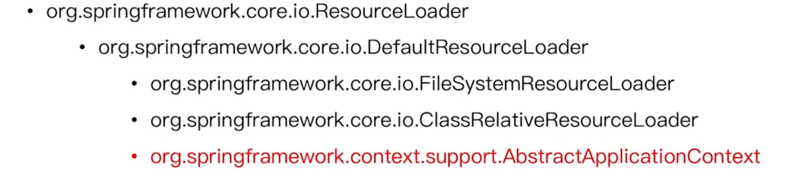
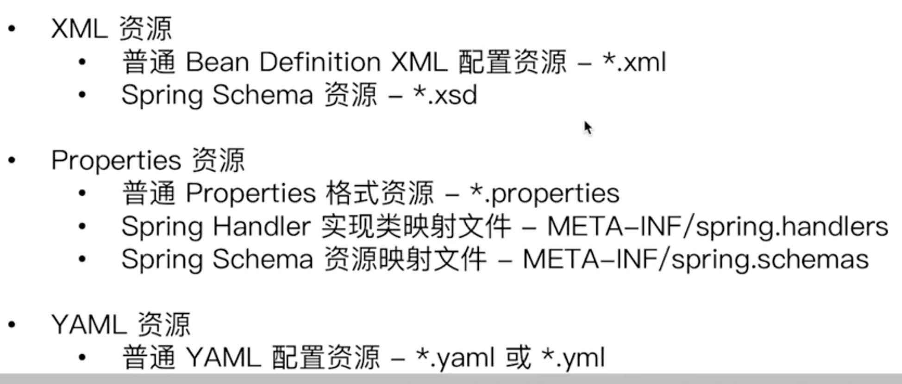
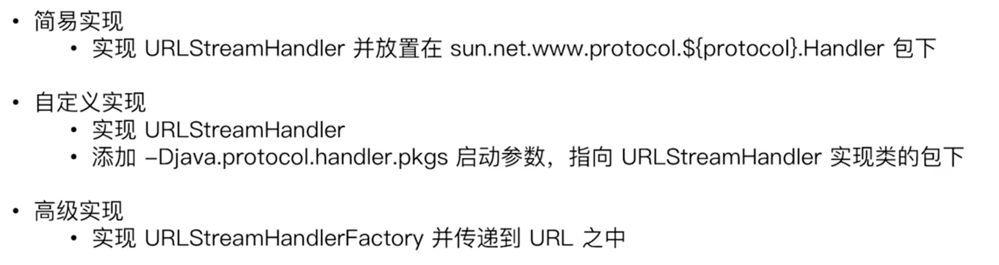

## java标准资源定位



## spring资源接口



## Spring Resource实现



`Resource`可以理解为对java中的一系列资源（包括网络、文件系统、类加载等）进行了一个统一的封装处理。

## Spring资源加载器



## Spring资源路径匹配器

- PathMatcher：指定了资源的匹配的格式，例如蚂蚁式的匹配
- ResourcePatternResolver：具体对资源的解析过程，通过不同的资源匹配格式来进行解析，其中的PathMatcher默认使用的是AntPathMatcher

```java
public class CustomizedResourcePatternResolverDemo {
   public static void main(String[] args) throws IOException {
      String currentPath = "/" + System.getProperty("user.dir") + "/spring-framework/bean-lifecycle/src/main/java/com/shen/bean/lifecycle/";
      String locationPattern = currentPath + "*.java";
      PathMatchingResourcePatternResolver patternResolver = new PathMatchingResourcePatternResolver(new FileSystemResourceLoader());
      Resource[] resources = patternResolver.getResources(locationPattern);
      Stream.of(resources).map(ResourceUtils::getContent).forEach(System.out::println);
   }
}
```

## 注入Resource对象实例

```java
public class InjectingResourceDemo {
   @Value("classpath:/META-INF/user.properties")
   private Resource resource;

   @Value("${user.dir}")
   private String dirStr;

   @Value("classpath*:/META-INF/*.properties")
   private Resource[] resources;

   @PostConstruct
   public void init() {
      System.out.println("resource:" + ResourceUtils.getContent(resource));
      System.out.println("--------------");
      Stream.of(resources).map(ResourceUtils::getContent).forEach(System.out::println);
      System.out.println("--------------");
      System.out.println(dirStr);
   }

   public static void main(String[] args) {
      AnnotationConfigApplicationContext annotationConfigApplicationContext = new AnnotationConfigApplicationContext();
      annotationConfigApplicationContext.register(InjectingResourceDemo.class);
      annotationConfigApplicationContext.refresh();
      annotationConfigApplicationContext.close();
   }
}
```

## 注入ResourceLoader对象实例

```java
public class InjectResourceLoaderDemo implements ResourceLoaderAware {

   private ResourceLoader resourceLoader;

   @Autowired
   private ResourceLoader resourceLoader2;

   @Autowired
   private AbstractApplicationContext abstractApplicationContext;

   @PostConstruct
   public void init() {
     // 几个都是一样的，因为在refresh的时候就会将applicationContext分别注入到resourceLoader和applicationContext中
      System.out.println(resourceLoader == resourceLoader2);
      System.out.println(resourceLoader == abstractApplicationContext);
   }

   public static void main(String[] args) {
      AnnotationConfigApplicationContext annotationConfigApplicationContext = new AnnotationConfigApplicationContext();
      annotationConfigApplicationContext.register(InjectResourceLoaderDemo.class);
      annotationConfigApplicationContext.refresh();
      annotationConfigApplicationContext.close();
   }

   @Override
   public void setResourceLoader(ResourceLoader resourceLoader) {
      this.resourceLoader = resourceLoader;
   }
}
```

## 面试题

> spring配置资源有哪些常见的类型

xml、properties、yaml

> 列举spring配置资源



> 扩展java标准资源管理



- 简易实现：自定义x协议的解析

  1. 在相应的包(sun.net.www.protocol.x)下面定义一个handler，用于返回一个`connection`
  2. 使用`connection`可以操作相应的关联资源

  ```java
  // 用于返回一个资源的连接
  public class Handler extends URLStreamHandler {
  
     @Override
     protected URLConnection openConnection(URL u) throws IOException {
        return new XURLConnection(u);
     }
  }
  ```

  ```java
  // 用于操作资源
  public class XURLConnection extends URLConnection {
  
     private final ClassPathResource resource;
  
     // 专门解析x协议的resource
     protected XURLConnection(URL url) {
        super(url);
        this.resource = new ClassPathResource(url.getPath());
     }
  
     @Override
     public void connect() throws IOException {
  
     }
  
     @Override
     public InputStream getInputStream() throws IOException {
        return resource.getInputStream();
     }
  }
  ```

  ```java
  public class HandlerTest {
     public static void main(String[] args) throws IOException {
        URL url = new URL("x:///META-INF/user.properties");
        URLConnection urlConnection = url.openConnection();
        InputStream inputStream = urlConnection.getInputStream();
        System.out.println(StreamUtils.copyToString(inputStream, Charset.forName("UTF-8")));
     }
  }
  ```

- 自定义实现

  只需要实现相应的handler，不需要放置在指定的包下，启动的时候配置参数即可。


