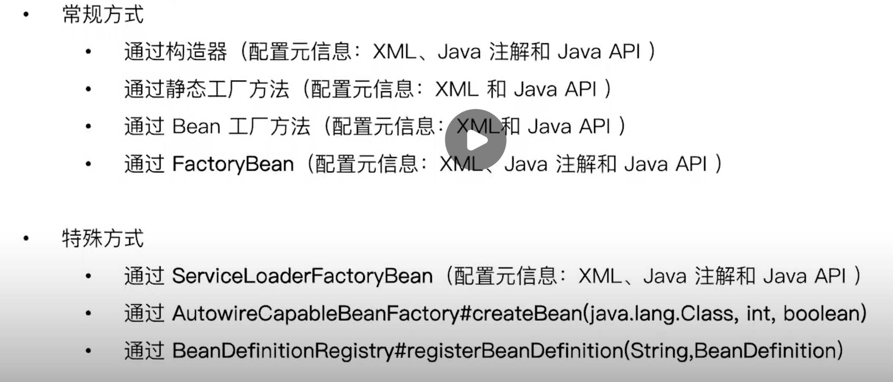

## BeanDefinition

> 理解

其实我们之前的依赖查找和依赖注入的模型都是`BeanDefinition`和`register`，beanDefinition可以有很多种：xml、注解、直接创建beanDefinition派生对象等，我们需要把beanDefinition源注入到register中：可以是Applicationcontext、BeanFactory等。

> Bean的名称生成方式

`BeanNameGenerator`：接口，xml方式使用默认的实现，注解（Component、service等）使用`AnnotationBeanNameGeneraton`实现。

> Bean的定位

可以通过id、名称、class等，也可以通过别名(alias)来查找。

```xml
<import resource="classpath:/META-INF/dependency-lookup-context.xml"/>
   <!--通过别名创建映射关系-->
<alias name="user" alias="shen-user"/>
```

```java
BeanFactory beanFactory = new ClassPathXmlApplicationContext("classpath:/META-INF/bean-definition-context.xml");
User user = (User) beanFactory.getBean("user");
User shenUser = (User) beanFactory.getBean("shen-user");
System.out.println(shenUser == user);
```

> 几种Bean的注册方式

```java
@Import(value = AnnotationBeanDefinitionDemo.ConfigTest.class)
public class AnnotationBeanDefinitionDemo {
  
   public static void main(String[] args) {
     	//1. 通过配置xml的方式，作为BeanDefinition
     
      //2. 通过注解的方式，拿到注解的beanFactory
      AnnotationConfigApplicationContext applicationContext = new AnnotationConfigApplicationContext();
      applicationContext.register(AnnotationBeanDefinitionDemo.class);
      //3. 通过手动定义beanDefinition
      registerUserBeanDefinition(applicationContext, "hand-user");
      registerUserBeanDefinition(applicationContext);
      // 刷新，启动beanFactory
      applicationContext.refresh();
      // 说明不会重复注册
      System.out.println(applicationContext.getBeansOfType(User.class));
      System.out.println(applicationContext.getBeansOfType(ConfigTest.class));
      applicationContext.close();
   }

   /**
    * 通过beanDefinition创建
    */
   public static void registerUserBeanDefinition(BeanDefinitionRegistry registry, String beanName) {
      // 创建bean的定义
      BeanDefinitionBuilder builder = BeanDefinitionBuilder.genericBeanDefinition(User.class);
      builder.addPropertyValue("id", 1L).addPropertyValue("name", "sxy");
      if (StringUtils.hasText(beanName)) {
         registry.registerBeanDefinition(beanName, builder.getBeanDefinition());
      } else {
         // 如果没有beanName
         BeanDefinitionReaderUtils.registerWithGeneratedName(builder.getBeanDefinition(),registry);
      }
   }

   /**
    * 自己创建名称
    * @param registry
    */
   public static void registerUserBeanDefinition(BeanDefinitionRegistry registry) {
      registerUserBeanDefinition(registry, null);
   }

   @Component
   public static class ConfigTest {
      @Bean
      public User getUser() {
         User user = new User();
         user.setId(1L);
         user.setName("小沈");
         return user;
      }

      @Override
      public String toString() {
         return "ConfigTest{}";
      }
   }
}
```

## Bean的实例化的几种方式



1. 通过构造器创建

2. 通过静态方法：

```xml
<bean id="user-by-static-method" class="dependency.domain.User"
factory-method="createUser">
</bean>
```

3. 通过Bean工厂方法

```xml
<bean id="user-by-instant-method" factory-bean="userFactory" factory-method="createUser"/>
<bean id="userFactory" class="com.shen.bean.study.factory.UserFactoryImpl"/>
```

4. 通过`factoryBean`构建复杂bean对象

   1. 先实现FactoryBean接口

      ```java
      public class UserFactoryBean implements FactoryBean<User> {
         @Override
         public User getObject() throws Exception {
            return User.createUser();
         }
      
         @Override
         public Class<?> getObjectType() {
            return User.class;
         }
      }
      ```

   2. xml配置：

      ```xml
      <!-- 使用FactoryBean来创建-->
      <bean id="user-by-factory-method" class="com.shen.bean.study.factory.UserFactoryBean"/>
      ```

5. 直接创建bean对象：

```java
ApplicationContext applicationContext = new ClassPathXmlApplicationContext("classpath:/META-INF/service-loader-bean-instantiation-context.xml");
AutowireCapableBeanFactory autowireCapableBeanFactory = applicationContext.getAutowireCapableBeanFactory();
System.out.println("-----------使用AutowireCapableBeanFactory，不用xml中配置bean的方式，直接就能创建bean----------------");
IUserFactory userFactory = autowireCapableBeanFactory.createBean(UserFactoryImpl2.class);
System.out.println(userFactory.createUser());
```

6. 使用`serviceLoader`创建bean

   - ServiceLoader：

     1. 在`META-INF.services`下创建相应的路径文件，文件名称就是相应接口的包路径。
     2. 可以通过ServiceLoader静态方法拿到一个`ServiceLoader`对象：

     ```java
     public static void domoServiceLoader() {
       // ServiceLoader用来创建文件中的所有实现类的bean对象，可以遍历
        ServiceLoader<IUserFactory> load = ServiceLoader.load(IUserFactory.class, Thread.currentThread().getContextClassLoader());
        Iterator<IUserFactory> iterator = load.iterator();
        while (iterator.hasNext()) {
           System.out.println(iterator.next().createUser());
        }
     }
     ```

   - 配合工厂bean使用：

     ```xml
     <bean id="userFactoryServiceLoader" class="org.springframework.beans.factory.serviceloader.ServiceLoaderFactoryBean">
        <property name="serviceType" value="com.shen.bean.study.factory.IUserFactory"/>
     </bean>
     ```

     `ServiceLoaderFactoryBean`是专门用来创建`ServiceLoader`的工厂，`serviceType`代表了上述相应的接口。

     通过如下拿到相应的`ServiceLoader`对象，就能拿到相应的实现bean：

     ```java
     ServiceLoader<IUserFactory> serviceLoader = applicationContext.getBean("userFactoryServiceLoader", ServiceLoader.class);
     ```


## 初始化bean的几种方式

1. 使用@PostConstruct注解（java注解，在创建对象的时候默认执行）
2. 使用自定义注解：包括在xml中配置，在@Bean中配置
3. 实现它的InitializingBean接口

```java
public class UserFactoryImpl2 implements IUserFactory, InitializingBean {

   /**
    * 初始化bean自动回调
    */
   @PostConstruct
   public void init() {
      System.out.println("UserFactoryImpl2进行了PostConstruct初始化");
   }

   /**
    * 测试bean注解初始化方法
    */
   public void initUserFactory() {
      System.out.println("UserFactoryImpl2进行了initUserFactory初始化");
   }

   @Override
   public User createUser() {
      User user = new User();
      user.setId(1L);
      user.setName("test");
      return user;
   }

   /**
    * 实现初始化bean
    * @throws Exception
    */
   @Override
   public void afterPropertiesSet() throws Exception {
      System.out.println("UserFactoryImpl2进行了afterPropertiesSet初始化");
   }
}
```

```java
@Bean(initMethod = "initUserFactory")
// 或者使用xml：<bean init-method="initUserFactory">
public IUserFactory getUserFactory() {
   return new UserFactoryImpl2();
}
```

> 这几种初始化方式的执行顺序

UserFactoryImpl2进行了PostConstruct初始化
UserFactoryImpl2进行了afterPropertiesSet初始化
UserFactoryImpl2进行了initUserFactory初始化

> 延迟初始化

使用`@Lazy`注解或者xml配置的方式。

作用：在应用上下文刷新refresh操作的时候不会将bean进行初始化，只有在进行依赖查找和注入等操作的时候才会进行相应的初始化。

## bean的销毁操作

和初始化基本一致，也是三种方法：

```java
@PreDestroy
public void preDestory() {
   System.out.println("UserFactoryImpl2进行了@PreDestroy销毁");
}

/**
 * bean销毁回调，实现DisposableBean接口
 * @throws Exception
 */
@Override
public void destroy() throws Exception {
   System.out.println("UserFactoryImpl2进行了destroy销毁");
}
// bean上写：destroyMethod = "destoryUserFactory"
public void destoryUserFactory() {
   System.out.println("UserFactoryImpl2进行了destoryUserFactory销毁");
}
```

> 执行顺序

UserFactoryImpl2进行了@PreDestroy销毁
UserFactoryImpl2进行了destroy销毁
UserFactoryImpl2进行了destoryUserFactory销毁

> 执行时机

在调用上下文close的时候执行。

## bean的垃圾回收

当bean所在的spring容器如果被`close()`了以后，那么此时bean没有被引用，是可以被jvm回收的。

## BeanDefinition剖析

作用：这个说白了就是定义一个bean，里面有相应的属性，包括是否为primary、bean的作用域等、等同与xml中可以配置的属性。