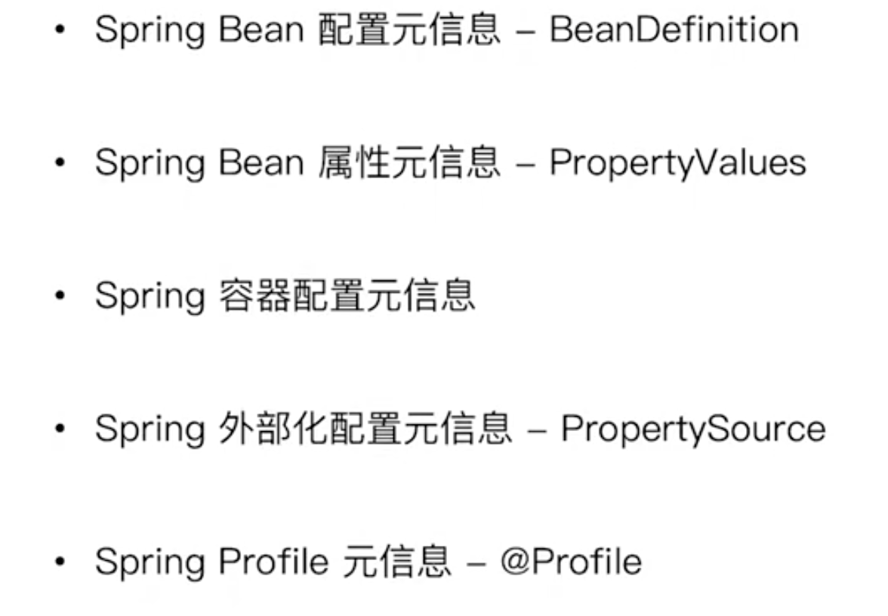

## spring配置元信息



## 容器配置元信息


> 对xml的理解

```xml
<beans xmlns="http://www.springframework.org/schema/beans"
      xmlns:xsi="http://www.w3.org/2001/XMLSchema-instance"
      xsi:schemaLocation="http://www.springframework.org/schema/beans
        https://www.springframework.org/schema/beans/spring-beans.xsd">
```

上面的这个引用schema其实就是一种xml规范，可以理解为一种像json一样的格式；spring在其中自定义了一些标签，只要你在自己的xml中按照它那样的规范来写的话，就能被spring正确的解析。

## 基于xml资源装载spring bean配置元信息


### 实现流程

1. 通过reader的loadBeanDefinition()进入

2. 通过`resourceLoader`拿到相应的xml对应的`Resource`资源对象

3. 在`registerBeanDefinitions()`中拿到`BeanDefinitionDocumentReader`对象，执行`registerBeanDefinitions`来进行创建相应的beanDefinition

4. 在`BeanDefinitionDocumentReader`中的`doRegisterBeanDefinitions`中开始迭代解析xml，在`parseBeanDefinition()`中进行bean的相关属性的解析封装成`BeanDefinitionHolder`，送入registry中：

   `BeanDefinitionReaderUtils.registerBeanDefinition(bdHolder, getReaderContext().getRegistry());`

## 基于properties来装载bean配置元信息

> 语法

使用`user.(class)`的方式来指定相应的bean属性，例如class、lazy-init等，具体属性通过`PropertiesBeanDefinitionReader`中的常量查看。

> 流程

1. 和xml的方式基本类似，使用`PropertiesBeanDefinitionReader`，具体是在`public int registerBeanDefinitions(Map<?, ?> map, @Nullable String prefix, String resourceDescription)`方法中实现。
2. 其中的具体逻辑：properties的解析方式是只要碰到了相应的前缀，例如user.id中的user，那么就直接使用user来将`BeanDefinition`对象封装出来，接下来只要有user的前缀都不管了；这样可以有效避免多个properties中都定义了user造成重复的注册。

> 为什么不用properties

通过源码发现，一个properties文件是通过一个prefix来进行区分的，如果一个properties中想定义多个user，但是id不一样，还需要使用多个properties，使用不同的prefix来区分，非常麻烦。

## 基于java注解装载bean配置元信息

基本同上，使用AnnotatedBeanDefinitionReader

## 基于xml资源装载ioc配置元信息

> 两个重要的配置文件

spring.handlers和spring.schemas，后者主要是建立xml配置的本地映射，而前者是指定对相应的映射字段的解析类。

> 在spring中的应用

```java
if (delegate.isDefaultNamespace(ele)) {
   parseDefaultElement(ele, delegate);
               // 如果该节点非默认命名空间，执行自定义解析
} else {
   delegate.parseCustomElement(ele);
}
```

- 在`DefaultBeanDefinitionDocumentReader`中的`parseBeanDefinitions`方法，如果是spring默认的命名空间，即`http://www.springframework.org/schema/beans`，就使用默认的解析方法，直接在element中将相应的属性取出。
- 如果不是默认的命名空间，例如context或者自定义namespace，那么就会在spring.handlers文件中进行键值对的匹配，取出相应的解析类来进行解析。

> 自定义解析

## 基于java注解装载ioc配置元信息

- @ImportResource：加载xml元信息
- @Import：加载类元信息
- @PropertySource：加载properties文件元信息

## properties进行外部化配置

```java
@ImportResource("classpath:/META-INF/dependency-lookup-context.xml")
@Import(User.class)
// 这个只是作为资源文件进行加载，不会按照bean来加载存放到容器中。
// 如果需要使用properties作为bean的容器资源，此时需要使用propertyReader来进行操作
@PropertySource("classpath:/META-INF/user.properties")
public class AnnotatedSpringIocContainerDemo {
   public static void main(String[] args) {
      AnnotationConfigApplicationContext context = new AnnotationConfigApplicationContext();
      context.register(AnnotatedSpringIocContainerDemo.class);

      context.refresh();

      Map<String, User> beansOfType = context.getBeansOfType(User.class);
      System.out.println("--------------------");
      for (User value : beansOfType.values()) {
         System.out.println(value);
      }
      System.out.println("--------------------");
      System.out.println(context.getBean(User.class));
      System.out.println("--------------------");
      context.close();
   }
}

```

```java
@PropertySource("classpath:/META-INF/user.properties")
public class PropertySourceDemo {
   /**
    * @param id
    * @param name：默认使用的是系统中自带的user.name，因为系统中存在相应的properties资源，如果需要修改成自己的则需要在链表前面链上相应的properties
    * @return
    */
   @Bean
   public User getUser(@Value("${user.id}") Long id, @Value("${user.name}") String name) {
      User user = new User();
      user.setId(id);
      user.setName(name);
      return user;
   }

   public static void main(String[] args) {
      AnnotationConfigApplicationContext context = new AnnotationConfigApplicationContext();
      context.register(PropertySourceDemo.class);
      context.getEnvironment().getPropertySources().addFirst(new MapPropertySource("first-property-source",
            new HashMap<String, Object>() {{put("user.name", "shenge");}}));
      context.refresh();

      Map<String, User> beansOfType = context.getBeansOfType(User.class);
      System.out.println("--------------------");
      for (User value : beansOfType.values()) {
         System.out.println(value);
      }
      System.out.println("--------------------");
      context.close();
   }
}
```

## YAML进行外部化配置

## 面试题

> spring内建的xml schema常见有哪些

- beans
- context：注解驱动
- aop：拦截
- tx：事务
- util、tool等

> spring配置元信息具体有哪些

- bean
- ioc（beans）
- 外部化配置PropertySource
- profile：条件分支


