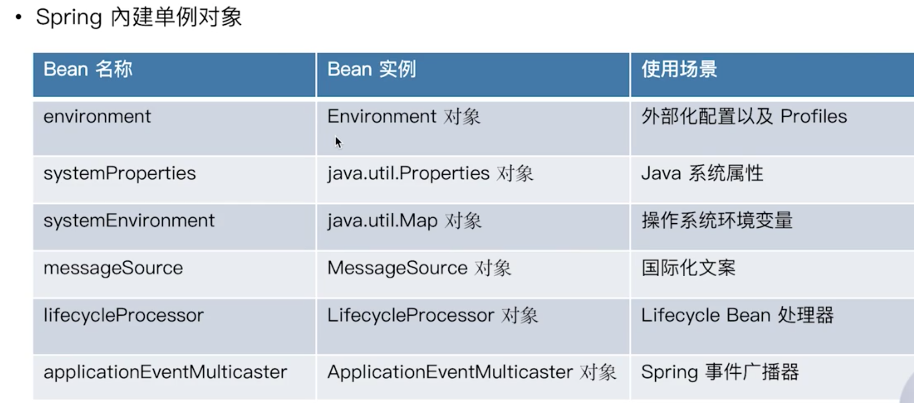
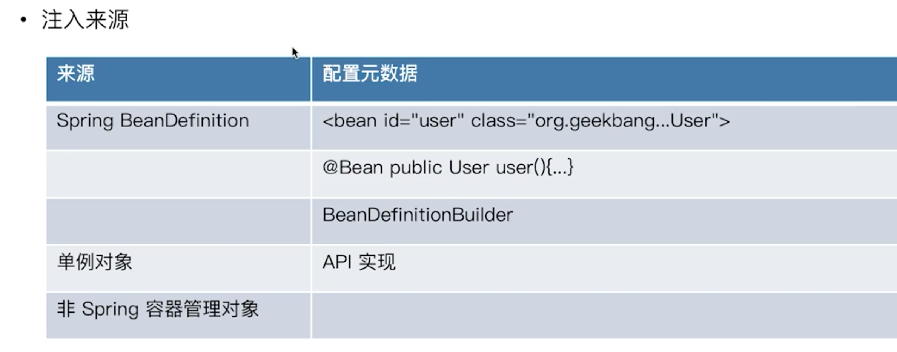
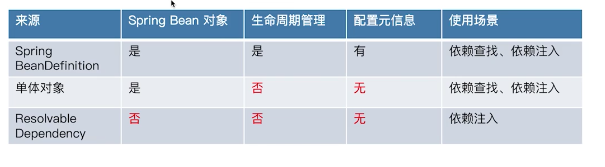
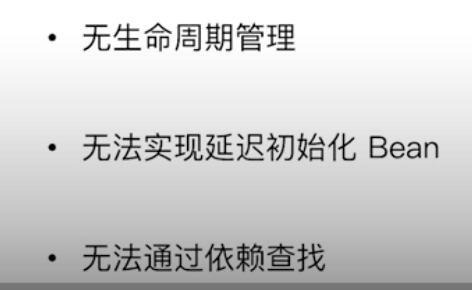

## 来源

### 依赖查找来源




### 依赖注入来源



### 区别

spring依赖注入的来源相比于依赖查找来源多了一个非spring容器管理对象，下面这些只能通过注入，不能通过`getBean`进行依赖查找：

```java
// 如果需要实现类似的功能，可以通过如下方式手动注册，默认注册了以下四种
beanFactory.registerResolvableDependency(BeanFactory.class, beanFactory);
beanFactory.registerResolvableDependency(ResourceLoader.class, this);
beanFactory.registerResolvableDependency(ApplicationEventPublisher.class, this);
beanFactory.registerResolvableDependency(ApplicationContext.class, this);
```

> 总结

Spring IOC的三种依赖来源，自定义注册的Spring bean、内建的Spring bean以及内建的可注入的依赖(不是严格意义上的bean，只是后面可能在注入中用到)，其中自定义注册的Spring bean基本上是通过xml、注解或者api注册BeanDefination创建的，内建的Spring bean是通过registerSingleton()创建的，内建的可注入的依赖是通过registerResolveDependency()创建的，后续如果我们需要往Spring容器里放入一些非Spring托管的bean但又可以被依赖注入的, 可以通过registerResolveDependency() API实现。



## Spring Bean来源


> 注册自定义BeanDefinition

默认实现就是`DefaultListableBeanFactory`中的`registerBeanDefinition`，将相应的BeanDefinition注册到map中，并使用一个List存储顺序。

> 单体对象作为来源

这里的单体对象指的是由外部初始化(new)的对象，spring不会对其生命周期管理：

```java
UserFactoryImpl userFactory = new UserFactoryImpl();
ConfigurableListableBeanFactory beanFactory = applicationContext.getBeanFactory();
// 直接注册
beanFactory.registerSingleton("userFactory", userFactory);
```


> ResolvableDependency作为来源

仅仅用于依赖注入

> 外部化配置作为依赖来源

使用@Value实现



## 面试题

> 依赖注入和查找的来源是否相同？

不相同，查找仅仅来源于自定义beanDefinition和单例bean。


