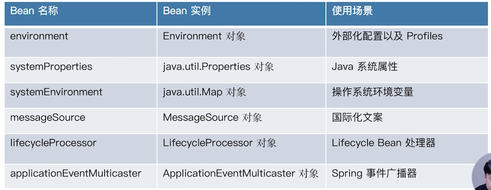
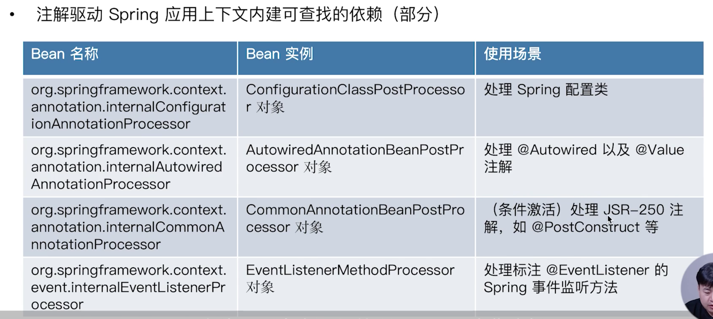
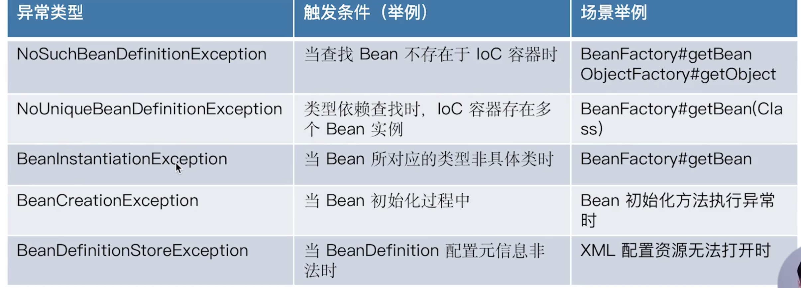
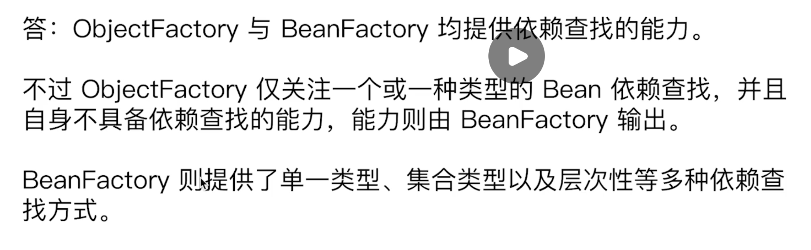

## 历史

在java beans里面就存在了，spring借鉴了。

## ListableBeanFactory

> 注意点

管理bean的集合工厂。

- 在相应的查找方法中传入`Class`，会将所有的子类`bean`都查出来。

- 其中`getBeanNamesForType(Class)`只是拿到bean的名称，并不会创造bean的实例，也不会对bean的初始化。
- `getBeansOfType(Class)`会拿到相应的bean实例，如果没有初始化会将相应的bean初始化，如果是只想查找bean的存在的话，最好不要使用这个方法，可能会造成bean的过早初始化，造成一些问题。

## 层次依赖树HierarchicalBeanFactory

> 概念

只要相应的BeanFactory继承了`HierarchicalBeanFactory`这个接口，那么这个工厂就能配置相应的`parentaFactory`，这种应用场景一般应用于需要引用别的`applicationContext`中的相应的bean的时候，就可以直接将这个context设置为parent factory。

> 使用

```java
AnnotationConfigApplicationContext applicationContext = new AnnotationConfigApplicationContext();
applicationContext.register(ObjectProviderDemo.class);

ConfigurableListableBeanFactory beanFactory = applicationContext.getBeanFactory();
// 设置parent factory
beanFactory.setParentBeanFactory(createBeanFactory());
BeanFactory parentBeanFactory = beanFactory.getParentBeanFactory();

/**
 * 如果父bean容器存在也会返回true，如果是之前的版本可以使用递归的方式进行user的查找。
 */
System.out.println(beanFactory.containsBean("user"));
System.out.println(parentBeanFactory.containsBean("user"));
// 查看源码，会递归父beanFactory来查找。
User user = beanFactory.getBean("user", User.class);
System.out.println(user);
applicationContext.refresh();
applicationContext.close();
```

## 依赖查找的安全性

- 使用`BeanFactory`和`ObjectFactory`这种单一类型的依赖查找api，如果当bean不存在的时候，会报出相应的异常。
- 与之对应，我们可以使用`ListableBeanFactory`和`ObjectProvider`中的一些api来进行依赖查找，在出现bean查不到的时候不会抛出异常。
- 推荐使用：`ObjectProvider`，既可以查找集合类型，也能查找单一类型。

```java
public class TypeSafetyLookupDemo {
   public static void main(String[] args) {
      AnnotationConfigApplicationContext applicationContext = new AnnotationConfigApplicationContext();
      applicationContext.register(TypeSafetyLookupDemo.class);
      // 如果这个放到最下面，不管怎么样都会抛出异常，因为在AbstractApplicationContext#getBean#assertBeanFactoryActive就被判断没有启动，就被拦截了...
      // 我们说的安全性指的是在刷新容器的前提之下进行的...
      applicationContext.refresh();

      lookupBygetBean(applicationContext);
      lookupBygetBeansOfType(applicationContext);
      lookupByObjectProvider(applicationContext);
      lookupBygetObject(applicationContext);
      lookupBygetIfAvailable(applicationContext);

      applicationContext.close();
   }

   private static void lookupBygetObject(AnnotationConfigApplicationContext applicationContext) {
      ObjectProvider<User> beanProvider = applicationContext.getBeanProvider(User.class);
      printBeansException("lookupBygetObject", () -> beanProvider.getObject());
   }

   private static void lookupByObjectProvider(AnnotationConfigApplicationContext applicationContext) {
      ObjectProvider<User> beanProvider = applicationContext.getBeanProvider(User.class);
      printBeansException("lookupByObjectProvider", () -> beanProvider.forEach(System.out::println));
   }

   private static void lookupBygetIfAvailable(AnnotationConfigApplicationContext applicationContext) {
      ObjectProvider<User> beanProvider = applicationContext.getBeanProvider(User.class);
      printBeansException("lookupBygetIfAvailable", () -> beanProvider.getIfAvailable());
   }

   /**
    * 这个是使用ListableBeanFactory的api，不会报异常
    * @param applicationContext
    */
   private static void lookupBygetBeansOfType(AnnotationConfigApplicationContext applicationContext) {
      printBeansException("lookupBygetBeansOfType", () -> applicationContext.getBeansOfType(User.class));
   }

   private static void lookupBygetBean(AnnotationConfigApplicationContext applicationContext) {
      printBeansException("lookupBygetBean", () -> applicationContext.getBean(User.class));
   }

   private static void printBeansException(String source, Runnable runnable) {
      System.out.println("===============================");
      System.out.println("Source from : " + source);
      try {
         runnable.run();
      } catch (BeansException e) {
         e.printStackTrace();
      }
   }

}
```

## spring内置依赖

#### ApplicationContext内建依赖





## 依赖查找的经典异常



> 解释

- `BeanInstantiationException`：当注册的bean不是一个具体类的时候。

```java
public static void main(String[] args) {
   AnnotationConfigApplicationContext applicationContext = new AnnotationConfigApplicationContext();
  // 使用一个接口，非具体类
   BeanDefinitionBuilder builder = BeanDefinitionBuilder.genericBeanDefinition(IUserFactory.class);
   applicationContext.registerBeanDefinition("errorBean", builder.getBeanDefinition());
   applicationContext.refresh();
   applicationContext.close();
}
```

## 面试题

- `BeanFactory`和`ObjectFactory`的区别



- getBean操作是否线程安全？

  是的，可以通过查看BeanFactory的默认实现`DefaultListableBeanFactory`的源码。 


