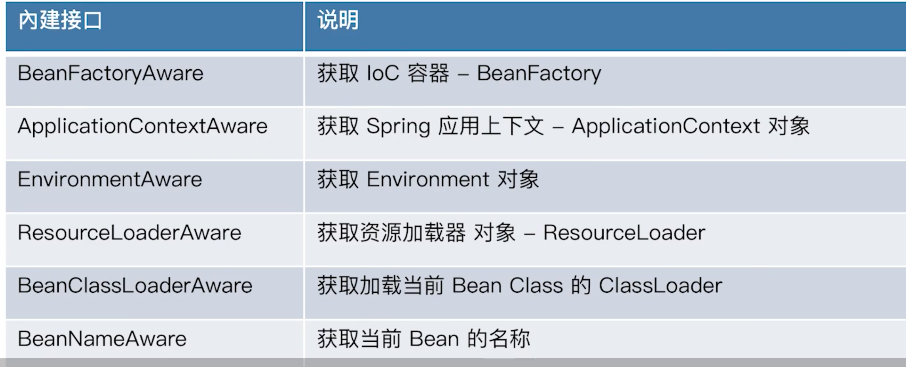
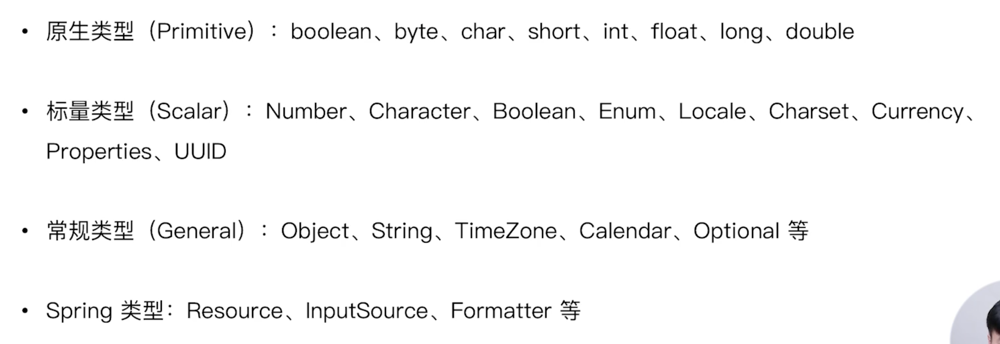

## 自动绑定Autowiring

- byName
- byType
- constructor
- no：不使用自动绑定

> 限制

自动绑定有弊端，不能进行精确的绑定。

## 几种常见的注入方式

### setter

可以使用注解、xml、api等方式实现：

```java
public class XmlDependencySetterInjectionDemo {
   public static void main(String[] args) {
      AnnotationConfigApplicationContext applicationContext = new AnnotationConfigApplicationContext();
//    applicationContext.register(XmlDependencySetterInjectionDemo.class);

      // 可以重复注册BeanDefinition
      applicationContext.registerBeanDefinition("beanDefinition", createBeanDefinition());

      // 使用
      XmlBeanDefinitionReader xmlBeanDefinitionReader = new XmlBeanDefinitionReader(applicationContext);
      xmlBeanDefinitionReader.loadBeanDefinitions("classpath:/META-INF/injection-context.xml");
      applicationContext.refresh();

      UserHolder bean = applicationContext.getBean(UserHolder.class);
      System.out.println(bean);

      applicationContext.close();
   }

   @Bean
   public UserHolder getUserHolder(User user) {
      return new UserHolder(user);
   }

   /**
    * 使用api方式
    * @return
    */
   public static BeanDefinition createBeanDefinition() {
      BeanDefinitionBuilder beanDefinitionBuilder = BeanDefinitionBuilder.genericBeanDefinition(UserHolder.class);
      beanDefinitionBuilder.addPropertyReference("user", "superUser");
      return beanDefinitionBuilder.getBeanDefinition();
   }
}
```

### 构造器注入

- 和setter注入类似，只是setter注入的顺序不是固定的，如果字段之前存在依赖等不确定性，那么就会出现错误。
- Constructor注入能够保证线程安全。
- 推荐使用构造器注入。

### 字段注入

使用@Autowired或者@Resource

> 注意

如果注入static会失败，详情见`AutowiredAnnotationBeanPostProcessor`

```java
public class AutoAndResourceInjectionDemo {

	@Autowired
	public UserHolder userHolder;

	@Resource
	public UserHolder userHolder2;

	public static void main(String[] args) {
		AnnotationConfigApplicationContext applicationContext = new AnnotationConfigApplicationContext();
		applicationContext.register(AutoAndResourceInjectionDemo.class);

		// 送一个注册中心进去
		XmlBeanDefinitionReader xmlBeanDefinitionReader = new XmlBeanDefinitionReader(applicationContext);
		xmlBeanDefinitionReader.loadBeanDefinitions("classpath:/META-INF/autowiring-injection-context.xml");

		applicationContext.refresh();
//		UserHolder bean = applicationContext.getBean(UserHolder.class);
		AutoAndResourceInjectionDemo contextBean = applicationContext.getBean(AutoAndResourceInjectionDemo.class);
		UserHolder userHolder = contextBean.userHolder;
		System.out.println(userHolder);
		UserHolder userHolder2 = contextBean.userHolder2;
		System.out.println(userHolder2);

		System.out.println(userHolder == userHolder2);
	}

	/**
	 * 默认是单例模式
	 * @param user
	 * @return
	 */
	@Bean
	public UserHolder getUserHolder(User user) {
		return new UserHolder(user);
	}
}
```

### 方法注入

使用如下的方法将相应的bean通过方法参数的方式进行注入：

```java
@Autowired
public void init1(UserHolder userHolder) {
   this.userHolder = userHolder;
}

@Resource
public void init2(UserHolder userHolder) {
   this.userHolder2 = userHolder;
}
```

### 接口回调注入



实现相应的接口，我们就可以在依赖注入的时候把相应的内建bean通过方法参数的方式进行注入。

```java
public class AwareInterfaceInjectionDemo implements BeanFactoryAware, ApplicationContextAware {

   private BeanFactory beanFactory;

   private ApplicationContext applicationContext;

   public static void main(String[] args) {
      AnnotationConfigApplicationContext applicationContext = new AnnotationConfigApplicationContext();

      applicationContext.register(AwareInterfaceInjectionDemo.class);

      applicationContext.refresh();

      AwareInterfaceInjectionDemo contextBean = applicationContext.getBean(AwareInterfaceInjectionDemo.class);
      System.out.println(contextBean.beanFactory);
      System.out.println(contextBean.applicationContext);
      System.out.println(contextBean.beanFactory == applicationContext.getBeanFactory());
      System.out.println(contextBean.applicationContext == applicationContext);
      applicationContext.close();
   }

   @Override
   public void setBeanFactory(BeanFactory beanFactory) throws BeansException {
      this.beanFactory = beanFactory;
   }

   @Override
   public void setApplicationContext(ApplicationContext applicationContext) throws BeansException {
      this.applicationContext = applicationContext;
   }
}
```

### 注入方式选型

低依赖使用构造器注入，高依赖使用setter方法注入（但是前后的注入如果有依赖就会出问题，因为注入顺序不定）。

### 基础类型注入



上述类型都能在xml文件注入配置中将相应的字符或者字符串进行转换而成。

### 集合类型注入

```xml
    <bean id="user" class="dependency.domain.User">
      <property name="id" value="1"/>
      <property name="name" value="haha"/>
      <property name="city" value="SHANGHAI"/>
      <property name="workCities" value="SHANGHAI,CHENGDU"/>
<!--      <property name="lifeCities" value="SHANGHAI,CHENGDU"/>-->
      <property name="lifeCities">
         <list>
            <value>SHANGHAI</value>
            <value>CHENGDU</value>
         </list>
      </property>
   </bean>
```

```java
private Long id;

private String name;

private City city;

private City[] workCities;

private List<City> lifeCities;
```

可以通过`,`的方式或者通过配置list的方式进行注入。

### 限定注入Qualifier

```java
public class QualifierAnnotationDependencyInjectDemo {

   @Autowired
   Collection<User> allUsers;  // user + superUser

   @Autowired
   @Qualifier
   Collection<User> qualifierUsers;  // 注入Qualifier

   @Autowired
   @Qualifier("user")
   User user1;     // user

   @Autowired
   User user2;  // 默认primary


   public static void main(String[] args) {
      AnnotationConfigApplicationContext applicationContext = new AnnotationConfigApplicationContext();
      applicationContext.register(QualifierAnnotationDependencyInjectDemo.class);
      XmlBeanDefinitionReader xmlBeanDefinitionReader = new XmlBeanDefinitionReader(applicationContext);
      xmlBeanDefinitionReader.loadBeanDefinitions("classpath:/META-INF/injection-context.xml");

      System.out.println("此时开始刷新全局上下文...");
      applicationContext.refresh();

      QualifierAnnotationDependencyInjectDemo contextBean = applicationContext.getBean(QualifierAnnotationDependencyInjectDemo.class);
      System.out.println("allUsers:" + contextBean.allUsers);  // 输出的是当前上下文除了Qualifier的所有bean
      System.out.println("qualifierUsers:" + contextBean.qualifierUsers);  // 输出的是当前上下文所有Qualifier的bean
      System.out.println("user1:" + contextBean.user1);  // 输出的是指定对象
      System.out.println("user2:" + contextBean.user2);  // 输出的是primary bean
      applicationContext.close();
   }

   @Bean
   @Qualifier
   public User user1() {
      User user = new User();
      user.setId(3L);
      return user;
   }

   @Bean
   @Qualifier
   public User user2() {
      User user = new User();
      user.setId(4L);
      return user;
   }
}
```

> @Qualifier注解的扩展

主要目的是实现逻辑或者物理上的一种分组。

```java
@Target({ElementType.FIELD, ElementType.METHOD, ElementType.PARAMETER, ElementType.TYPE, ElementType.ANNOTATION_TYPE})
@Retention(RetentionPolicy.RUNTIME)
@Inherited
@Documented
@Qualifier
public @interface UserGroup {

}
```

此时使用UserGroup，那么只会检索到被@UserGroup标记的bean；此时@Qualifier注入也会将UserGroup标记的bean注入

```java
@Autowired
@UserGroup
Collection<User> userGroups;  // 注入Qualifier

@Bean
@UserGroup
public User user3() {
	User user = new User();
	user.setId(5L);
	return user;
}
```

### 延迟注入

和延迟查找类似：

```java
@Autowired
private ObjectProvider<User> userObjectProvider; // 延迟注入
```


## 依赖注入原理解析

> 步骤

1. 元信息解析
2. 依赖查找（处理）
3. 依赖注入

### 元信息解析

主要使用类：AutowiredAnnotationBeanPostProcessor

1. 会先进行`postProcessMergedBeanDefinition`，将相应的bean的`InjectionMetadata`创建并加入缓存中。
2. 执行`postProcessProperties`，找出相应的`InjectionMetadata`，对于其中需要注入的元素对象，会在`ListableFactoryBean`中的`descriptor.resolveCandidate(autowiredBeanName, type, this);`中，通过getBean来进行创建，然后再将拿到的对象通过反射依赖注入。

### 依赖处理

通过`DefaultListableBeanFactory`中的`resolveDependency`方法进行解析：

1. 判断是否懒加载-->doResolveDependency()-->
2. 判断是否是多类型的bean resolveMultipleBeans()-->
3. 根据类型查找匹配到的bean findAutowireCandidates()-->
4. bean个数大于1,选择bean即@Primary修饰 determineAutowireCandidate()--->返回结果
5. 通过`resolveCandidate`将相应的@Primary转换成一个对象(中间如果没有在bean中，会再进行元信息解析，将其初始化为一个bean)。

### 依赖注入规则

通过反射的方式进行依赖注入：`field.set(bean, value);`

## jsr-330的@Inject

这个和@Autowired区别不大，是jsr-330相应的依赖注入方式，同样适用`AutowiredAnnotationBeanPostProcessor`来进行处理，如果没有jsr-330的支持，也不会报错：

```java
public AutowiredAnnotationBeanPostProcessor() {
   this.autowiredAnnotationTypes.add(Autowired.class);
   this.autowiredAnnotationTypes.add(Value.class);
   try {
      this.autowiredAnnotationTypes.add((Class<? extends Annotation>)
            ClassUtils.forName("javax.inject.Inject", AutowiredAnnotationBeanPostProcessor.class.getClassLoader()));
      logger.trace("JSR-330 'javax.inject.Inject' annotation found and supported for autowiring");
   }
   catch (ClassNotFoundException ex) {
      // JSR-330 API not available - simply skip.
   }
}
```

## @Resource和@EJB注入

上述的@Autowired使用的的是`AutowiredAnnotationBeanPostProcessor`进行处理的，而相应的@Resource和@EJB则使用的是`CommonAnnotationBeanPostProcessor`:

> 基本实现步骤

- `CommonAnnotationBeanPostProcessor`和`AutowiredAnnotationBeanPostProcessor`在bean的创建过程中都需要进行执行，他们的执行顺序根据他们的order字段定义，order小的先执行（根据ordered接口判断）。
- `CommonAnnotationBeanPostProcessor`相比于`AutowiredAnnotationBeanPostProcessor`不同的地方除了注入类型不同，还有就是能够对bean的`@PostConstruct`进行识别。

## 注入创建流程（总结）

1. 一般先将相应的`@Configration`类进行加载，如果其中有相应的注入方法或字段，优先将这些字段的bean创建。
2. 创建的流程一般会先走`CommonAnnotationBeanPostProcessor`，再走`AutowiredAnnotationBeanPostProcessor`，如果是@Resource标记的注解，会在`CommonAnnotationBeanPostProcessor`中就进行`InjectionMetadata`的创建和相应的流程(依赖查找)，如果是@Autowired标记的注解，一般会在后一个阶段`AutowiredAnnotationBeanPostProcessor`才会进行相应的依赖查找。
3. 如果相应的注入字段中存在`@PostConstruct`这类初始化或销毁的注解，会在第一个阶段`CommonAnnotationBeanPostProcessor`的父类相应的`findLifecycleMetadata`中创建相应的方法，然后再创建完bean之后（AbstractAutowireCapableBeanFactory），进行相应的初始化initializeBean。

```java
populateBean(beanName, mbd, instanceWrapper);
         // 调用初始化方法
exposedObject = initializeBean(beanName, exposedObject, mbd);
```

4. 在initializeBean中调用在之前`findLifecycleMetadata`中使用`this.lifecycleMetadataCache.put(clazz, metadata);`put进去的方法。

## 自定义注解解析

#### 自定义注解

```java
@Target({ElementType.CONSTRUCTOR, ElementType.METHOD, ElementType.PARAMETER, ElementType.FIELD, ElementType.ANNOTATION_TYPE})
@Retention(RetentionPolicy.RUNTIME)
@Documented
public @interface MyAutowired {
   boolean required() default true;
}
```

#### 定义注解解析器

```java
public class AutoAndResourceInjectionDemo {

   @Autowired
   @Qualifier("user")
   public User user1;

   @Autowired
   public User user2;

   @MyAutowired
   public User user3;

   /**
    * 使用static优先加载
    * @return
    */
   @Bean
   @Order(Ordered.LOWEST_PRECEDENCE - 4)
   public static AutowiredAnnotationBeanPostProcessor beanPostProcessor() {
      AutowiredAnnotationBeanPostProcessor processor = new AutowiredAnnotationBeanPostProcessor();
      processor.setAutowiredAnnotationType(MyAutowired.class);
      return processor;
   }

   public static void main(String[] args) {
      AnnotationConfigApplicationContext applicationContext = new AnnotationConfigApplicationContext();
      applicationContext.register(AutoAndResourceInjectionDemo.class);

      // 送一个注册中心进去
      XmlBeanDefinitionReader xmlBeanDefinitionReader = new XmlBeanDefinitionReader(applicationContext);
      xmlBeanDefinitionReader.loadBeanDefinitions("classpath:/META-INF/autowiring-injection-context.xml");

      applicationContext.refresh();

      AutoAndResourceInjectionDemo bean = applicationContext.getBean(AutoAndResourceInjectionDemo.class);

      System.out.println("user1 -> " + bean.user1);
      System.out.println("user2 -> " + bean.user2);
      System.out.println("user3 -> " + bean.user3);
   }
}
```

- 使用static，保证在`AutoAndResourceInjectionDemo`加载之前将自定义的`AutowiredAnnotationBeanPostProcessor`进行加载，这样就相当于除了`AutowiredAnnotationBeanPostProcessor`和`CommonAnnotationBeanPostProcessor`之外，又加了一个自定义的处理类。
- 如果不使用static，那么就会出现问题，通过调试发现，虽然会将自定义的`AutowiredAnnotationBeanPostProcessor`进行加载，但是`AutoAndResourceInjectionDemo`不会进行加载。
  - 原因：执行上下文的`refresh()`操作的时候，会执行`registerBeanPostProcessors`，所以会优先将`AutoAndResourceInjectionDemo`进行初始化，此时由于没有`processer`处理器，所以根本不会将其中的字段注入，之后将这个自定义`processor`拿到的时候，由于这个类已经初始化过了，系统就不会再对其进行@Autowired注入。

## 面试题

> 有多少种依赖注入的方式？

- 构造器
- setter
- 字段
- 方法
- 接口回调

> 构造注入区别

推荐使用构造器：线程安全、保证顺序。


