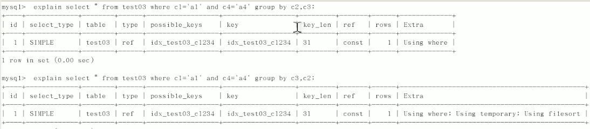

## mysql安装


服务器上的mysql是安装在docker中的。

## mysql配置文件

找到相应的my.cnf文件，进行相应的配置。

> 配置文件的组成

- `log-bin`：用于主从复制
- `log-error`：默认是关闭，记录启动和关闭的详细信息
- 慢查询日志
- frm文件：存放表结构
- myd：存放表数据
- myi：存放表索引

##  mysql的架构


**插件式的存储引擎将查询和其他系统任务以及数据的存储提取相分离。**

1. 连接层
2. 服务层
3. 引擎层
4. 存储层（文件系统）

## mysql存储引擎


## sql执行慢的原因

1. 查询语句写的烂
2. 索引失效
3. join
4. 服务器调优设置

> 手写sql顺序


> mysql机读顺序


> join查询关联

七种情况


## Explain语句性能解析

> mysql常见瓶颈

1. cpu饱和
2. io瓶颈
3. 硬件性能

> explain语句作用

用来解析分析mysql是如何优化运行你的sql语句的。


> 使用

explain+sql语句

> 表头格式


- id：select语句操作的顺序（表的读取顺序）

  - 如果是子查询，id大的优先级高，越先执行
  - id相同的从上到下执行

-  select_type：执行的操作类型

  

- type：

  https://www.cnblogs.com/benbenhan/articles/13212861.html

  

  - ALL：此时字段上没有建立索引，并且全表扫描主键，性能最差。
  - system：表中只有一条记录（等于系统表）
  - const：将常量送到where后面，通过索引一次就找到了，例如主键索引和唯一索引
  - eq_ref：和const不同在于const指定检索常量，而eq_ref一般用于联表中，后者扫描每一行，而前者只需要针对每一行的值进行唯一性检索
  - ref：非唯一性的索引检索，此时如果使用非唯一索引进行扫描，常量也会变成ref
  - range：使用索引检索的时候使用了between这种语句，这样需要通过索引定位到初始值，然后一个一个开始扫描。
  - index：在索引上进行全表扫描，例如扫描全表主键id。

- possible_keys和key
  - `possible_keys`显示可能应用在这张表中的索引，但是不一定实际查询的时候真实使用了。
  - key：实际最终用到的索引

- key_len：索引的长度

- ref： 此时用索引的值对应的到底是什么，也就是索引匹配的值是什么

- rows：估算需要查找多少行

  

- extra：

  - `Using fileSort`: 排序时没有使用到索引，性能差
  - `Using temporary`：使用临时表，性能差
  - `Using index`：
  - `using join buffer`：使用了连接缓存（为什么少用join）
  - `impossible where`：where总是false


## 索引

### 1. 原理

> 数据结构

使用b+树，由于其数据块与磁盘匹配，极大减少了io次数。

https://time.geekbang.org/column/article/69236

> 几个索引概念

1. 单值索引：一个索引只包含单列
2. 唯一索引：索引列的值必须唯一
3. 复合索引：索引列包含多列

> 语法


> **覆盖索引**

​	如果执行的语句是 select ID from T where k between 3 and 5，这时只需要查 ID 的值，而 ID 的值已经在 k 索引树上了，因此可以直接提供查询结果，不需要回表。也就是说，在这个查询里面，索引 k 已经“覆盖了”我们的查询需求，我们称为覆盖索引。

作用：减少树的搜索次数，提高性能


> 前缀索引

最左索引原则

> 索引下推

mysql5.6后，可以判断索引后再回表

https://time.geekbang.org/column/article/69636

### 2. 索引优缺点

- 优点：排序查找，查找的时候增加了速度。
- 缺点：占用空间、降低更新插入速度

> 建立索引规则

**1. 适合建立索引：**

- 主键
- 频繁查询
- 外键
- 按顺序order by查询
- 按顺序group by

**2. 不适合建立索引：**

- 频繁更新
- where用不到
- 表记录太少
- 某字段如果大量重复（例如：国籍中国）

> 注意事项

1. 尽量选择组合索引（注意最左前缀原则）
2. 查询中排序`order by`字段，如果按照索引顺序去访问将大大提高排序速度

### 3. 索引优化案例

> 单表优化

- 建表

```sql
CREATE TABLE IF NOT EXISTS `article` (
`id` INT(10) UNSIGNED NOT NULL PRIMARY KEY AUTO_INCREMENT, `author_id` INT(10) UNSIGNED NOT NULL, `category_id` INT(10) UNSIGNED NOT NULL, `views` INT(10) UNSIGNED NOT NULL, `comments` INT(10) UNSIGNED NOT NULL, `title`VARBINARY(255) NOT NULL, `content` TEXT NOT NULL);
INSERT INTO `article`(`author_id`,`category_id`, `views`, comments, title, `content`) VALUES
(1, 1, 1, 1,'1', '1'),
(2, 2, 2, 2, '2', '2'),
(1, 1, 3, 3, '3','3');
```

- 需要优化的sql：

  ```sql
  explain select id, author_id from article where category_id=1 and comments > 1 order by views limit 1;
  ```

- 建立索引：

  ```sql
  create index idx_article_ccv on article(comments, category_id, views);
  
  mysql> explain select id, author_id from article where comments > 1 and category_id = 1 order by views limit 1;
  +----+-------------+---------+------------+-------+-----------------+-----------------+---------+------+------+----------+---------------------------------------+
  | id | select_type | table   | partitions | type  | possible_keys   | key             | key_len | ref  | rows | filtered | Extra                                 |
  +----+-------------+---------+------------+-------+-----------------+-----------------+---------+------+------+----------+---------------------------------------+
  |  1 | SIMPLE      | article | NULL       | range | idx_article_ccv | idx_article_ccv | 4       | NULL |    2 |    33.33 | Using index condition; Using filesort |
  +----+-------------+---------+------------+-------+-----------------+-----------------+---------+------+------+----------+---------------------------------------+
  1 row in set, 1 warning (0.00 sec)
  // 此时用到了文件排序，需要进行优化
  ```

- 优化索引

  ```sql
  create index idx_article_cv on article(category_id, views);
  
  +----+-------------+---------+------------+------+--------------------------------+----------------+---------+-------+------+----------+-------------+
  | id | select_type | table   | partitions | type | possible_keys                  | key            | key_len | ref   | rows | filtered | Extra       |
  +----+-------------+---------+------------+------+--------------------------------+----------------+---------+-------+------+----------+-------------+
  |  1 | SIMPLE      | article | NULL       | ref  | idx_article_ccv,idx_article_cv | idx_article_cv | 4       | const |    2 |    66.67 | Using where |
  +----+-------------+---------+------------+------+--------------------------------+----------------+---------+-------+------+----------+-------------+
  1 row in set, 1 warning (0.00 sec)
  // 此时文件不再排序
  ```

> 两表优化

结论：左连接要在右表建立索引，右连接在左表建立索引。

因为对于左连接来说，左边必须要全部遍历，而在左边加索引其实也就是将all变成了index，而对于右边而言，是ref和all的区别。

> 三表优化

和两表连接类似。

> 结论

1. 使用小结果驱动大结果集，也就是在联表的时候，需要将数量小的表放在连接的驱动一侧，进行全表扫描。
2. 保证被join表用上索引。
3. 优先优化内层循环。

### 4. 索引失效


1. 如果不使用最佳左前缀法则，也就是没有最左字段的搜索，那么会变成全表扫描all；并且尽量不跳过索引中的列，如果跳过，那么索引不完全。（带头大哥不能死，中间兄弟不能断）

2. 索引上不能使用函数。

3. 范围之后全失效。

4. 尽量使用覆盖索引。

5. 索引中不能使用符号（例如>  !  <>  is null等）

   `explain select * from staffs where name != 'July'`

   `explain select * from staffs where name is null`

6. 在使用like语句的时候，需要把%放在右边才能使用到索引。

   > 如何解决`%xx%`无法使用索引的问题？

   **使用覆盖索引即可，如果查询结果在索引里，那么此时mysql会优化成使用使用索引遍历index；而如果结果不在覆盖索引中，mysql认为如果使用索引还要进行回表，那么此时会选择主键遍历all。**

7. varchar类型不能失去单引号，失去单引号会导致索引失效，因为mysql进行了整数到字符串的转换，也就是进行了第2条的操作（使用了函数）。

8. 使用or也有可能导致索引失效：

   `explain select * from staffs where name='July' or name='z3'`，在or的时候，mysql也要全表遍历，如果优化成index的话，由于此时返回的*，那么需要回表，此时mysql可能会选择all。

### 5. 面试题

> 注意点

1. group by：分组之前必排序，可能会产生临时表




## 查询截取分析

> 几种方法

1. 慢查询日志的开启和捕获
2. explain+慢sql分析
3. show profile查询sql的执行细节和生命周期
4. sql服务器参数调优

### 原则

#### 小表驱动大表


	> in和exists

- exists是先执行前面的查询，将结果进行exists后面查询条件的筛选。
- in是先执行in后面的语句，将后面的条件列出，再进行前面的遍历。

##### order by/group by排序优化

 如果没有使用到优化，而是使用了`filesort`，此时有两种算法，单路排序和双路排序。

- 双路排序：mysql4.1之前使用，先将所有需要排序的行中的需要排序字段取出进行排序，再通过排序字段取出其他字段，需要两次磁盘io。

- 单路排序：将需要排序的所有行都取出，直接在内存中排序，不需要第二次io，但是很占用buffer内存。

  > 单路的问题

  

  - 所以尽量少用select *，如果不能进行覆盖索引，也尽量取需要的字段。
  - 尽量提高sort_buffer_size，避免出现单路的问题，变成多路排序。

> 总结

- 排序方式：分为filesort和扫描索引有序排序
- 使用索引的最左前缀
- group by是先排序再分组，和order by类似


### 慢查询日志分析

#### 常用命令

- 查看是否开启：`show variables like '%slow_query_log%';`
  - 其中记录了相应的慢sql文件保存地址
- 开启慢查询日志：`set global slow_query_log=1;`，但是只能此时生效，关闭数据库就失效。
- 永久生效：修改`my.cnf`文件
- 查看慢查询的时间阈值：`show variable like '%long_query_time%';`
- 查询当前系统有多少条慢记录：`show global status like '%Slow_queries%';`

#### mysqldumpslow日志分析工具


#### 批量插入数据脚本测试

> 前置知识

- 函数和存储过程：是只要创建了就随着mysql一直存在的，不会重启失效。

> 进行插入1000w数据测试

1. 建表

2. 设置参数 `set global log_bin_trust_function_creators=1`

3. 创建函数，保证每条数据都不同

   - 随机产生字符串：

     ```sql
       DELIMITER $$ ## 将此时的sql执行不以;结尾，以$$结尾
       ## 创建函数
       CREATE FUNCTION rand_string(n INT) RETURNS VARCHAR(255)
       BEGIN    ##方法开始 
       DECLARE chars_str VARCHAR(100) DEFAULT   'abcdefghijklmnopqrstuvwxyzABCDEFJHIJKLMNOPQRSTUVWXYZ'; 
       DECLARE return_str VARCHAR(255) DEFAULT ''; 
       DECLARE i INT DEFAULT 0;
       WHILE i < n DO   
       SET return_str =CONCAT(return_str,SUBSTRING(chars_str,FLOOR(1+RAND()*52),1));
       SET i = i + 1;
       END WHILE;
       RETURN return_str;
       END $$
     ```

   - 产生随机数：

     ```sql
      #用于随机产生部门编号
      DELIMITER $$
      CREATE FUNCTION rand_num( ) RETURNS INT(5)  
      BEGIN    
      DECLARE i INT DEFAULT 0;   
      SET i = FLOOR(100+RAND()*10);  RETURN i;   
      END $$  
     ```

4. 创建存储过程

   ```sql
     ## 插入员工表
     DELIMITER $$
     CREATE PROCEDURE insert_emp(IN START INT(10),IN max_num INT(10))  
     BEGIN  
     DECLARE i INT DEFAULT 0;   
     SET autocommit = 0;     
     REPEAT  
     SET i = i + 1;  
     INSERT INTO emp (empno, ename ,job ,mgr ,hiredate ,sal ,comm ,deptno ) VALUES ((START+i) ,rand_string(6),'SALESMAN',0001,CURDATE(),FLOOR(1+RAND()*20000),FLOOR(1+RAND()*1000),rand_num());   
     UNTIL i = max_num   
     END REPEAT; 
     COMMIT;   
     END $$
     
      #执行存储过程，往dept表添加随机数据
      DELIMITER $$
      CREATE PROCEDURE insert_dept(IN START INT(10),IN max_num INT(10))  
      BEGIN  
      DECLARE i INT DEFAULT 0;    
      SET autocommit = 0;     
      REPEAT   
      SET i = i + 1;   
      INSERT INTO dept (deptno ,dname,loc ) VALUES (START +i ,rand_string(10),rand_string(8));   
      UNTIL i = max_num   
      END REPEAT;   
      COMMIT;   
      END $$ 
   ```

5. 调用存储过程：CALL insert_emp(100001,500000);

#### show-profile

> 概念

- mysql提供可以用来分析当前会话中语句执行的资源消耗情况，用于sql调优。

- 默认关闭，`show variables like 'profiling'` `set global profiling=on`

- 查看profile：`show profiles;`

- 具体查看其中的某一条细节，各个步骤的具体时间（sql的具体生命周期），举例（查看cpu和block io）：`show profile cpu,block io for query 2;`

  

  具体要查看哪些：

  <font color=red>出问题的几种情况：</font>

#### 全局查询日志

- 配置启用或者set启用


- 不要在生产环境中启用


## mysql锁

## 表锁

#### 常见命令

- 查看表是否有锁：`show open tables;`

> 表锁例子

1. 创建表

   ```sql
    【表级锁分析--建表SQL】 
    create table mylock( id int not null primary key auto_increment, 	   name varchar(20))
    engine myisam;  ## 使用myisam引擎
    insert into mylock(name) values('a');
    insert into mylock(name) values('b');
    insert into mylock(name) values('c');
    insert into mylock(name) values('d');
    insert into mylock(name) values('e'); 
    select * from mylock;
   ```

   

2. 手动增加表锁：`lock table mylock read,book write`

   ```sql
    lock table 表名字1 read(write)，表名字2 read(write)，其它;
   ```

3. 解锁：` unlock tables; ##释放表锁`

   > 读锁结论

   - 一个客户端加对`mylock`表加读锁，这个客户端不能进行插入，也不能进行对其他表的读取。

   - 另一个客户端对mylock表可以读取，但是插入时会等待，直到上一个客户端释放锁。

   > 写锁结论

   - 一个客户端对mylock表加写锁，别的客户端读也会阻塞。

   **读锁会阻塞写，但是不会阻塞读，而写锁都会阻塞**

#### 如何分析表锁


myisam引擎读写调度是写优先，不适合作为主表（偏写），因为写锁后，其他线程不能进行操作，可能造成永久堵塞。


### 行锁（偏写）

##### innodb和mysiam区别：事务和行锁

> 行锁特点

- 基于索引，没有索引就会变成表锁

- 优点：并发度搞，冲突概率低，力度小
- 缺点：开销大，加锁慢，会出现死锁

**自动提交**：如果开启自动提交（默认开启）：`set autocommit=1;`，此时如果不显式指定事务（begin transaction），mysql也会将单个语句当做事务处理，不用自己显式的commit。

#### 并发事务带来的问题

1. 更新丢失
2. 脏读
3. 不可重复读
4. 幻读

#### 事务隔离级别


#### 无索引行锁升级为表锁

<font color=red>如果update语句后面的where没有走索引（例如没有加索引或、varchar和int类型没有区分），那么此时会将行锁升级为表锁。</font>

#### 间隙锁

使用范围条件而不是相等条件检索数据，会锁定整个范围内的所有索引键值，即使这个索引不存在。

> 行锁性能监控

- 查看行锁记录表：`show starus like '%innodb_row_lock%';`，如果出问题，使用`show-profile`进行判断

  

## 主从复制

### 原则

1. 每个slave只能有一个master
2. 一个master可以有多个slave

#### 常见配置

1. mysql版本一致
2. 主从配置在mysqld下，修改相应的my.ini或者cnf文件


