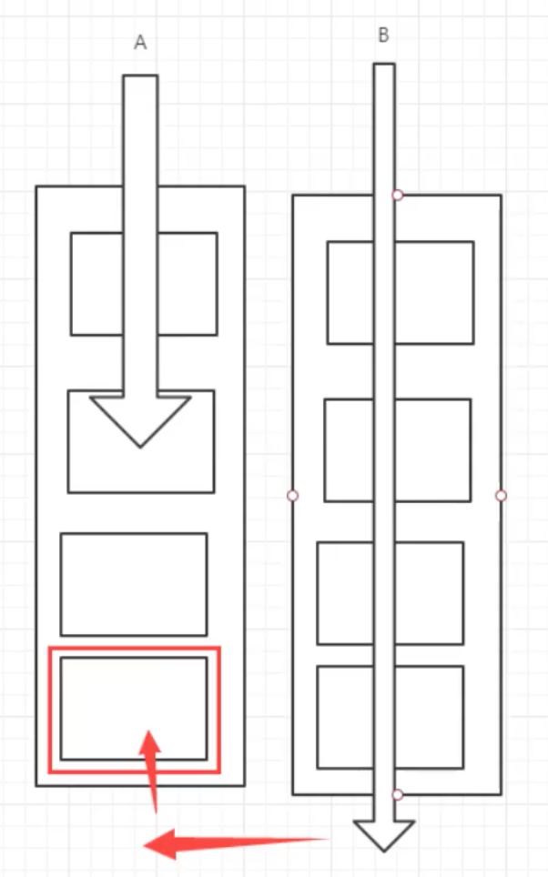

## 锁

### 1. Synchronized和Lock区别

>  Synchroized demo

``` java
public class Ticket2 {
    private int number = 80;
    
    public synchronized void sale() {
        if (number > 0) {
            System.out.println(Thread.currentThread().getName() + "买了一张票，还剩" + --number + "张");
        }
    }
}
```

>  Lock demo

``` java
public class Ticket {
    private int number = 80;

    private Lock lock = new ReentrantLock();

    /**
     *
     */
    public void sale() {
        lock.lock();
        try {
            if (number > 0) {
                System.out.println(Thread.currentThread().getName() + "买了一张票，还剩" + --number + "张");
            }
        } catch (Exception e) {
            e.printStackTrace();
        } finally {
            lock.unlock();
        }
    }
}
```

> Synchronized和Lock的区别

1. synchronized是一个java内置的语法，Lock是一个类
2. synchronized是自动的，Lock要手动释放锁
3. synchronized是可重入锁，并且不可中断，非公平；Lock是可重入锁，可以判断锁的状态，非公平（能够自己设置）；
4. synchronized只要被一个线程获得了锁，就算阻塞了，别的线程也会傻傻等下去；Lock不会，它有判断机制。
5. synchronized适合锁少量的代码块；Lock适合锁大量的代码块。

> 锁小结

static锁的是Class类对象，而普通方法锁的是对象实例，这两个锁是分开算的。

```java
public class Phone {
    public synchronized void sendMsg() {
        try {
            TimeUnit.SECONDS.sleep(4);
        } catch (InterruptedException e) {
            e.printStackTrace();
        }
        System.out.println(Thread.currentThread().getName() + "->发短信");
    }

    public static synchronized void call() {
        System.out.println(Thread.currentThread().getName() + "->打电话");
    }
  
    public static void main(String[] args) {
        Phone phone = new Phone();
        new Thread(() -> {
            phone.sendMsg();
        }).start();
        new Thread(() -> {
            phone.call();
        }).start();
    }
}
```


### 2.线程间通信

#### wait()和notify()

https://www.cnblogs.com/moongeek/p/7631447.html

> wait

- 作用是等待，并且在等待的时候将线程持有的此对象的锁释放，让其他的线程也能持有这个对象。

- 只有别的对象在此对象的方法中执行notify或者notifyAll的时候唤醒这个线程，并且此时此线程需要等待notify的那个线程执行完了以后，才能和别的线程开始抢占资源。

> notify()

唤醒众多线程中其中某一个在wait状态的线程。

> notifyAll()

唤醒此时所有在此对象上wait的线程。

> 注意点：if和while的使用

因为当多线程的状态下，如果当很多wait线程同时被唤醒，那么此时如果有什么判断条件的话，使用if，那么唤醒的线程是不会去判断的，**这被称为虚假唤醒**，典型的就是生产消费者问题；所以尽量使用while。

#### 生产者消费者问题

> synchronize demo

``` java
public class Data {

    private int number;

    public synchronized void increment() throws InterruptedException {
      // if
        while (number != 0) {
            this.wait();
        }
        System.out.println(Thread.currentThread().getName() + "此时生产了" + ++number);
        this.notify();
    }

    public synchronized void decrement() throws InterruptedException {
        while (number == 0) {
            // wait的时候回释放线程
            this.wait();
        }
        System.out.println(Thread.currentThread().getName() + "消费了" + --number);
        this.notify();
    }
}
```

如果使用if进行条件的判断，就会出现上面说的问题。

> Lock demo


```java
public class DataLock {
    private int number = 0;

    private Lock lock = new ReentrantLock();

    private Condition condition = lock.newCondition();

    public void increment() {
        try {
            lock.lock();
            // 业务代码
            while (number != 0) {
                condition.await();
            }
            System.out.println(Thread.currentThread().getName() + "增加了" + ++number);
            condition.signalAll();
        } catch (Exception e) {
            e.printStackTrace();
        } finally {
            lock.unlock();
        }
    }

    public void decrement() {
        try {
            lock.lock();
            while (number == 0) {
                condition.await();
            }
            System.out.println(Thread.currentThread().getName() + "减少了" + --number);
            condition.signalAll();
        } catch (Exception e) {
            e.printStackTrace();
        } finally {
            lock.unlock();
        }
    }
}
```

> Condition的作用

**我们想实现一种操作，当A操作完了通知B，B操作完了通知C，如果使用传统的Sychronize实现不了，这时候Condition的作用就体现出来了。**

```java
public class Data3 {
    private int number = 0;
    private Lock lock = new ReentrantLock();

    private Condition condition1 = lock.newCondition();
    private Condition condition2 = lock.newCondition();
    private Condition condition3 = lock.newCondition();

    /**
     * 打印a
     */
    public void printA() {
        try {
            lock.lock();
            while (number != 0) {
                condition1.await();
            }
            System.out.println(Thread.currentThread().getName() + "--> A被唤醒了");
            number = ++number % 3;
            condition2.signalAll();
        } catch (Exception e) {
            e.printStackTrace();
        } finally {
            lock.unlock();
        }
    }
    /**
     * 打印b
     */
    public void printB() {
        try {
            lock.lock();
            while (number != 1) {
                condition2.await();
            }
            System.out.println(Thread.currentThread().getName() + "--> B被唤醒了");
            number = ++number % 3;
            condition3.signalAll();
        } catch (Exception e) {
            e.printStackTrace();
        } finally {
            lock.unlock();
        }
    }
    /**
     * 打印c
     */
    public void printC() {
        try {
            lock.lock();
            while (number != 2) {
                condition3.await();
            }
            System.out.println(Thread.currentThread().getName() + "--> C被唤醒了");
            number = ++number % 3;
            condition1.signalAll();
        } catch (Exception e) {
            e.printStackTrace();
        } finally {
            lock.unlock();
        }
    }
  
      public static void main(String[] args) {
        Data3 data3 = new Data3();
        new Thread(() -> {
            for (int i = 0; i < 10; i++) {
                data3.printA();
            }
        }).start();
        new Thread(() -> {
            for (int i = 0; i < 10; i++) {
                data3.printB();
            }
        }).start();
        new Thread(() -> {
            for (int i = 0; i < 10; i++) {
                data3.printC();
            }
        }).start();
    }
}
```

## 集合类不安全

### list

> ArrayList的问题

```java
public class ListTest {
    public static void main(String[] args) {
        List<String> list = new ArrayList<>();
        for (int i = 0; i < 10; i++) {
            new Thread(() -> {
                list.add(UUID.randomUUID().toString().substring(0, 5));
                System.out.println(list);
            },String.valueOf(i)).start();
        }
    }
}

//运行结果：报ConcurrentModificationException异常。
```

由于ArrayList的线程不安全，所以在某些高并发的时候需要使用解决的方法。

> 解决方法

1. 使用Vector，它和`ArrayList`的作用基本一样，但是它在操作的时候加入了Synchronized，使得它是并发安全的。
2. 使用`Collections.synchronizedList(list);`对list进行一个包裹。
3. 使用线程安全的`CopyOnWriteArraylist`，它在写入的时候直接对数组进行了一个复制操作，并且添加了Lock锁，相比于Vector更加的高效。

### set

和List基本类似，解决方法也可以使用Collections对Set进行一个包裹，或者使用线程安全的CopyOnWriteArraySet。

### HashMap

默认也是线程不安全的，使用ConcurentHashMap。

## Callable

> 使用Callable的好处

1. 它能够抛出异常。
2. 它能够有返回结果。

> 使用方法

由于Thread只能接收Runable，如果要使用Callable，那么必须要通过一个实现了Runable的实现类进行转换。

```java
public class CallableTest {
    public static void main(String[] args) {
      	// 使用FutureTask进行转换。
        FutureTask<Integer> task = new FutureTask<>(() -> 123);
        new Thread(task,"A").start();
      // 如果再使用一个线程跑同样的task，这个不会进行，因为有缓存。
				new Thread(task,"B").start();
        try {
          // 调用get的时候会产生阻塞，如果在返回值之前被阻塞的话。
            System.out.println(task.get());
        } catch (InterruptedException e) {
            e.printStackTrace();
        } catch (ExecutionException e) {
            e.printStackTrace();
        }
    }
}
```

> TODO:FutureTask的缓存问题

## 一些JUC辅助类

> 计数器：CountDownLatch

```java
public class CountDownLatchDemo {
    public static void main(String[] args) {
        CountDownLatch count = new CountDownLatch(6);
        for (int i = 0; i < 6; i++) {
            new Thread(() -> {
                System.out.println(Thread.currentThread().getName() + "-> go out");
                count.countDown();
            },String.valueOf(i)).start();
        }
        // 等待它减少到0，要不然就不往下走
        try {
            count.await();
        } catch (InterruptedException e) {
            e.printStackTrace();
        }
        System.out.println("Close main");
    }
}
```

使用场景：主要是为了判断某些条件，在这些条件成立后主线程才会继续往下面走；计数器就是只有当count减少到0了才会往下面走。

> 向上计数器：CyclicBarrier

```java
public class CyclicBarrierDemo {
    public static void main(String[] args) {
        CyclicBarrier cyclicBarrier = new CyclicBarrier(7, () -> {
            System.out.println("集齐7个了");
        });
        for (int i = 0; i < 7; i++) {
            new Thread(() -> {
                try {
                    // 只有有7个await才会执行CyclicBarrier后面的方法，并且将所有线程都放过。
                    cyclicBarrier.await();
                    System.out.println(Thread.currentThread().getName() + "正在执行");
                } catch (InterruptedException e) {
                    e.printStackTrace();
                } catch (BrokenBarrierException e) {
                    e.printStackTrace();
                }
            },String.valueOf(i)).start();
        }
    }
}
```

使用场景：在某些时候需要等待过个线程到某个节点才能触发下一步步骤。

> 资源限制：Semaphore抢车位

```java
public class SemaphoreDemo {
    public static void main(String[] args) {
        // 设置车位数：3
        Semaphore semaphore = new Semaphore(3);
        for (int i = 0; i < 6; i++) {
            new Thread(() -> {
                try {
                  // 如果车位数(线程数)满了的时候，此时再进来的就会阻塞，直到别的线程释放了资源为止。
                    semaphore.acquire();
                    System.out.println(Thread.currentThread().getName() + "抢到了车位");
                    TimeUnit.SECONDS.sleep(2);
                } catch (InterruptedException e) {
                    e.printStackTrace();
                }finally {
                  // 释放车位
                    semaphore.release();
                }
            }).start();
        }
    }
}
```

使用场景：资源受限的时候使用，限流，控制线程数。


## 读写锁

> ReadWriteLock

主要目的：增加锁的细粒度，使得对读和写的操作区别对待。

```java
public class ReadWriteData {

    private Map<String, String> map = new HashMap<>();

    private ReadWriteLock readWriteLock = new ReentrantReadWriteLock();

    public void put(String key, String val) {
        try {
            // 写锁会限制
            readWriteLock.writeLock().lock();
            System.out.println(Thread.currentThread().getName() + "正在存储");
            map.put(key, val);
            System.out.println(Thread.currentThread().getName() + "存储完成");
        } catch (Exception e) {
            e.printStackTrace();
        } finally {
            readWriteLock.writeLock().unlock();
        }
    }

    public String get(String key) {
        String s = null;
        try {
            // 读锁无所谓，可以插队
            readWriteLock.readLock().lock();
            System.out.println(Thread.currentThread().getName() + "正在读取");
            s = map.get(key);
            System.out.println(Thread.currentThread().getName() + "读取完成");
        } catch (Exception e) {
            e.printStackTrace();
        } finally {
            readWriteLock.readLock().unlock();
        }
        return s;
    }
}
```

1. 写的时候是**独占式锁**，不能插队。
2. 当全部写完之后，此时拿到的是读锁，而读的时候是**共享锁**，可以插队。

## 阻塞队列

### BlockingQueue

**和List和Set一样，都继承自Collection接口。**

> 什么情况下使用？

在多线程的并发处理，线程池中使用。

> BlockingQueue的位置


> BlockingQueue的几组api


> SynchronousQueue同步队列

- 不存储元素，当一个线程向里面插入put以后被阻塞，只有当另一个线程从队列里将数据取出take才恢复；反之如果没有数据，一个线程取数据take的时候被阻塞，只有当另一个线程往里面存数据的时候才恢复。
- 我们一般只会使用它的put和take方法，一般不会使用它的offer、and这种立即返回的方法。

```java
public class SynchronousQueueDemo {
    public static void main(String[] args) {
        BlockingQueue<String> synchronousQueue = new SynchronousQueue<>();
        new Thread(() -> {
            try {
                System.out.println(Thread.currentThread().getName() + "放入了");
                synchronousQueue.put("123");
                System.out.println(Thread.currentThread().getName() + "放入了");
                synchronousQueue.put("456");
                System.out.println(Thread.currentThread().getName() + "放入了");
                synchronousQueue.put("789");
            } catch (InterruptedException e) {
                e.printStackTrace();
            }
        },"A").start();

        new Thread(() -> {
            try {
                System.out.println(Thread.currentThread().getName() + "->" + synchronousQueue.take());
                TimeUnit.SECONDS.sleep(2);
                System.out.println(Thread.currentThread().getName() + "->" + synchronousQueue.take());
                TimeUnit.SECONDS.sleep(2);
                System.out.println(Thread.currentThread().getName() + "->" + synchronousQueue.take());
                TimeUnit.SECONDS.sleep(2);
            } catch (InterruptedException e) {
                e.printStackTrace();
            }
        },"B").start();
    }
}
```

## 线程池(*)

> Executors使用

```java
    public static void main(String[] args) {
        ExecutorService executorService = Executors.newFixedThreadPool(5);
        try {
            for (int i = 0; i < 50; i++) {
                executorService.execute(() -> {
                    System.out.println(Thread.currentThread().getName() + "执行了");
                });
            }
        } catch (Exception e) {
            e.printStackTrace();
        } finally {
            executorService.shutdown();
        }
    }
```

> 线程池Executors的本质

- 本质：其实就是对`ThreadPoolExecutor`的封装，阿里巴巴编程规范里面说尽量不使用Executors，我们尽量用原生的`ThreadPoolExecutor`。

- 七大参数

```java
    public ThreadPoolExecutor(int corePoolSize, // 核心线程数
                              int maximumPoolSize, // 最大线程池
                              long keepAliveTime, // 最大等待时间
                              TimeUnit unit,  // 时间单位
                              BlockingQueue<Runnable> workQueue, // 阻塞队列
                              ThreadFactory threadFactory, // 线程工厂
                              RejectedExecutionHandler handler  // 拒绝策略)
```

- 七大参数的理解


1. corePoolSize:核心线程数，一直就在这里。
2. keepAliveTime：max线程在这么长时间以后如果没有使用就会释放。
3. workQueue:阻塞队列就是线程的排队，可以自己选择相应的数据结构。
4. ThreadFactory：线程工厂，也就是怎么创建线程，可以自己实现（例如指定一些线程所对应的异常处理等）。
5. RejectedExecutionHandler：拒绝策略，当阻塞队列满了，新来的任务应该怎么办。

> 手动创建线程池

```java
public class MyExecutorDemo {
    public static void main(String[] args) {
        ExecutorService service = new ThreadPoolExecutor(
                2,  
                5,
                3,
                TimeUnit.SECONDS,
                // 阻塞队列的数据结构
                new LinkedBlockingDeque<>(3),
                // 创建线程的方式
                Executors.defaultThreadFactory(),
                // 拒绝策略：如果阻塞队列满了直接抛出异常。
                new ThreadPoolExecutor.AbortPolicy());
        try {
            // 这样设置线程池：那么最大线程数：max+阻塞队列容量，超出就会进入拒绝策略。
            for (int i = 0; i < 9; i++) {
                service.execute(() -> {
                    System.out.println(Thread.currentThread().getName() + "执行了..");
                });
            }
        } catch (Exception e) {
            e.printStackTrace();
        } finally {
            service.shutdown();
        }
    }
}
```

> 四大拒绝策略


> CPU密集型和IO密集型

- CPU密集型最大线程数的设置：一般设置为cpu的最大线程数，从而能最大化利用硬件资源。

  ```java
  System.out.println("cpu核数为 ->" + Runtime.getRuntime().availableProcessors());
  ```

- IO密集型最大线程数的设置：一般找出IO密集的线程数，设置为它的2倍即可。因为IO操作密集的话，很多线程就会挂起，如果线程数量不够的话，会造成一些使用cpu的线程拿不到资源。

## ForkJoin

> 什么是ForkJoin

简而言之就是将一个大任务拆分成几个小任务。


> ForkJoin的特点

能够实现工作窃取：每个线程维护一个双端队列，如果B执行完了它的所有双端队列中的任务，就会从A中拿到双端队列后面的任务执行，避免线程等待。



> ForkJoinPool的使用

`Forkjoinpool`其实是线程池的一个衍生，它主要用于cpu密集型任务中使用，它底层是分治的思想，将一个任务拆成多个小任务，分成多个线程进行处理（并不是一个小任务对应一个线程，底层实现有待研究）。

```java
public class ForkJoinPoolDemo {
    public static void main(String[] args) throws ExecutionException, InterruptedException {
        long start = System.currentTimeMillis();
        ForkJoinPool forkJoinPool = new ForkJoinPool();
      // 这里需要使用ForkJoinTask
        ForkJoinTask<Long> task = forkJoinPool.submit(new SumTask(0, 10_0000_0000L, 1000L));
        Long aLong = task.get();
        long end = System.currentTimeMillis();
        System.out.println("结果为：" + aLong);
        System.out.println("消耗时间为：" + (end - start));
        System.out.println("------------------------------------------");

        // 使用并行流计算
        long start1 = System.currentTimeMillis();
        long result = LongStream.rangeClosed(0, 10_0000_0000L).parallel().reduce(0, Long::sum);
        long end1 = System.currentTimeMillis();
        System.out.println("结果为：" + result);
        System.out.println("消耗时间为：" + (end1 - start1));
    }
}
```

```java
public class SumTask extends RecursiveTask<Long> {

    private long start;
    private long end;
    private long temp;

    public SumTask(long start, long end, long temp) {
        this.start = start;
        this.end = end;
        this.temp = temp;
    }

    @Override
    protected Long compute() {
//        System.out.println("线程名字 -> " + Thread.currentThread().getName());
        long sum = 0;
        if (end - start < temp) {
            for (long i = start; i <= end; i++) {
                sum += i;
            }
            return sum;
        } else {
            long k = start + (end - start) / 2;
            SumTask task1 = new SumTask(start, k, temp);
            task1.fork();
            SumTask task2 = new SumTask(k + 1, end, temp);
            task2.fork();
            return task1.join() + task2.join();
        }
    }
}
```

> ForkJoinPool的api

- `ForkJoinPool`中需要提交一个`ForkJoinTask`，分为几种：
  - `RecursiveTask`代表有返回值的任务
  - `RecursiveAction`代表没有返回值的任务
- `fork()`开始分治，`join()`将分治后的结果合并。
- `submit`执行的是有返回值的方法，通过get拿到结果。

## 异步回调(TODO)

## JMM和Volatile

> JMM是什么？

https://www.cnblogs.com/null-qige/p/9481900.html

JMM是一种JVM内存与线程之间的规范

> JMM的八大操作

**内存交互操作有8种，虚拟机实现必须保证每一个操作都是原子的，不可在分的（对于double和long类型的变量来说，load、store、read和write操作在某些平台上允许例外）**

- lock   （锁定）：作用于主内存的变量，把一个变量标识为线程独占状态

- unlock （解锁）：作用于主内存的变量，它把一个处于锁定状态的变量释放出来，释放后的变量才可以被其他线程锁定
- read  （读取）：作用于主内存变量，它把一个变量的值从主内存传输到线程的工作内存中，以便随后的load动作使用
- load   （载入）：作用于工作内存的变量，它把read操作从主存中变量放入工作内存中
- use   （使用）：作用于工作内存中的变量，它把工作内存中的变量传输给执行引擎，每当虚拟机遇到一个需要使用到变量的值，就会使用到这个指令
- assign （赋值）：作用于工作内存中的变量，它把一个从执行引擎中接受到的值放入工作内存的变量副本中
- store  （存储）：作用于主内存中的变量，它把一个从工作内存中一个变量的值传送到主内存中，以便后续的write使用
- write 　（写入）：作用于主内存中的变量，它把store操作从工作内存中得到的变量的值放入主内存的变量中

**JMM对这八种指令的使用，制定了如下规则：**

- 不允许read和load、store和write操作之一单独出现。即使用了read必须load，使用了store必须write

- 不允许线程丢弃他最近的assign操作，即工作变量的数据改变了之后，必须告知主存
- 不允许一个线程将没有assign的数据从工作内存同步回主内存
- 一个新的变量必须在主内存中诞生，不允许工作内存直接使用一个未被初始化的变量。就是怼变量实施use、store操作之前，必须经过assign和load操作
- 一个变量同一时间只有一个线程能对其进行lock。多次lock后，必须执行相同次数的unlock才能解锁
- 如果对一个变量进行lock操作，会清空所有工作内存中此变量的值，在执行引擎使用这个变量前，必须重新load或assign操作初始化变量的值
- 如果一个变量没有被lock，就不能对其进行unlock操作。也不能unlock一个被其他线程锁住的变量
- 对一个变量进行unlock操作之前，必须把此变量同步回主内存


### Volatile

#### 为什么要使用volatile

> 可见性问题

如上图所示，当线程A中的工作内存没有及时写到主内存的时候，线程B从主内存中取值，那么会发生数据不一致问题。

```java
public class VolatileDemo {
    private static int num = 0;
    
    public static void main(String[] args) {
        new Thread(() -> {
            while (num == 0) {}
        }).start();
        try {
            TimeUnit.SECONDS.sleep(1);
        } catch (InterruptedException e) {
            e.printStackTrace();
        }
        num = 1;
        System.out.println(num);
    }
}

// 如果这个程序执行，因为数据的不及时更新，程序会死在while里，所以我们需要给int加上Volatile，保证数据的一致性，让每次读写都往主存里操作。
```

> 不能解决原子性问题

volatile只是保证了数据的一致性问题，保证读写都能在主存中进行，但是它依旧会导致线程切换导致的原子性问题，还是得加上Lock来解决。

> 指令重排

当程序在编译的时候，可能编译器会在不影响程序结果的前提下对程序的执行顺序进行一些细微的改变，然而，重排可能会影响本地处理器缓存与主内存交互的方式，从而产生细微的程序 bug 。现在，**volatile** 关键字可以阻止重排 **volatile** 变量周围的读写指令。这种重排规则称为 *happens before* 担保原则 。

这项原则保证在 **volatile** 变量读写之前发生的指令先于它们的读写之前发生。同样，任何跟随 **volatile** 变量之后读写的操作都保证发生在它们的读写之后。例如：

```java
public class ReOrdering implements Runnable {
  int one, two, three, four, five, six;
  volatile int volaTile;
  @Override
  public void run() {
    one = 1;
    two = 2;
    three = 3;
    volaTile = 92;
    int x = four;
    int y = five;
    int z = six;
  }
}
```

例子中 **one**，**two**，**three** 变量赋值操作就可以被重排，只要它们都发生在 **volatile** 变量写操作之前。同样，只要 **volatile** 变量写操作发生在所有语句之前， **x**，**y**，**z** 语句可以被重排。这种 **volatile** （易变性）操作通常称为 *memory barrier* （内存屏障）。 *happens before* 担保原则确保 **volatile** 变量的读写指令不能跨过内存屏障进行重排。

*happens before* 担保原则还有另一个作用：当线程向一个 **volatile** 变量写入时，在线程写入之前的其他所有变量（包括非 **volatile** 变量）也会刷新到主内存。当线程读取一个 **volatile** 变量时，它也会读取其他所有变量（包括非 **volatile** 变量）与 **volatile** 变量一起刷新到主内存。尽管这是一个重要的特性，它解决了 Java 5 版本之前出现的一些非常狡猾的 bug ，但是你不应该依赖这项特性来“自动”使周围的变量变得易变性 （ **volatile** ）的 。如果你希望变量是易变性 （ **volatile** ）的，那么维护代码的任何人都应该清楚这一点。

#### 自己对volatile的理解

http://www.sxyniubi.xyz/archives/%E7%BA%BF%E7%A8%8B%E5%86%85%E5%AD%98%E7%9A%84%E5%90%8C%E6%AD%A5%E6%97%B6%E6%9C%BA

### 原子类(TODO)

> 引出

由于上面说了，volatile只是保证工作内存和主内存之间的刷新，并不能保证操作的原子性，如果我们不想使用Sychronized和Lock的话(太麻烦)，怎么保证对变量操作的原子性呢？

此时就要用到java提供的原子类了，它直接使用硬件底层的原子性解决了问题，效率非常高。


