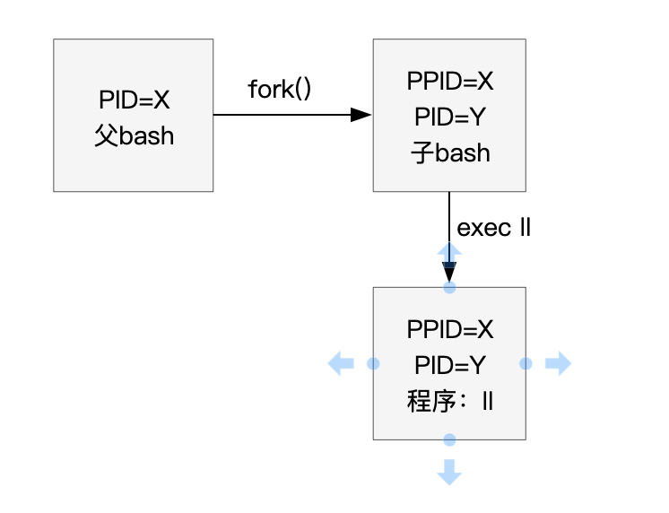

## linux进程
详见操作系统的进程 
linux运行一个程序的流程（敲下`ll`这样的命令时）：

- `ps`:查看当前用户的进程和所有系统进程。
- 当在一个用户bash中执行的一系列子进程，这些和前面的at不一样，at不依赖于用户的shell，在系统的后台执行；但是这些子进程都是属于bash后台进程，是依赖于本用户的shell的，一旦shell关闭，这些子进程也都会消失。

## 进程分类
- 前台：例如shell、vim需要与用户进行交互的进程。
- 后台：一些备份、运算等进程，例如`crontab`这种，无需和用户交互都能归类成后台进程。
- 服务进程：例如一些端口的监听等进程，只要开启就一直存在于内存中都属于服务，也属于后台进程。

## 任务管理
在一个bash中，可以在这个bash下同时运行很多的子进程。
- 在一条命令后面加上`&`，将这个进程丢到后台执行。
- 将目前正在执行的任务（例如vim正在编辑的时候）丢到后台去暂停：按下`ctrl+z`即可。
- `jobs`:查看目前bash的后台进程。
- `fg`:将后台进程（例如刚刚的vim）从后台拉回前台。
- `bg`:将后台的程序从暂停到运行。
- `kill`:将进程杀死。可以直接接pid号，也可以接`%数字`删除bash下的子进程号。`killall`:用进程名来杀进程。
- 由于任务放入后台都是放入当前bash的后台，而不是系统后台；除了通过`at`指令外，还能使用`nohup`，使得脱机以后后台仍然执行。

## 进程管理
- `pstree`:查看进程树。
- `top`:动态查看进程变化。
### 管理
如cs:app里，使用信号进行管理。
- `kill -signal pid`:signal包括启动进程、中断进程、暂停进程等。
- 通过设置优先级控制进程的执行：root可以随意控制自己和他人进程的优先级；而普通用户只能调整自己的进程优先级，并且只能增加优先级，不能减少，防止抢占系统资源。
- 查看系统资源信息：`free`、`uname`、`top`、`uptime`等。
- `netstat`:监控当前的网络端口连接情况。并且列出所有非网络的socket文件（用于系统进程通信，与socket套接字不一样，这是系统进程通信的文件）。
- `/proc/*`:虚拟的文件系统，存在于内存中（并不在磁盘中），记录了linux中的系统进程文件和当前启动的所有进程pid相关信息（和pcb进程控制块不是一个东西）。
- `fuser`:查看正在使用某一个文件或文件系统的进程。

## SELINUX
之前的linux都是针对用户的权限来指定相应用户进程可以访问的文件有哪些（根据文件的权限），但是这种方法会有很大的安全隐患，例如有的人拿到了root的进程（例如访问服务器的时候，这个服务器的80端口由root启动），会对系统文件形成安全隐患；selinux为了解决这个问题，它将针对控制的主体从用户变成了进程，有些进程就算是root启动的，也不能访问某些文件和目录，全都交给了selinux管理。

