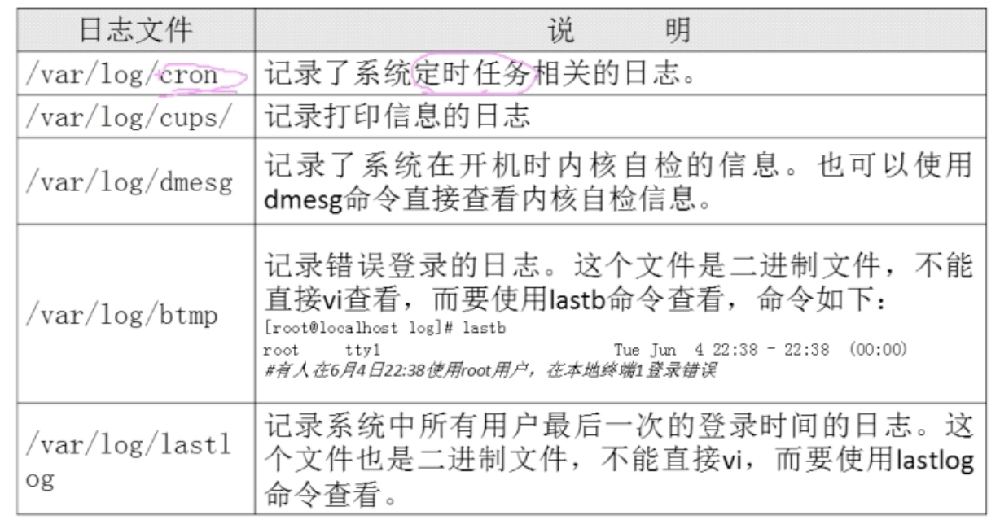
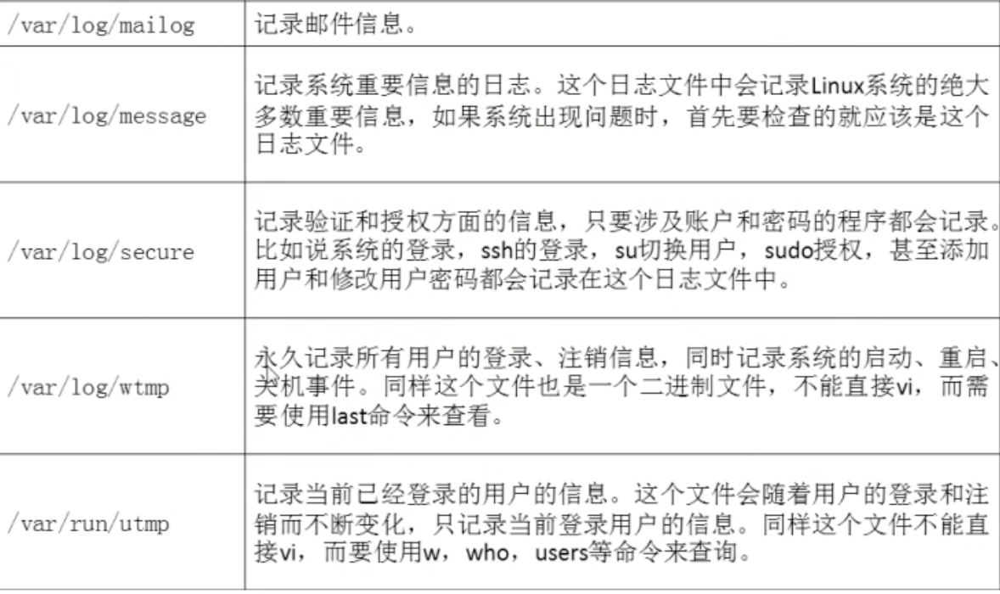
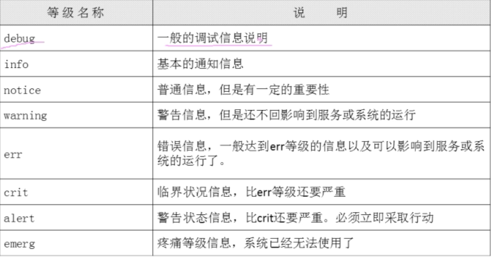
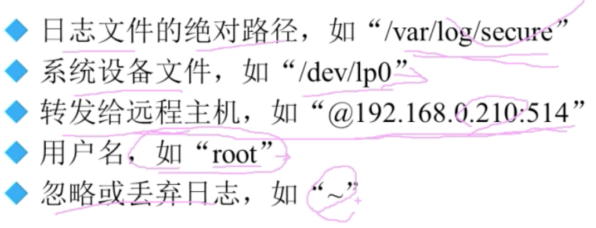
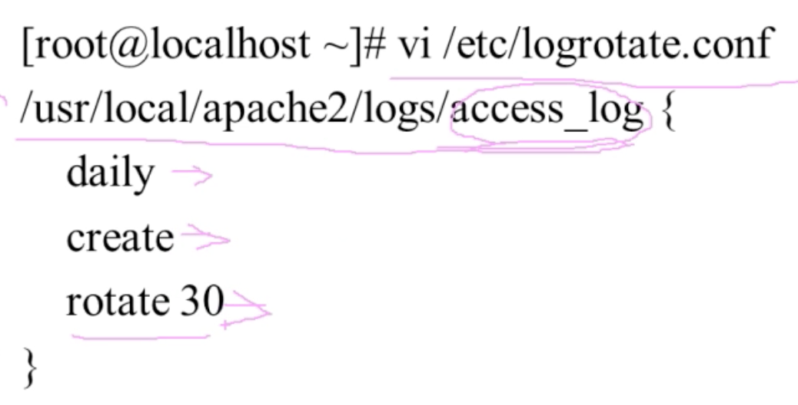

## 日志目录
- 日志可以分为两类，一个是应用程序的日志，一般会在应用中指定日志文件位置；一个是系统日志，只要开启了rsyslog就能启动这个服务。
- 系统记录的日志

  - 除了系统默认的日志之外，采用rpm方式安装的系统服务会把日志放到`/var/log/目录`中。这些不是由rsylogd服务管理的。而是又这个服务本身来管理。

## rsyslog服务
#### 日志格式

- rsyslog服务的配置文件是`/etc/rsyslog.conf`,可以通过改这个配置文件修改服务属性。
    
    - 最左边：服务名称，如果是*代表所有服务。
    - 连接符号：`.`:只要比`.`后面的等级高的都记录，如果是`*`，那么就是任何都记录。
    - `.=`：只记录等于后面的等级的。
    
    - 最右边的是路径，可以支持多种路径
        

## 日志轮替
- 就是将日志分成不同的文件记录，并且只保留最近一段时间的。
- 不同应用（例如apache）提供的日志功能不一样，很多不全，我们使用linux提供的日志轮替工具进行管理。
  - 日志轮替的工具：logrotate，配置文件`/etc/logrotate.conf`，只要rpm安装的服务都已经在这个文件中配好了，都不需要自己去配置轮替，只有源码包安装的服务需要自己手工去配置轮替。
  - 配置轮替方法：找到源码包的日志目录，直接将日志目录加到配置文件中。
    
  - 日志的命名规则：加dateext参数，日志文件名以时间为后缀进行区分。
  - 轮替其实是一个定时任务，也可以通过`logrotate -f /etc/logrotate.conf`命令手动轮替。

