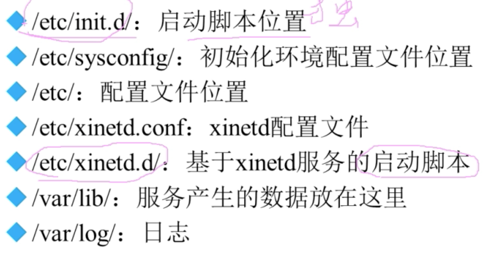
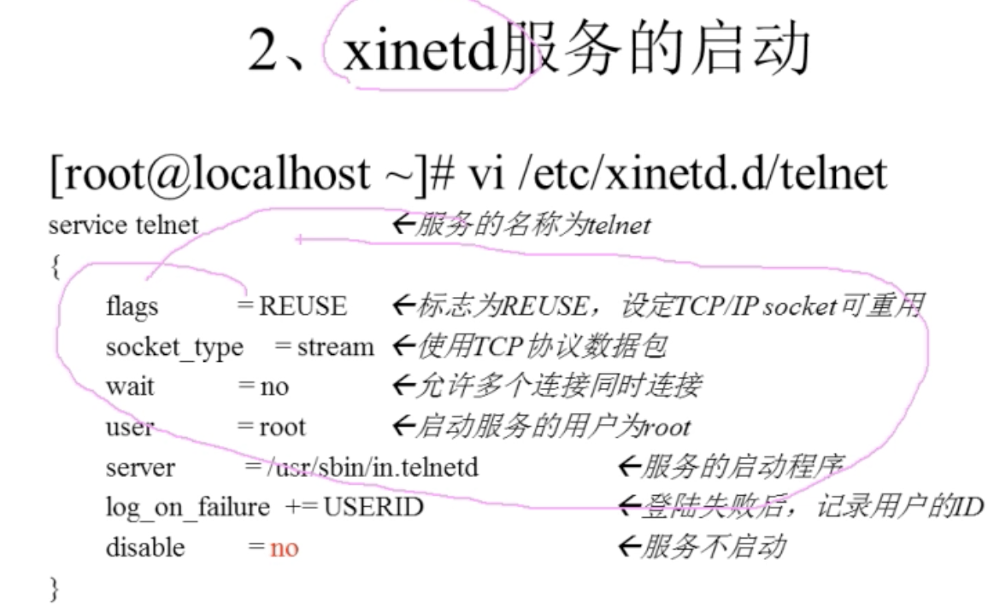

## 服务的分类
- rpm包安装的服务
  - 独立的服务：apache，独立在内存中，访问立刻相应。
  - 基于xinetd的服务：服务被xinetd管理，不在内存中；用户通过访问xinetd来调用相关服务。
- 源码包安装的服务

## 服务的管理
其实就是各个服务如何启动，如何自启动。
- `chkconfig --list`:查看rpm包安装的服务情况，显示的不是当前系统启动的服务，而是哪些服务的哪些级别可以自启动；总的来说就是查看服务的自启动状态，当系统进入哪个级别后能够自启动。
- `ps aux`:查看系统运行的所有进程。
- 源码包安装的服务：直接去`/usr/local`下查看。

#### 独立服务的管理

- rpm包独立服务启动
  - `绝对路径 start`，上面的是centos6的，7以后的绝对路径是`/usr/lib/systemd/system/`。
  - `service 独立服务名 start`
- rpm包独立服务自启动
  - `chkconfig --level 2345 服务名 on`:则系统进入这几个级别就会自启动这个服务。
  - 修改`/etc/rc.d/rc.local`文件:这个文件是每次系统启动都会执行的脚本文件，可以把每次自启动需要执行的命令写在这里；推荐，因为可以将源码包和rpm包的自启动一起管理。
  - `ntsysv`:自启动的可视化工具。这个不仅可以管理独立服务，也可以管理`xinetd`管理的服务。

#### 基于xinetd服务管理
现在基于xinetd的服务越来越少，linux默认是没有装xinetd的，需要手动安装。典型的telnet远程管理就是基于xinetd，现在基本被ssh替代。
启动xinetd管理的服务：

1. 进入图中的文件，修改disable。
2. `service xinetd restart`:重启xinetd。

xinetd服务的自启动：
- `ntsysv`
- `chkconfig xx on`

会发现xientd一个问题，由于它的启动和自启动都是修改上述文件的disable，所以它的启动和自启动是通用的；启动了一次，那么下次开机又会启动。

#### 源码包安装的服务管理
源码包启动：查看install文件，绝对路径start即可。
自启动：
- 修改`/etc/rc.d/rc.local`文件:这个文件是每次系统启动都会执行的脚本文件，可以把每次自启动需要执行的命令写在这里；推荐，因为可以将源码包和rpm包的自启动一起管理。
- service管理的原理其实就是去`/usr/lib/systemd/system/`（centos7，如果centos6则是去`/etc/init.d`下）找相应的启动脚本，那么我们可以吧源码包的启动脚本链接到这个目录下，也就能通过service进行管理了，不过不推荐这么做。

## centos7中的管理
使用systemctl进行管理。