## 传输层的两个协议
- TCP：需要将要传输的文件分段的时候用tcp，传输需要建立会话，可靠传输，流量控制
- UDP：1.一个数据包就能够完成数据通信的时候用udp，不需要建立会话，不需要流量控制；2.屏幕广播
- 查看会话  netstat -n 

#### 传输层协议和应用层的关系
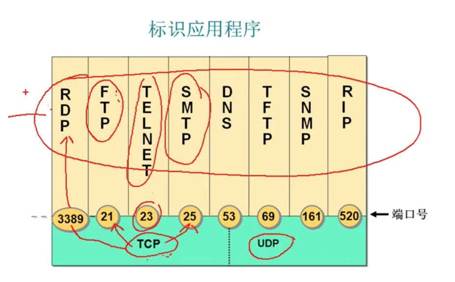
传输层协议加一个端口可以标记一个应用层协议。

- http:tcp+80
- https:tcp+443
- rdp(远程桌面):tcp+3389
- ftp:tcp+21
- 共享文件夹:tcp+445，不同主机访问共享资源
- smtp(邮件):tcp+25
- telnet:tcp+23
- sql server:tcp+1433
- dns:udp+53
- pop3:tcp+110

#### 服务和应用层协议之间的关系
安装了上述的服务，这些服务只要一启动，就会在相应的端口进行侦听，tcp包上会携带相应的端口信息。 
可以通过配置网卡，只让他通过某些端口的数据。所以可以在网卡上只开必要的服务。例如web站点只开网卡上的80端口，其他端口的进程就算启动侦听了，网卡也会将送往他们的数据包自动隔离。
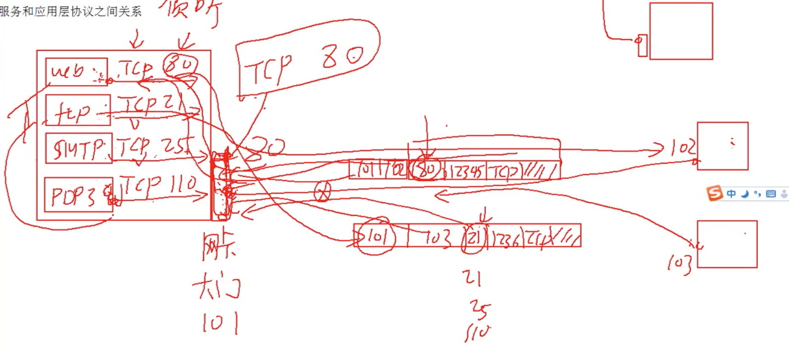

#### 总关系
- 服务使用tcp/udp端口侦听客户端请求
- 客户端使用ip地址定位服务器，使用目标端口定位服务

## 实践
- 可以使用talent来测试端口到远程端口的连接是否畅通，`talent 主机ip 端口号`；通过这个命令查看目标ip运行了什么服务。
- `netstat -an`:查看侦听的端口
- `netstat -n`:查看建立的会话
- 打开80端口，将服务器放入此端口，其他主机可以通过这个端口访问服务器。
- SMTP和pop3：收发电子邮件，这俩服务都安装在服务器上。
  - SMTP(25)：邮件的发送协议，通过smtp协议进行邮件的转发流程。
  - POP3(110)：邮件的接受协议，通过这个协议来进行邮件的客户端与服务器中间的通信。
- 各个端口号可以自由改变，如果主机没有提供相应的gui，可以自己去注册表改。
- 设置本地连接 tcp/ip筛选，只开必要的端口。
#### 端口
- tcp的端口：以访问web服务器来举例，客户端访问web服务器的80端口，自己会相应的开一个高端口（如1466）这种，以区分不同的网页。
- 端口取值：0-65535  
  - 熟知端口：0-1023（一些基本功能）
  - 登记端口：1024-49151（如RDP 3389，后面微软开发人员使用的端口）
  - 客户端端口：49152-65535

## UDP
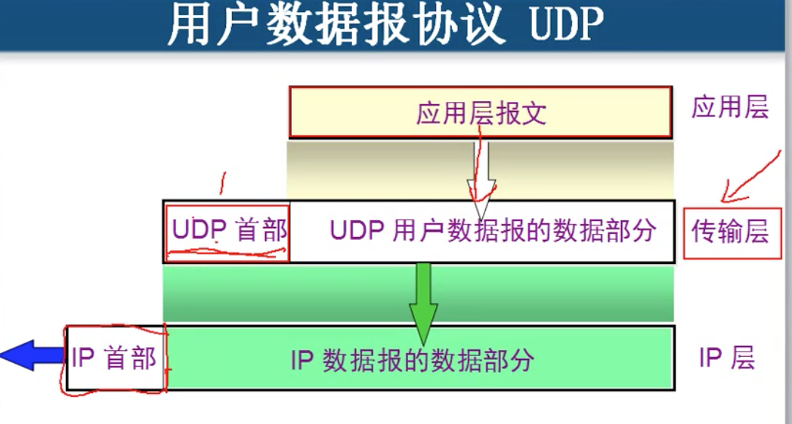
- udp计算检验和的时候用到了网络层的地址。
  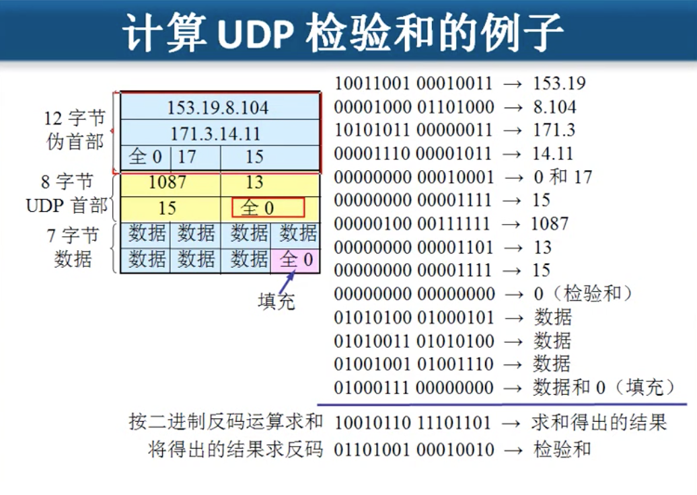

## TCP
### 解决的问题
- 实现可靠传输
- 流量控制
- 避免网络堵塞

### tcp概述
- 面向连接的传输层协议
- 每一条tcp只有两个端点，每一条tcp只能是点到点的连接
- 可以实现全双工通信
- 面向字节流

### tcp的连接
连接是基于套接字的，端口号加ip地址就构成了socket。

### 可靠传输的工作原理
- 使用了停止等待协议ARQ
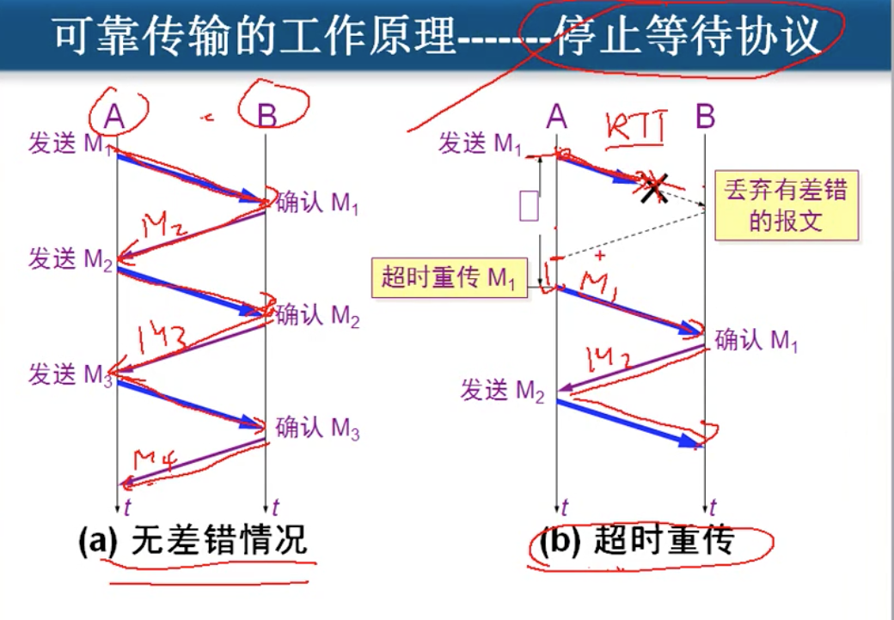
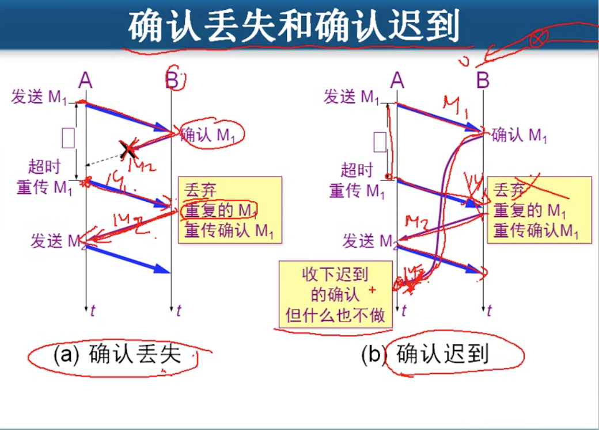
只要没告诉收到了，发送方就要重传。 
  - 缺点：信道利用率太低
  - 改进方法：使用流水线传输（现在计算机通用方法），规定一个发送窗口。
    1. 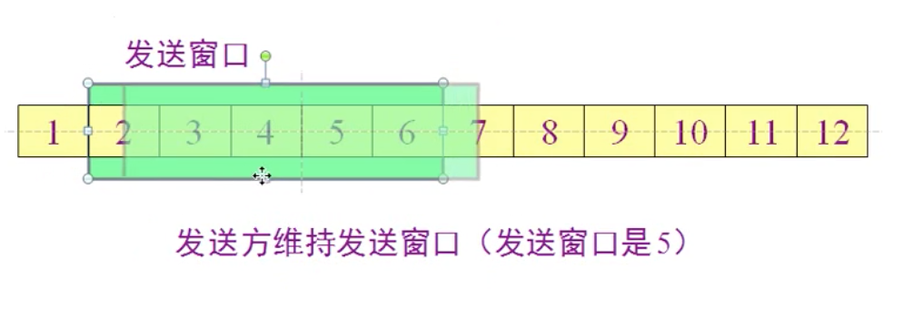
    先连发5个，发完以后等待第一个的确认，只要确认了一个，窗口就往前移动一个。
    2. 
    先连发几个，然后B计算机不用全部确认，如果他收到了123，只回了一个确认3收到了，那么A也会当做123个包B都收到了。

### TCP在报文段的首都格式
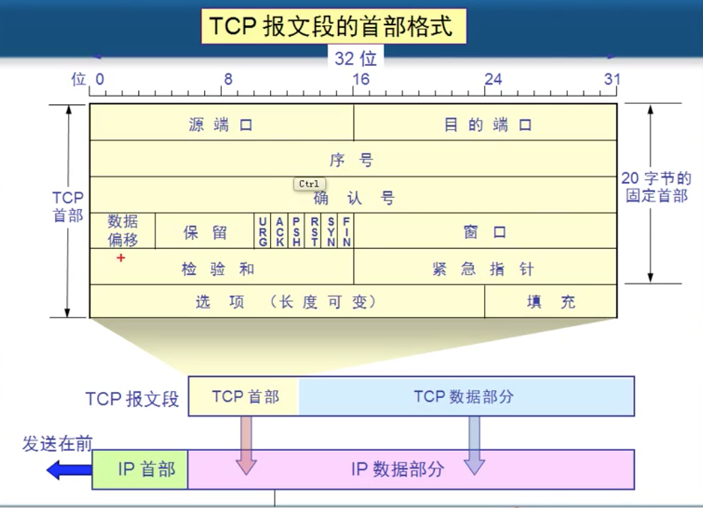

- 序号：这个包的首个字节在整个文件中是第几个字节。

- 确认号：是接受方返回发送方时候发的，里面是现在应该发第几个字节。

- 数据偏移：记录整个tcp报文段在第几个字节开始是数据。总共4位，每个位代表4个字节，所以首部最多只有4*15=60个字节。
  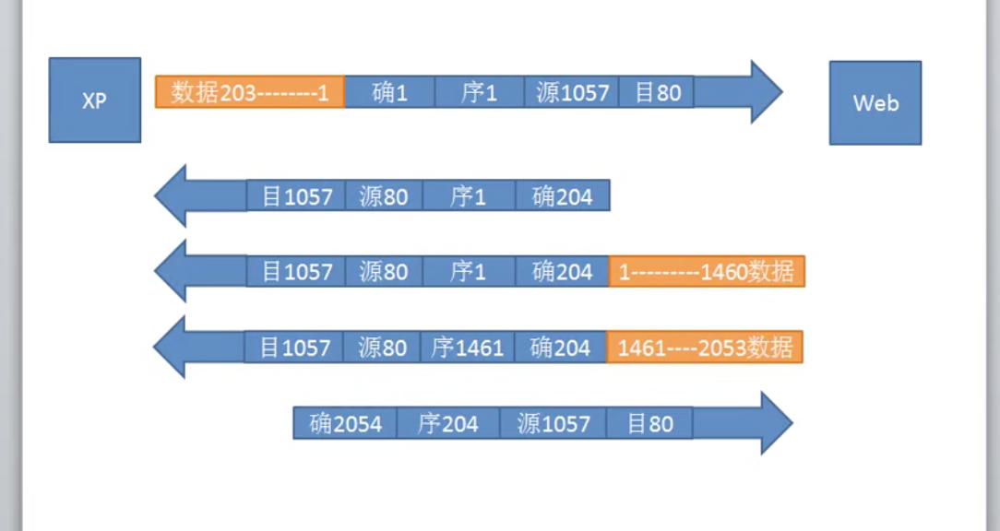

- urg：优先传输位。在发送缓冲区中插队。

- ack：确认号有效位，发同步信号的时候是0，传数据的时候就是1了。

- syn：同步位，建立会话的时候发送的请求为1，同步完后就是0了。
  #### 通过发送同步信号攻击系统
  当发送一个请求会话信号给服务器，但是发送的源地址瞎编一个，这样服务器同意请求发出同步信号的时候迟迟等不到信息；周而复始这样搞，服务器资源就会被占用过大，停止响应。
  
- psh：在接受缓冲区中插队。

- rst：tcp会话发生了严重的错误，必须重新建立连接。

- fin：数据传完了释放连接时为1。

- 窗口：分别说明了发送缓存和接受缓存有多大。
  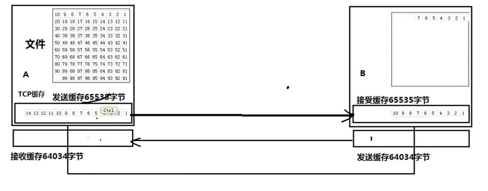
  抓包发现的发送包的两个参数`MSS=1460  WIN=64240`，代表了发送的缓存为64240个字节，接收端最多只能将窗口设置为64240；1460则代表了接收方往发送端发数据的时候发送端一个包最多只能接受1460个字节。

- 检验和：和udp一样。

- 紧急指针：和urg搭配使用，指明了这个数据包内从哪个字节开始是紧急的。

- 选项：
  - 例如上述的mss（最大字节数）就是选项中的。
  - SACK permitted(是否支持选择性确认)
  
- 填充：凑够4个字节。

### 详细理解可靠传输
1. 以字节为单位的滑动窗口技术。
2. 超时重传时间的选择调整：略大于之前往返时间的加权平均。

### 流量控制的实现
当接收端缓存容量顶不住的时候；也就是说接收端确认接收了以后，这些数据在窗口以外的缓存中，但是应用程序取的又没这么快，一下子缓存区就满了，这样的话就会造成数据丢失的问题，需要进行流量控制。 
通过接收端在返回的时候携带改变窗口大小信息，使得发送端的窗口大小改变来实现。
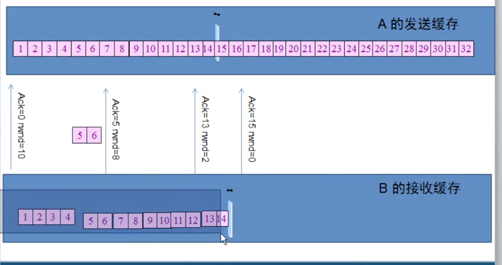

### tcp拥塞控制
什么是拥塞? 
局域网中多个计算机的流量过大，每个计算机的相关的进程都往外狂甩数据包，但是连着的交换机和路由器最大只能支持相应带宽的数据包通过，这样就会造成丢包严重的现象。如果tcp不加以控制发包的速率，那么会因为发了一个包对面主机没回应，反而会加大发送的频率，形成一个正反馈，那么网络就会瘫痪。
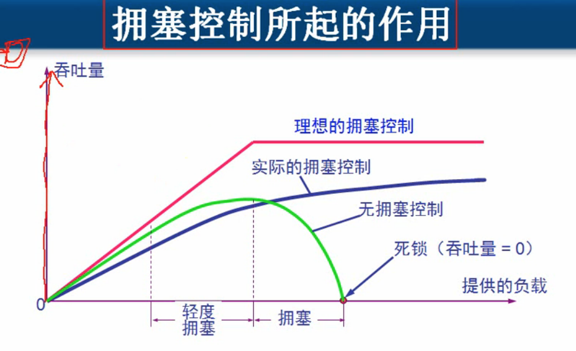
如何实现拥塞控制：

1. 使用慢开始，当出现丢包的时候，就认为网堵了，啥也不管，重新开始计数。
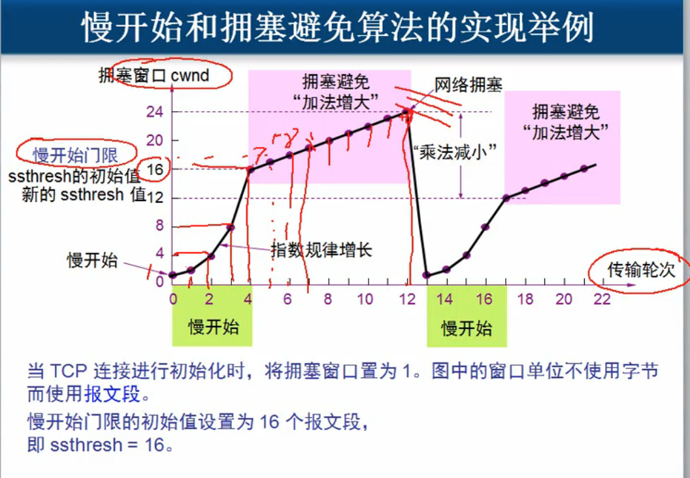
2. 使用将快重传机制引入拥塞避免，快恢复。
快重传：加入一开始接受方采用了连发回应的机制，发了5个包才返回一个信号，那么快重传就是只要发现了其中有丢包，不管有没有累计到5个，立马返回3个重复的确认给发送方。
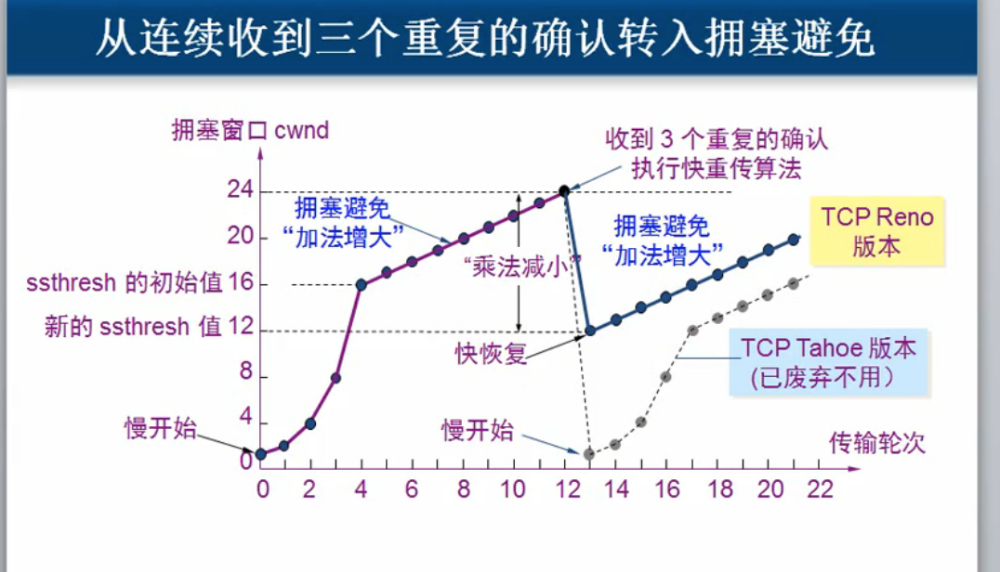
如果发送方接收到了这连续的3个信号，那么就会判断，可能刚刚那个丢包并不是网堵了，就会将门限不降为0，仅仅降为原来的一半，然后再缓慢增长。

### 发送窗口到底有多少
肯定会产生疑问，为了防止拥塞和流量控制，这俩需求对发送窗口的值的要求不一样。 
我们把流量控制的发送窗口作为拥塞控制的上限值。所以我们之前说的流量控制的发送窗口只是最大值而已。

### 传输连接管理
#### 三次握手建立tcp连接
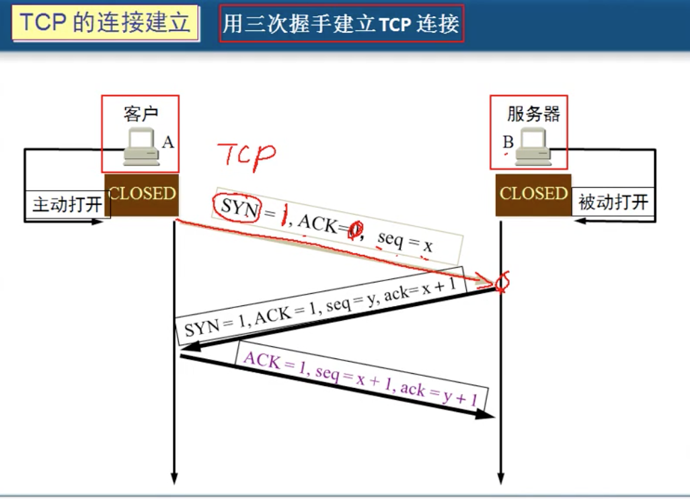
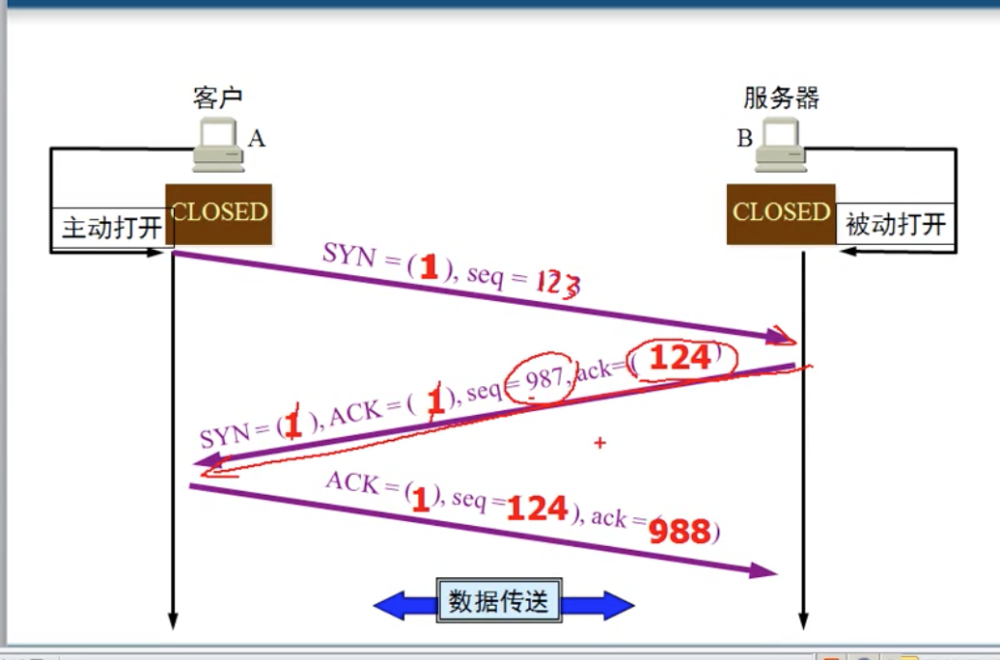
为什么要第三次握手？ 因为发了第一个同步包的时候可能传输的过程太久，A会以为这个包丢了从而再发，等这两个包都到了的时候就会建立两个连接，但是实际上A只要一个，所以造成了资源的浪费。 第三个数据包的出现就解决了这个问题，如果出现上述的情况，由于A只需要进行一个连接，那么它只会发出一个第三个包，这时也就只会建立一个通道了。

#### TCP连接释放
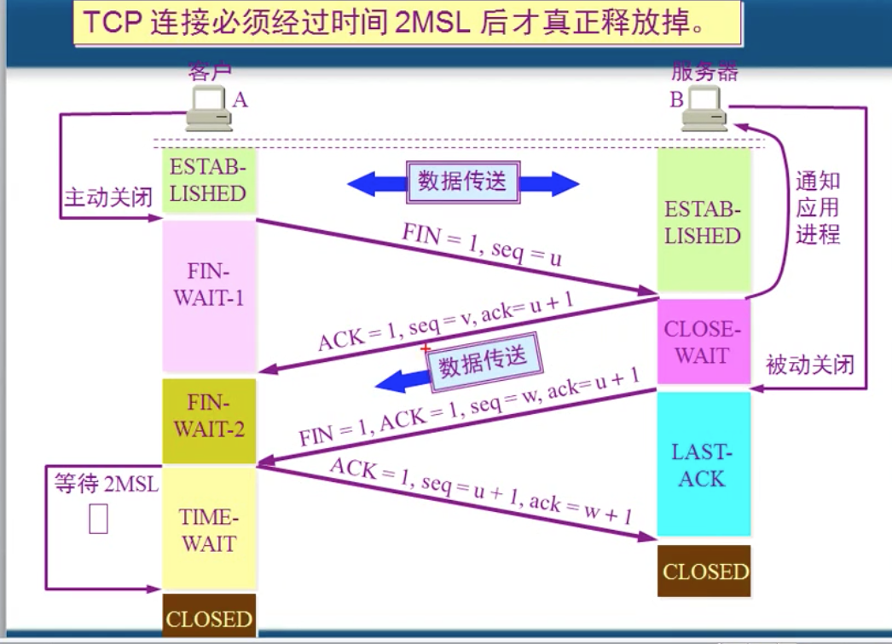

