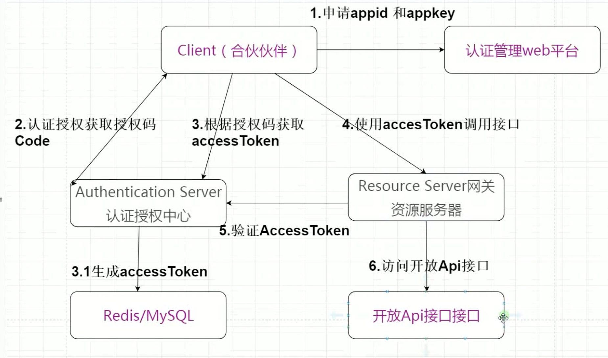

# day13
## OAUTH2
- 是一种对分布式登录和第三方授权的解决方案。
- 和token生成类似，但是jwt是一种token的具体生成方法，而oauth2只是一种解决方案。

## 微信扫码登录流程

可以完全类比于github的登陆，都是oath2的认证过程。



### 步骤
#### 后端部分
1. 需要使用企业名去申请一个微信第三方登录凭证，申请到了就会获得如下信息：
```txt
    # 微信开放平台 appid

    appid: wxed9954c01bb89b47

    # 微信开放平台 appsecret
    appsecret: a7482517235173ddb4083788de60b90e

    # 微信开放平台 重定向url（guli.shop需要在微信开放平台配置）
    redirecturl: http://guli.shop/api/ucenter/wx/callback
```

2. 点击微信登录按钮，请求后端接口，后端将按照登录api文档重定向到一个二维码的url。
3. 用户扫码，直接和这个url交互，点击确定后将信息传到腾讯的url中并对应上一个code。
4. 腾讯将这个code传到第二步送过来的重定向地址，并且这个地址就是之前注册的时候的重定向地址（使用的是别人的重定向地址，他帮你定向到你内网服务器的端口），拿到code和openid（用户唯一标识），使用httpclient（或者okhttp）将code传到腾讯的另一个api以获取access_token。
5. 拿到access_token后，就可以调用腾讯的相关api获取相关用户的昵称头像等信息。
6. 将信息封装到类中，存入数据库；这样下次登录的时候就不用再使用access_token去请求腾讯服务器了，只需要拿到用户的openid去数据库找即可。
#### 前端部分
1. 后端此时已经拿到了代表用户信息的类了，此时可以通过cookie将信息存到request中，不过由于cookie不能跨域，重定向后必然丢失。
2. 所以我们继续使用JWT的token来登录，将JWT生成的字符串拼接到重定向到首页的路径后，在首页的created方法中通过`this.token=this.$route.query.token`获取出token参数，再使用getUserInfo（想之前普通登录那样获取用户信息），将用户信息存入cookie中。
