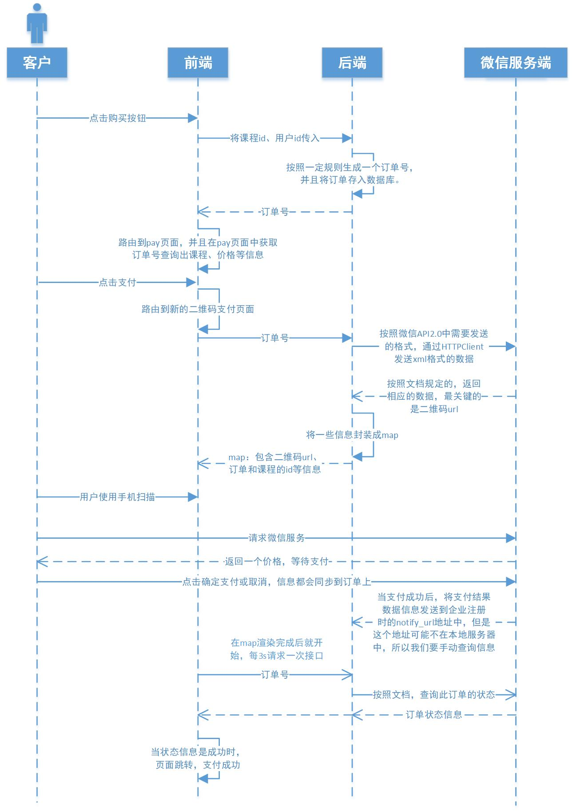

# day15
## 微信支付流程
### 流程

### 后端接口
#### 订单接口
##### 生成订单接口
需要通过课程号查询课程信息，讲师信息，所以需要生成两个模块调用。并且按一定规则生成一个唯一的订单号，这个订单号将会在后面一直跟着路由。
##### 根据订单查询接口

#### 支付接口
整合HttpClient，当使用https时需要使用ssl。

### 前端实现
js定时器的使用，在vue中如下使用：
```js
    data(){
        return {
            timer1:''
        }
    },
    mounted(){
        //js定时器，每隔3秒检查一次是否支付成功，如果支付成功就跳转页面。
        this.timer1=setInterval(()=>{
            this.queryOrderStatus()
        },3000)
    },
    methods:{
        queryOrderStatus(){
            orders.queryStatus(this.orderId)
            .then(response =>{
                if(response.data.code==20000){  //此时已经支付成功了
                    clearInterval(this.timer1)
                    this.$message({
                        type: 'success',
                        message: '支付成功!'
                    })
                //跳转到课程详情页面观看视频
                this.$router.push({path: '/course/' + this.payObj.course_id})
                }
            })
        }
    }
```