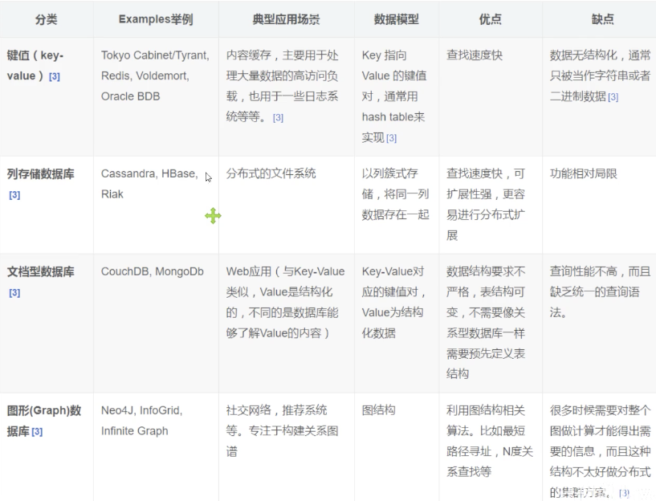
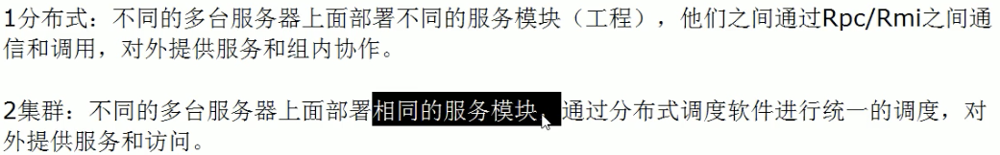
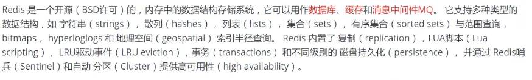
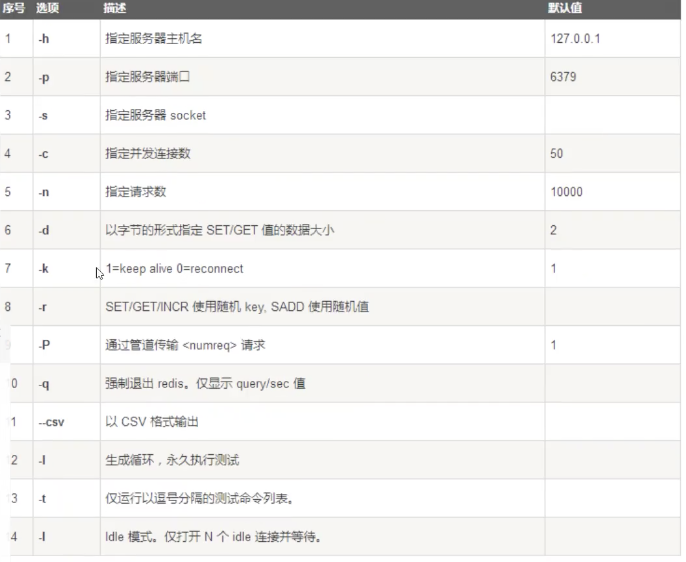
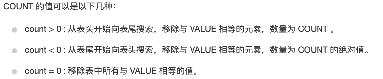
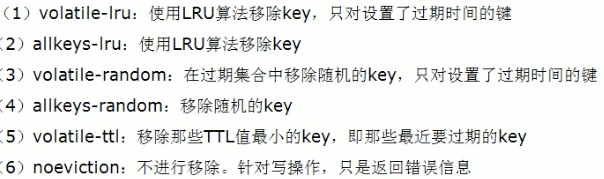

##  Nosql

> 为什么要使用nosql？

当用户的个人信息，社交网络，地理位置等爆发式增长，用传统的关系型数据库已经不能满足需要了，此时需要使用nosql。

> 什么是nosql？

关系型数据库：表、行、列。

not only sql：非关系型数据库，很多数据类型的存储不需要一个固定的格式，不需要多余的操作就可以横向扩展。

> nosql特点

1. 方便扩展（数据之间没有关系，很好扩展）
2. 大数据量、高性能（一秒8w次、读取11w，细粒度缓存、性能高）
3. 数据类型多样型，不需要事先设计数据库，随取随用

> 与关系型数据库对比

- 传统的rdbms

  - sql
  - 数据和关系都存在表中
  - 事务：即原子性、一致性、隔离性、持久性

  > 什么是一致性？

  在分布式数据库中，有一致性的概念，一致性分为强一致性、弱一致性、最终一致性

  https://zhuanlan.zhihu.com/p/67949045

- nosql

  - 没有固定的查询语言
  - 四种存储类型：键值对、列、文档、图形数据库等存储方式
  - 最终一致性
  - cap定理和base
  - 高性能、高可用、可扩展

###  nosql的四大分类

- kv键值对：redis为代表
- 文档型数据库：bson
  - MongoDB：基于分布式文件存储的数据库，主要是用来处理大量的文档，介于关系型数据库和非关系型数据库中间的产品，是非关系型数据库中功能最丰富的。
- 列存储数据库
  - Hbase
  - 分布式文件系统
- 图形关系数据库
  - 放的是关系，例如朋友圈社交网络

### 分布式数据库的cap和base

- 传统的关系型数据库：acid，原子性、一致性、独立性、持久性

- cap，只能三选二

  	- 强一致性：对于一个系统而言，是否数据绝对精确（如果插了一条数据，一定要等待从库的同步后再返回请求）
  	- 可用性：系统是否可以正常使用，不崩坏
  	- 分区容错性：如果节点（服务器）在不同的区域，是否能够保证正确（容忍网络节点之间的通信故障）

  

> 几种架构选择的原因

1. 对于电商网站，包括社交网站架构而言，必须保证系统不崩，并且机房可以在不同的区域，但不一定要保证强一致性（只需要保证读己之所写），只需要保证最终一致性即可。
2. 对于关系型数据库本身（单点）而言满足一致性和高可用性，但是对扩展性要求不大。

- base：基本可用、软状态、最终一致性

### 分布式和集群

## Redis入门

> 概念

remote dictionary server：远程字典服务

**Redis的高并发和快速原因**

1.**redis**是基于内存的，内存的读写速度非常快； 2.**redis**是单线程的，省去了很多上下文切换线程的时间； 3.**redis**使用多路复用技术，可以处理并发的连接。 非阻塞IO 内部实现采用epoll，采用了epoll+自己实现的简单的事件框架。

> 启动服务

1. 安装redis
2. 将redis-server配置成启动服务`systemctl`脚本，并start启动
3. 将redis-cli配置一下环境变量
4. 执行`redis-cli`，启动redis客户端连接服务器

> 官方自带测试性能工具：redis-benchmark

`redis-benchmark -h localhost -p 6379 -c 100 -n 100000`，对6379端口进行100个并发客户端，100000个请求测试。

> 基础

和mysql类似，配置都放在了`redis.conf`文件下。

**常用命令（官网查看帮助文档）：**

1. `select 3`：选择3号数据库，默认配置有16个数据库，默认选中0号数据库。
2. `dbsize`：显示此时选中的数据库中存储的大小
3. `set name xx`：name作为key，xx作为值存储
4. `get name`：拿到key(name)对应的值
5. `keys *`：拿到此时选中数据库中所有的key
6. `flushdb`：清空当前数据库
7. `flushall`：清空所有的数据库
8. `exists xx`：xx键是否存在
9. `move name 1`：移除1号数据库的name键
10. `expire name 10`：10s后name过期
11. `ttl name`：看name啥时候过期
12. `type name`：看name的类型

**redis是单线程的**

为什么能实现高性能？

- io多路复用同时处理多个socket
- 网络带宽是瓶颈，而不是cpu
- 由于redis操作的是内存，如果使用多线程可能需要大量的加锁操作，权衡以后还是选择单线程。

#### redis-key

## redis5大数据类型

### String

**常用命令**

1. `append key1 hello`：向key1追加hello字符串，如果字符串不存在，就相当与直接创建字符串
2. `strlen key1`：获取key1对应字符串的长度
3. `getrange key1 0 3`：截取字符串0-3
4. `setrange key2 1 xx`：替换指定位置1字符串
5. `incr/decr views`：对views进行++或--
6. `incrby views 10`：对views加10
7. `setex key3 30 "hello"` ：设置过期时间
8. `setnx `：不存在才设置，返回1则设置成功
9. `mset`：批量设置string
10. `mget`：批量获取
11. `msetnx`：批量设置，只有不存在则创建，原子性操作
12. 设置对象将`user:{id}:{field}`作为键
13. `getset key 123`：先get key，再设置key为123

**数据结构**

类似于java里的arrayList，使用了包含动态字符数组的结构体，没有使用c语言中的字符串，因为c字符串底层字符数组没有保存长度，且容易发生内存溢出。

**使用场景**

1. 计数器
2. 统计多单位的数量

### List

**常用命令**

1. `LPUSH/RPUSH list xx`：将xx放到list的左边/右边头部
2. `LRANGE list 0 1`：将list从左到右输出
3. `LPOP/RPOP list`：将list的左边/右边弹出一个
4. `lindex list 1`：输出从左到右的第一个
5. `Llen list`：返回列表的长度
6. `lrem list 1 xx`：
7. `ltrim list 1 2`：只保留指定区间的元素
8. `ropolpush list1 list2`：将list1的最右边元素弹出往左插入list2
9. `LINSERT list before world new `：将new插入到world的前面

**数据结构**

相当于java里的linkList，使用了链表，所以尽量少检索。

### set

相当于java的set，无序、不能重复

**常用命令**

1. sadd 添加
2. smembers 元素输出
3. spop：弹出元素，由于是无序的，所以任意弹出
4. scard：元素个数
5. srem：删除集合元素
6. `smove key1 key2 xx`：将key1的xx赋给key2
7. `sdiff set1 set2`：在set1里面，不在set2里面的项
8. `sunion set1 set2`：并集

### hash

相当于java里的hashMap

**常用命令**

1. `hset user id 11`：此时的value是一对kv
2. `hget user id`：拿出
3. `hmset`：设置多个
4. `hmget`：拿出多个
5. `hmgetall user`：拿出全部

### Zset

有序set，有点像**SortedSet** 和HashMap的结合体

**内部使用跳表实现**

**常用命令**

1. `zadd zset1 60 v1 70 v2 80 v3`：添加，60代表排序依据，v1代表值
2. `zrange zset1 0 -1`：将zset所有的value输出
3. `zrange zset1 0 -1 withscores`：将zset的值包括排序都输出
4. `zrem zset1 v1`：将v1删除

## redis.conf配置文件解析

各项具体见思维导图

redis的ttl和lru不是精确的，它会选择几个（默认是5个）样本值，找出这5个里最小的移除，样本值设置的越大，结果越精确。

**常见`redis.conf`配置介绍**

参数说明redis.conf 配置项说明如下：

1. Redis默认不是以守护进程的方式运行，可以通过该配置项修改，使用yes启用守护进程 daemonize no
2.  当Redis以守护进程方式运行时，Redis默认会把pid写入/var/run/redis.pid文件，可以通过pidfile指定 pidfile /var/run/redis.pid
3.  指定Redis监听端口，默认端口为6379，作者在自己的一篇博文中解释了为什么选用6379作为默认端口，因为6379在手机按键上MERZ对应的号码，而MERZ取自意大利歌女Alessia Merz的名字 port 6379
4.  绑定的主机地址 bind 127.0.0.1
5. 当 客户端闲置多长时间后关闭连接，如果指定为0，表示关闭该功能 timeout 300
6.  指定日志记录级别，Redis总共支持四个级别：debug、verbose、notice、warning，默认为verbose loglevel verbose
7. 日志记录方式，默认为标准输出，如果配置Redis为守护进程方式运行，而这里又配置为日志记录方式为标准输出，则日志将会发送给/dev/null logfile stdout
8.  设置数据库的数量，默认数据库为0，可以使用SELECT <dbid>命令在连接上指定数据库id databases 16
9.  指定在多长时间内，有多少次更新操作，就将数据同步到数据文件，可以多个条件配合 save <seconds> <changes> Redis默认配置文件中提供了三个条件： save 900 1 save 300 10 save 60 10000 分别表示900秒（15分钟）内有1个更改，300秒（5分钟）内有10个更改以及60秒内有10000个更改。 
10.  指定存储至本地数据库时是否压缩数据，默认为yes，Redis采用LZF压缩，如果为了节省CPU时间，可以关闭该选项，但会导致数据库文件变的巨大 rdbcompression yes
11.  指定本地数据库文件名，默认值为dump.rdb dbfilename dump.rdb
12.  指定本地数据库存放目录 dir ./
13.  设置当本机为slav服务时，设置master服务的IP地址及端口，在Redis启动时，它会自动从master进行数据同步 slaveof <masterip> <masterport>
14. 当master服务设置了密码保护时，slav服务连接master的密码 masterauth <master-password>
15.  设置Redis连接密码，如果配置了连接密码，客户端在连接Redis时需要通过AUTH <password>命令提供密码，默认关闭 requirepass foobared
16.  设置同一时间最大客户端连接数，默认无限制，Redis可以同时打开的客户端连接数为Redis进程可以打开的最大文件描述符数，如果设置 maxclients 0，表示不作限制。当客户端连接数到达限制时，Redis会关闭新的连接并向客户端返回max number of clients reached错误信息 maxclients 128
17.  指定Redis最大内存限制，Redis在启动时会把数据加载到内存中，达到最大内存后，Redis会先尝试清除已到期或即将到期的Key，当此方法处理 后，仍然到达最大内存设置，将无法再进行写入操作，但仍然可以进行读取操作。Redis新的vm机制，会把Key存放内存，Value会存放在swap区 maxmemory <bytes>
18.  指定是否在每次更新操作后进行日志记录，Redis在默认情况下是异步的把数据写入磁盘，如果不开启，可能会在断电时导致一段时间内的数据丢失。因为 redis本身同步数据文件是按上面save条件来同步的，所以有的数据会在一段时间内只存在于内存中。默认为no appendonly no
19. 指定更新日志文件名，默认为appendonly.aof  appendfilename appendonly.aof
20.  指定更新日志条件，共有3个可选值：  no：表示等操作系统进行数据缓存同步到磁盘（快）  always：表示每次更新操作后手动调用fsync()将数据写到磁盘（慢，安全）  everysec：表示每秒同步一次（折衷，默认值） appendfsync everysec 
21. 指定是否启用虚拟内存机制，默认值为no，简单的介绍一下，VM机制将数据分页存放，由Redis将访问量较少的页即冷数据swap到磁盘上，访问多的页面由磁盘自动换出到内存中（在后面的文章我会仔细分析Redis的VM机制）  vm-enabled no
22. 虚拟内存文件路径，默认值为/tmp/redis.swap，不可多个Redis实例共享  vm-swap-file /tmp/redis.swap23. 将所有大于vm-max-memory的数据存入虚拟内存,无论vm-max-memory设置多小,所有索引数据都是内存存储的(Redis的索引数据 就是keys),也就是说,当vm-max-memory设置为0的时候,其实是所有value都存在于磁盘。默认值为0  vm-max-memory 0
23. Redis swap文件分成了很多的page，一个对象可以保存在多个page上面，但一个page上不能被多个对象共享，vm-page-size是要根据存储的 数据大小来设定的，作者建议如果存储很多小对象，page大小最好设置为32或者64bytes；如果存储很大大对象，则可以使用更大的page，如果不 确定，就使用默认值  vm-page-size 32
24.  设置swap文件中的page数量，由于页表（一种表示页面空闲或使用的bitmap）是在放在内存中的，，在磁盘上每8个pages将消耗1byte的内存。  vm-pages 134217728
25. 设置访问swap文件的线程数,最好不要超过机器的核数,如果设置为0,那么所有对swap文件的操作都是串行的，可能会造成比较长时间的延迟。默认值为4  vm-max-threads 4
26. 设置在向客户端应答时，是否把较小的包合并为一个包发送，默认为开启 glueoutputbuf yes
27. 指定在超过一定的数量或者最大的元素超过某一临界值时，采用一种特殊的哈希算法 hash-max-zipmap-entries 64 hash-max-zipmap-value 512
28. 指定是否激活重置哈希，默认为开启（后面在介绍Redis的哈希算法时具体介绍） activerehashing yes
29. 指定包含其它的配置文件，可以在同一主机上多个Redis实例之间使用同一份配置文件，而同时各个实例又拥有自己的特定配置文件 include /path/to/local.conf

## redis的持久化

### RDB

> 概念

在时间间隔内将内存中的数据集快照（Snapshot）写入磁盘，恢复时将快照文件直接读入内存里

> 特点

1. 适合大规模的数据恢复
2. 对数据的完整性要求不高，如果在间隔时间的时候down掉，丢失最后一次的数据更改。
3. fork的时候，内存中的数据被克隆了一分，大致两倍的膨胀性。

### AOF

> 概念

用户每输入一个命令，redis就记录下来，恢复时候把之前用户输入的所有命令再执行一遍。

**详见思维导图**

## redis事务

redis对事务是部分支持。

#### watch

借鉴了乐观锁的思想，在执行事务前先监控相应的变量，如果提交的时候发现被修改了，就回滚。

## redis发布订阅

## redis主从复制

**常见命令**

1. `slave of ip端口` ：将此机作为某ip端口下的从机
2. `info replication`：查看此时本机的主从信息
3. `slaveof no one`：当前数据库停止与其他数据库的同步，转成主数据库

**几种架构**

1. 一主两从
2. 薪火相传
3. 反客为主
4. 哨兵模式：反客为主的自动版

## jedis

