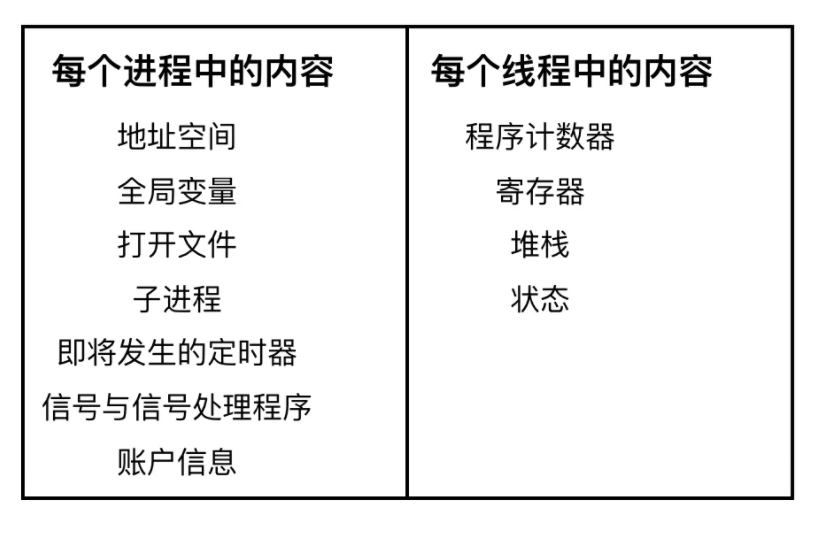
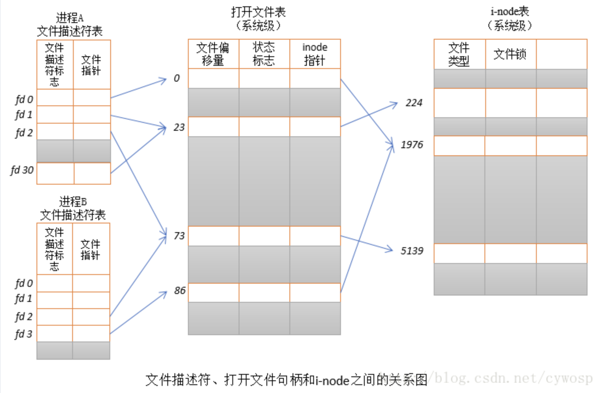
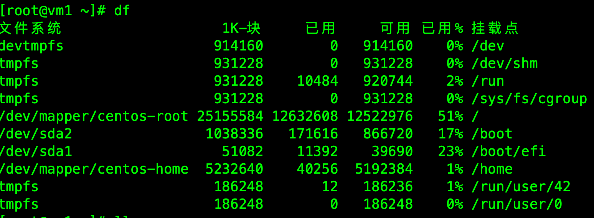

# 操作系统

### 基础

1. 进程和线程的区别是什么？1对多，映射到jvm（线程之间有自己的、有共享），进程切换和线程切换的开销（进程需要切换内存页表（资源）、文件描述符等，很复杂；线程只需要切换程序、栈、寄存器）。
2. 进程和进程表（进程控制块pcb）：进程表中存在进程此时的所有信息，包括状态、资源等，当操作系统调度的时候会通过进程表还原进程的运行状态。
3. 进程的几种状态：
   - **创建状态(new)** ：进程正在被创建，尚未到就绪状态。
   - **就绪状态(ready)** ：进程已处于准备运行状态，即进程获得了除了处理器之外的一切所需资源，一旦得到处理器资源(处理器分配的时间片)即可运行。
   - **运行状态(running)** ：进程正在处理器上上运行(单核 CPU 下任意时刻只有一个进程处于运行状态)。
   - **阻塞状态(waiting)** ：又称为等待状态，进程正在等待某一事件而暂停运行如等待某资源为可用或等待 IO 操作完成。即使处理器空闲，该进程也不能运行。
   - **结束状态(terminated)** ：进程正在从系统中消失。可能是进程正常结束或其他原因中断退出运行。

4. 多线程的好处：
   - 充分利用cpu多核的特性。
   - 就算单核的情况下，也能照顾到各个线程，虽然说整个吞吐量可能不如单线程，但是能够照顾到所有用户的体验。
   - 与多进程的方面：更轻量级。
5. 多处理器和多核的区别：cpu在同一个时刻只能有一个mmu映射，所以多核只能跑多线程（共享一个mmu）；而多处理器可以同时跑多进程。

6. 页表、虚拟内存、按需分页、页面置换相关概念。

7. 进程通信方式：

   1. **管道/匿名管道(Pipes)** ：用于具有亲缘关系的父子进程间或者兄弟进程之间的通信。
   2. **有名管道(Names Pipes)** : 匿名管道由于没有名字，只能用于亲缘关系的进程间通信。为了克服这个缺点，提出了有名管道。有名管道严格遵循**先进先出(first in first out)**。有名管道以磁盘文件的方式存在，可以实现本机任意两个进程通信。
   3. **信号(Signal)** ：信号是一种比较复杂的通信方式，用于通知接收进程某个事件已经发生；
   4. **消息队列(Message Queuing)** ：消息队列是消息的链表,具有特定的格式,存放在内存中并由消息队列标识符标识。管道和消息队列的通信数据都是先进先出的原则。与管道（无名管道：只存在于内存中的文件；命名管道：存在于实际的磁盘介质或者文件系统）不同的是消息队列存放在内核中，只有在内核重启(即，操作系统重启)或者显示地删除一个消息队列时，该消息队列才会被真正的删除。消息队列可以实现消息的随机查询,消息不一定要以先进先出的次序读取,也可以按消息的类型读取.比 FIFO 更有优势。**消息队列克服了信号承载信息量少，管道只能承载无格式字 节流以及缓冲区大小受限等缺。**
   5. **信号量(Semaphores)** ：信号量是一个计数器，用于多进程对共享数据的访问，信号量的意图在于进程间同步。这种通信方式主要用于解决与同步相关的问题并避免竞争条件。
   6. **共享内存(Shared memory)** ：使得多个进程可以访问同一块内存空间，不同进程可以及时看到对方进程中对共享内存中数据的更新。这种方式需要依靠某种同步操作，如互斥锁和信号量等。可以说这是最有用的进程间通信方式。linux mmap()
   7. **套接字(Sockets)** : 此方法主要用于在客户端和服务器之间通过网络进行通信。套接字是支持 TCP/IP 的网络通信的基本操作单元，可以看做是不同主机之间的进程进行双向通信的端点，简单的说就是通信的两方的一种约定，用套接字中的相关函数来完成通信过程。

8. 文件管理：linux把一切看作文件，举例ext2 inode

   

   > 解释：http://www.sxyniubi.xyz/archives/io%E9%80%9A%E4%BF%A1%E4%B8%8Ejavanio%E8%AF%A6%E8%A7%A3
   >
   > 在进程A中，文件描述符1和30都指向了同一个打开的文件句柄（标号23）。这可能是通过调用dup()、dup2()、fcntl()或者对同一个文件多次调用了open()函数而形成的。
   >
   > 进程A的文件描述符2和进程B的文件描述符2都指向了同一个打开的文件句柄（标号73）。这种情形可能是在调用fork()后出现的（即，进程A、B是父子进程关系），或者当某进程通过UNIX域套接字将一个打开的文件描述符传递给另一个进程时，也会发生。再者是不同的进程独自去调用open函数打开了同一个文件，此时进程内部的描述符正好分配到与其他进程打开该文件的描述符一样。
   >
   >   此外，进程A的描述符0和进程B的描述符3分别指向不同的打开文件句柄，但这些句柄均指向i-node表的相同条目（1976），换言之，指向同一个文件。发生这种情况是因为每个进程各自对同一个文件发起了open()调用。同一个进程两次打开同一个文件，也会发生类似情况。

9. 常见文件类型：**普通文件**，**目录文件**，**链接文件**，**设备文件**，**管道文件**，**Socket 套接字文件**

10. 线程同步方式：

    1. 操作系统互斥量（mutex）
    2. wait/notify

11. 进程调度算法：

    - **先到先服务(FCFS)调度算法** : 从就绪队列中选择一个最先进入该队列的进程为之分配资源，使它立即执行并一直执行到完成或发生某事件而被阻塞放弃占用 CPU 时再重新调度。
    - **短作业优先(SJF)的调度算法** : 从就绪队列中选出一个估计运行时间最短的进程为之分配资源，使它立即执行并一直执行到完成或发生某事件而被阻塞放弃占用 CPU 时再重新调度。
    - **时间片轮转调度算法** : 时间片轮转调度是一种最古老，最简单，最公平且使用最广的算法，又称 RR(Round robin)调度。每个进程被分配一个时间段，称作它的时间片，即该进程允许运行的时间。
    - **多级反馈队列调度算法** ：前面介绍的几种进程调度的算法都有一定的局限性。如**短进程优先的调度算法，仅照顾了短进程而忽略了长进程** 。多级反馈队列调度算法既能使高优先级的作业得到响应又能使短作业（进程）迅速完成。，因而它是目前**被公认的一种较好的进程调度算法**，UNIX 操作系统采取的便是这种调度算法。
    - **优先级调度** ： 为每个流程分配优先级，首先执行具有最高优先级的进程，依此类推。具有相同优先级的进程以 FCFS 方式执行。可以根据内存要求，时间要求或任何其他资源要求来确定优先级。

12. 死锁：手撕

    1. 如何预防死锁？

       破坏死锁的条件：

       	1. 例如当拿不到资源的时候，主动释放资源；
        	2. 一次性拿到所有的资源；
        	3. 按照循环顺序拿资源，规定每个进程必须按编号递增的顺序请求资源；

    2. 如何避免死锁？

       银行家算法：只有当资源池中有充足的资源时才将资源分配给进程，否则便认为可能存在死锁的风险

       但是也有缺点，就是有些资源的浪费，而且非常耗时间，每次资源请求都要申请批准。所以现代操作系统不会进行这种算法判断。

    3. 死锁检测：

       - 工具：Jconsole、Java Visual VM判断死锁
       - 死锁检测算法：判断是否有环路，如果有死锁的话必然存在等待环。

    4. 死锁解除：

       1. 直接剥夺某个进程的资源
       2. 进程回退
       3. 数据库里直接将其中一个事务回滚

11. 内存管理

    1. 作用：回收内存、内存映射
    2. 方式：
       1. 块式管理：操作系统将内存分成很多块，进程进来了就分一块，这样会导致内存碎片太多，资源利用率低。
       2. 页式管理：将内存分成页式（相比块小很多），系统中的每个进程通过自己进程的页表去进行逻辑地址和物理地址的映射。
       3. 段式管理：用户看来，一个进程在内存中其实就是那么几个段，包括代码段、数据段、栈等等。所以我们管理内存可以基于这种段的思想进行管理，基本思路和之前的页表差不多，只是把每个页换成了相应的段。
    3. 页式管理和段式管理区别：
       1. 共同点
          - 分页机制和分段机制都是为了提高内存利用率，较少内存碎片。
          - 页和段都是离散存储的，所以两者都是离散分配内存的方式。但是，每个页和段中的内存是连续的。
       2. 区别
          - 页的大小是固定的，由操作系统决定；而段的大小不固定，取决于我们当前运行的程序。
          - 分页仅仅是为了满足操作系统内存管理的需求，而段是逻辑信息的单位，在程序中可以体现为代码段，数据段，能够更好满足用户的需要。

12. 多级页表：解决页表占用空间过大的问题。

13. 为什么需要虚拟地址？因为如果直接使用物理地址的话，那这样应用程序可以直接操作任意内存，有可能就操作了操作系统中的内存，会引起问题。

14. 僵尸进程：僵尸进程是已完成且处于终止状态，但在进程表中却仍然存在的进程。  https://blog.csdn.net/qingzhuyuxian/article/details/80312517

    - 为什么会产生僵尸进程？

      僵尸进程通常发生在父子关系的进程中，由于fork过后，父子进程执行就变成异步的了，但是当子进程退出的时候，父进程需要知道子进程退出的相关信息，包括子进程退出状态、执行时间等；这时候linux提供了一种机制，当子进程退出的时候，如果发现父进程还没有执行完，那么会释放相应资源，但是进程表中依然存在相应的pid信息；当父进程执行wait函数的时候可以将进程信息进行清除操作；但是有时候父进程太忙了，无法及时去wait，导致子进程号一直在进程表中，当这些进程号一多，会导致进程爆满，无法分配进程号的问题。

    - 如何解决僵尸进程？

      可以通过信号量的方式，当子进程退出的时候，给父进程一个信号，父进程去执行相应的wait函数。

### Linux

1. 目录操作：

   - **`mkdir 目录名称`：** 增加目录。
   - **`ls/ll`**（ll 是 ls -l 的别名，ll 命令可以看到该目录下的所有目录和文件的详细信息）：查看目录信息。
   - **`find 目录 参数`：** 寻找目录（查）。示例：① 列出当前目录及子目录下所有文件和文件夹: `find .`；② 在`/home`目录下查找以.txt 结尾的文件名:`find /home -name "*.txt"` ,忽略大小写: `find /home -iname "*.txt"` ；③ 当前目录及子目录下查找所有以.txt 和.pdf 结尾的文件:`find . \( -name "*.txt" -o -name "*.pdf" \)`或`find . -name "*.txt" -o -name "*.pdf"`。
   - **`mv 目录名称 新目录名称`：** 修改目录的名称（改）。注意：mv 的语法不仅可以对目录进行重命名而且也可以对各种文件，压缩包等进行 重命名的操作。mv 命令用来对文件或目录重新命名，或者将文件从一个目录移到另一个目录中。后面会介绍到 mv 命令的另一个用法。
   - **`mv 目录名称 目录的新位置`：** 移动目录的位置---剪切（改）。注意：mv 语法不仅可以对目录进行剪切操作，对文件和压缩包等都可执行剪切操作。另外 mv 与 cp 的结果不同，mv 好像文件“搬家”，文件个数并未增加。而 cp 对文件进行复制，文件个数增加了。
   - **`cp -r 目录名称 目录拷贝的目标位置`：** 拷贝目录（改），-r 代表递归拷贝 。注意：cp 命令不仅可以拷贝目录还可以拷贝文件，压缩包等，拷贝文件和压缩包时不 用写-r 递归。
   - **`rm [-rf] 目录` :** 删除目录（删）。注意：rm 不仅可以删除目录，也可以删除其他文件或压缩包，为了增强大家的记忆， 无论删除任何目录或文件，都直接使用`rm -rf` 目录/文件/压缩包。

2. 文件crud：

   - **`touch 文件名称`:** 文件的创建（增）。
   - **`cat/more/less/tail 文件名称`** ：文件的查看（查） 。命令 `tail -f 文件` 可以对某个文件进行动态监控，例如 tomcat 的日志文件， 会随着程序的运行，日志会变化，可以使用 `tail -f catalina-2016-11-11.log` 监控 文 件的变化 。
   - **`vim 文件`：** 修改文件的内容（改）。vim 编辑器是 Linux 中的强大组件，是 vi 编辑器的加强版，vim 编辑器的命令和快捷方式有很多，但此处不一一阐述，大家也无需研究的很透彻，使用 vim 编辑修改文件的方式基本会使用就可以了。在实际开发中，使用 vim 编辑器主要作用就是修改配置文件，下面是一般步骤： `vim 文件------>进入文件----->命令模式------>按i进入编辑模式----->编辑文件 ------->按Esc进入底行模式----->输入：wq/q!` （输入 wq 代表写入内容并退出，即保存；输入 q!代表强制退出不保存）。
   - **`rm -rf 文件`：** 删除文件（删）。

3. 文件压缩和解压：

   1. 压缩文件：需要先将一堆文件打包成一个tar包，再将tar包使用gzip进行压缩：`tar -zcvf 打包压缩后的文件名 要打包压缩的文件`
      - z：调用 gzip 压缩命令进行压缩
      - c：打包文件
      - v：显示运行过程
      - f：指定文件名
   2. 解压文件：使用tar命令解压：`tar [-xvf] 压缩文件`
      - x：解压

4. linux权限(`ls - l`可以看到文件此时的权限信息)：

   1. 文件-

      - r：可读
      - w：可写
      - x：可执行

   2. 目录d

      - r：可访问目录
      - w：可添加删除文件
      - x：可进入目录

   3. 文件的所有者、所在组、其他组

      - **所有者(u)** ：一般为文件的创建者，谁创建了该文件，就天然的成为该文件的所有者，用 `ls ‐ahl` 命令可以看到文件的所有者 也可以使用 chown 用户名 文件名来修改文件的所有者 。
      - **文件所在组(g)** ：当某个用户创建了一个文件后，这个文件的所在组就是该用户所在的组用 `ls ‐ahl`命令可以看到文件的所有组也可以使用 chgrp 组名 文件名来修改文件所在的组。
      - **其它组(o)** ：除开文件的所有者和所在组的用户外，系统的其它用户都是文件的其它组。

   4. 修改/test 下的 aaa.txt 的权限为文件所有者有全部权限，文件所有者所在的组有读写权限，其他用户只有读的权限。

      **`chmod u=rwx,g=rw,o=r aaa.txt`** 或者 **`chmod 764 aaa.txt`**

5. cpu相关

   - 我们可以通过`uptime`，`w`或者`top`命令看到CPU的平均负载。
   - 负载和利用率的区别：
     - 负载：是在某一个时候，对于单个核心而言此时正在运行的进程数和就绪的进程数之和。
     - 利用率：在某一段时间内，cpu执行的时间占总时间的比例。
   - 高负载低利用率排查：可能有很多io密集型的任务
   - 负载低、利用率高：top命令查到使用率最高的任务，定位看。
   - cpu使用率达到了满载
     - 通过top定位到占用率高的进程
     - `top -Hp pid`找到进程对应的线程。
     - 通过jstack等jvm工具查看线程此时的堆栈日志。

6. linux文件系统相关

   1. linux磁盘文件管理的执行逻辑：

      1. 先使用分区表，使用mbr或者gpt，将一个磁盘分成多个分区，每个分区配备单独的文件系统，在linux下一般使用ext、windows下使用ntfs、u盘下使用fat32等。

      2. 将相应的文件系统挂载在目录树下：

         - 例如在虚拟机安装配置linux的时候就会进行配置，对相应的目录配置内存大小，并且选择相应的文件系统

         - u盘插入时作为外部设备，可以将其挂载到/mnt目录下。

           

      3. 当用户通过系统调用创建文件的时候，系统会在进程级以及系统级创建相应的资源（文件描述符fd那一套），并且会识别当前路径下的文件系统作出相应操作（在ext文件系统会找到此文件路径相应的inode表，也有可能是socket等资源），创建相应的io缓冲区等。

   2. linux系统的磁盘文件系统：

      在linux的ext2文件系统中，它是通过inode表来实现一系列操作的，ext2会通过当前路径，通过文件系统的inode索引表，找到当前文件对应的inode表，通过当前的inode表去找到相应的区块，对相应区块进行读写操作。

      > ext文件系统的组成部分
      >
      > 1. 数据区块：存放数据的块。
      >
      > 2. superblock：记录整个文件系统信息的地方，包括此时已经使用的inode、数据区块量；文件系统的挂载时间等。
      >
      > 3. inode对应表：用来记录inode的索引。
      >
      > 4. inode区块：单个文件的inode表，记录文件的信息，包括修改时间、文件内容真正的指向块地址、文件权限等。
      >
      >    inode由于只有128b，不能记录太多块数据，通过直接记录和间接记录的方式配合，最大可以记录16G的文件。

#### 常用命令

1. `pwd`：当前位置。
2. `sudo + 命令`：使用管理员身份执行命令
3. `lsof -i tcp:8080`：看8080端口是否被占用
4. `kill + 进程号`：关闭进程
5. **`grep 要搜索的字符串 要搜索的文件 --color`：** 搜索命令，--color 代表高亮显示
6. `ifconfig`：看本机ip网络
7. `netstat -an`：查看现在系统端口使用
8. **`ps -ef`**：查看此时系统运行的所有进程

#### 补充

1. 开机自启动脚本的配置：封装linux的服务 http://www.sxyniubi.xyz/archives/%E5%BE%85%E5%AE%8C%E5%96%84linux%E7%9A%84%E6%9C%8D%E5%8A%A1

2. linux ` fork()`  https://blog.csdn.net/qingzhuyuxian/article/details/80312517

3. 学习linux问题：

   1. nat端口映射的问题。http://www.sxyniubi.xyz/archives/%E9%97%AE%E9%A2%98%E5%B1%80%E5%9F%9F%E7%BD%91%E4%B8%BB%E6%9C%BA%E6%97%A0%E6%B3%95%E8%AE%BF%E9%97%AEnat%E6%A8%A1%E5%BC%8F%E7%9A%84%E8%99%9A%E6%8B%9F%E6%9C%BA
   2. lvm磁盘挂载的问题

4. linux部署

   1. 单机版项目部署：使用`nohup java [ -jar xx] [　& ]`，nohup代表在后台运行程序，关闭窗口也不停止，此时日志可以输出到此目录下的nohup.out文件中。

      关闭服务：`ps -def | grep "名称"`：找到相应进程，kill掉。

   2. 前后端项目部署：

#### shell编程

### docker

